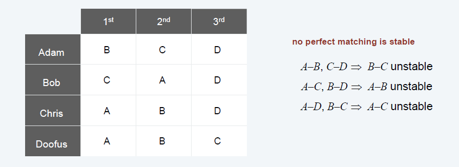
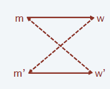
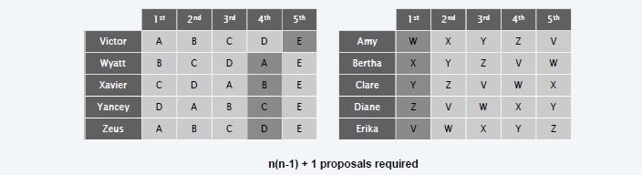
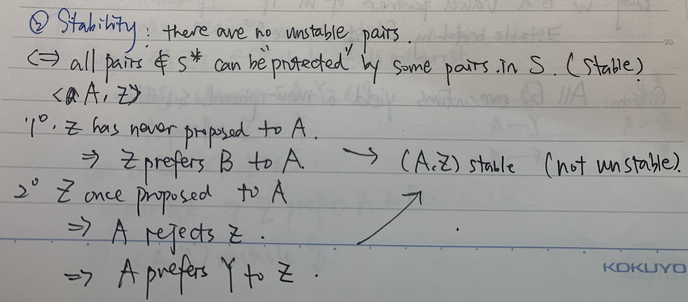
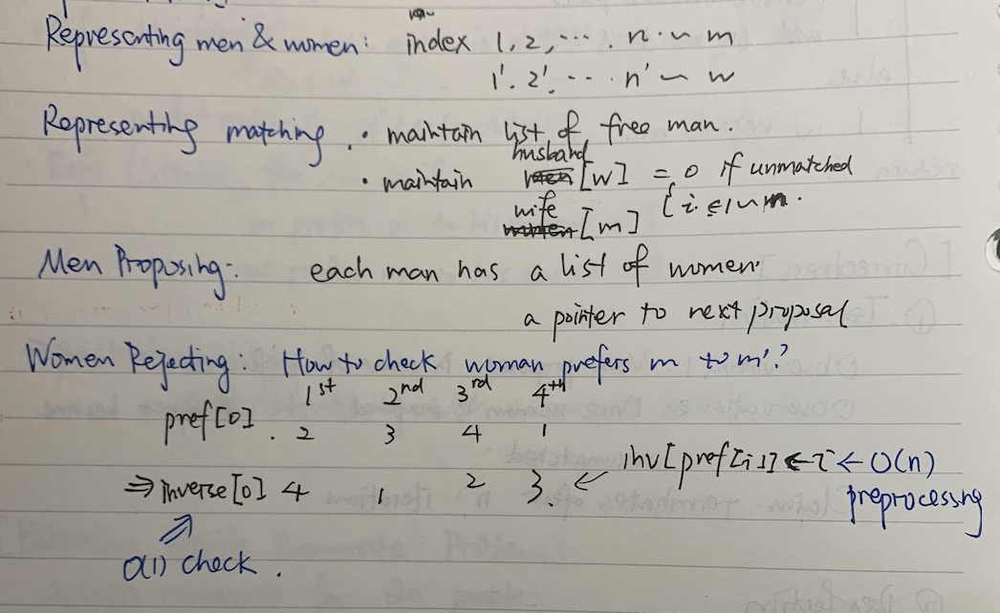
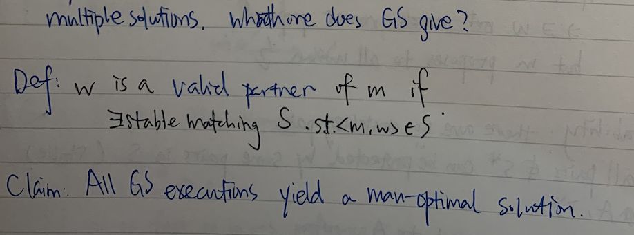
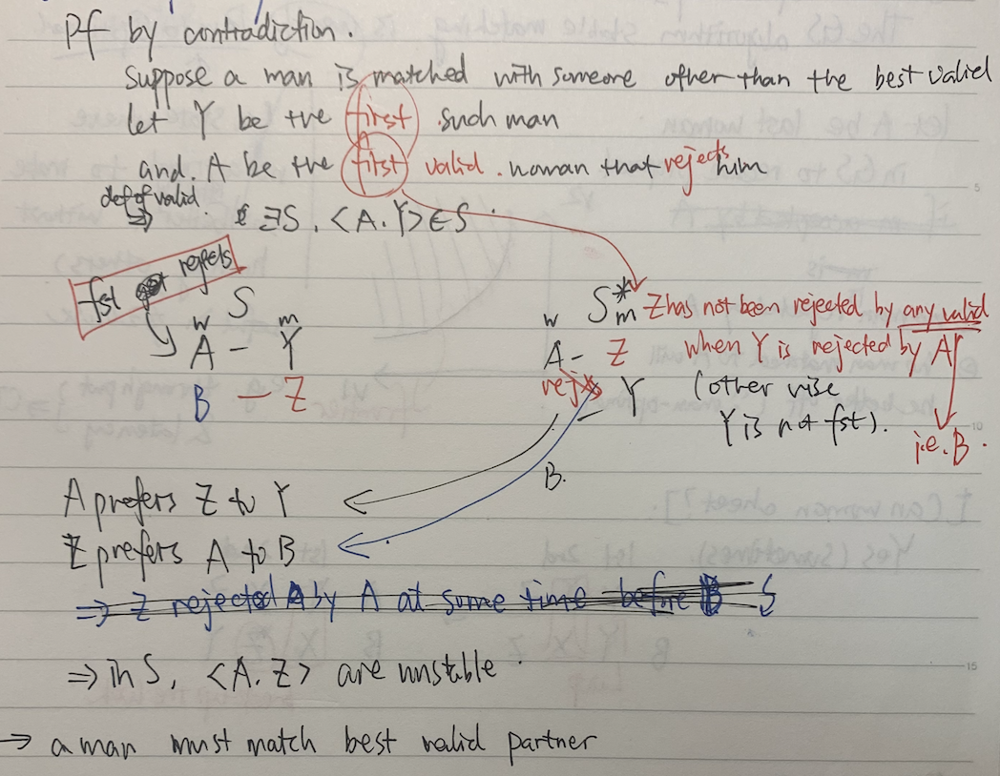
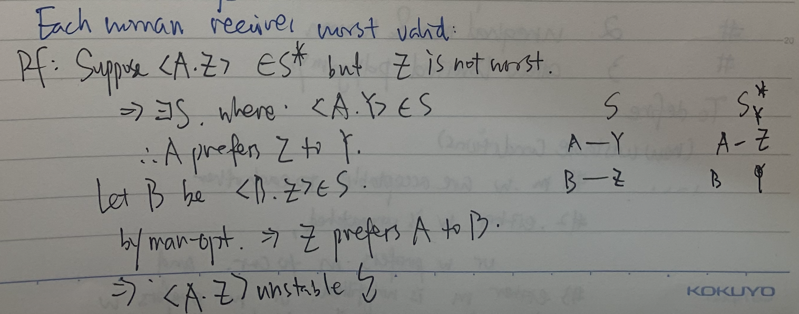
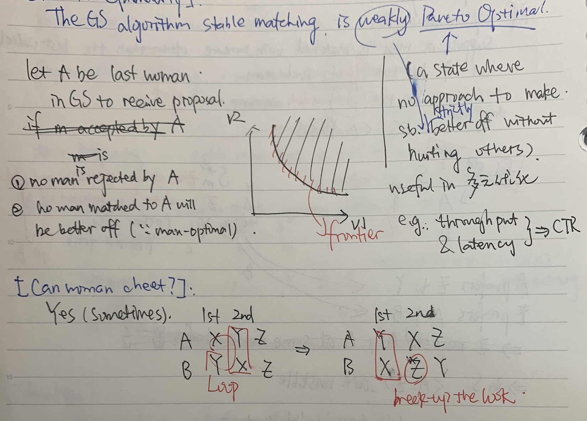
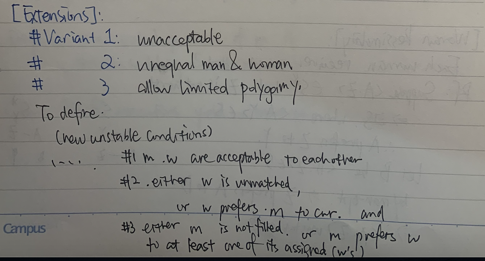

<!--more-->

[toc]

## Euclid’s Algorithm
$$gcd(m,n) = gcd(n, m \space \text{mod} \space n)$$
algorithm: repeatedly replace $(m,n)$ with $(n, m \space \text{mod} \space n)$, until the second component becomes 0.

## Stable Matching: Problem

**Definition: Matching**

**Definition: Perfect Matching**

**Definition: Unstable Pair** `m` and `w` are unstable if
- `m` prefers `w` to its current
- `w` prefers `m` to its current
- i.e. can be improved

**Definition: Stable Pair** a perfect matching with no unstable pairs

> Hint: Try to define the problem from the opposite direction. (What is an unstable pair)

**Problem:** Given the preference lists of n men and n women, find a stable matching (if one exists).

### Stable Roomate Problem

1. assign roommate pairs for `2n` people, stable matching doesn't always exists.
   

2. Is stable matching unique? not necessarily(四角恋)
   

## Solution: Gale-Shapley

1. initialize empty matching `S`
2. while `some men are not proposed`
   1. `w = first woman on m`
   2. if `w` unmatched
      - add `(m,w)` to `S`
   3. else if `w` prefers `m` to current `m'`
      - remove `(m',w)` from `S`
      - add `(m,w)` to `S`
      - add `m'` to queue
3. return `S`

### Proof of correctness: Termination

**Observations**
1. Men propose to women in decreasing order of preference
2. Once a woman is matched, she never becomes unmatched

**Claim:** Algorithm terminates after at most $n^2$ iterations of while loop
**Proof.** Each time through the while loop a man proposes to a new woman. There are only $n^2$ possible proposals.

### Proof of correctness: Perfection

> Hint: Prove by contradiction

**Claim:** In Gale-Shapley matching, all men and women get matched.
**Proof.**
- if a man is not matched upon termination of GS algorithm, 
- then some woman is never proposed
- but the man has proposed to all women
- contradiction

### Proof of correctnes: Stability

**Claim:** After GS Matching, there are no unstable pairs.

## Implementation

## Analysis

### Man Optimality

### Woman Pessimality

### Pareto Optimality

## Extensions

## 5 Representative Problems

