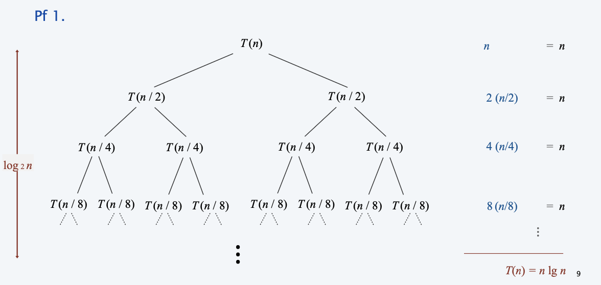

Divide-and-conquer.
- Divide up problem into several subproblems.
- Solve each subproblem recursively.
- Combine solutions to subproblems into overall solution.
Most common usage.
- Divide problem of size n into two subproblems of size n / 2 **in linear time.** 
- Solve two subproblems recursively.
- Combine two solutions into overall solution **in linear time**.
Consequence.
- Bruteforce: Θ(n^2). 
- Divide-and-conquer: Θ(nlogn).

<!--more-->

[toc]

## mergesort

**Def**. $T(n)=$ max number of compares to mergesort a list of size $\leq n$

**Note**. $T(n)$ is monotone nondecreasing.

**Mergesort recurrence**.
$$
T(n) \leq\left\{\begin{array}{ll}
0 & \text { if } n=1 \\
T(\ln / 2])+T(\ln / 2\rfloor)+n & \text { otherwise }
\end{array}\right.
$$

**Solution**. $T(n)$ is $O\left(n \log _{2} n\right)$

**Assorted proofs**. We describe several ways to prove this recurrence. Initially we assume $n$ is a power of 2 and replace $\leq$ with $=$

### Proof by recursion tree

Proposition. If $T(n)$ satisfies the following recurrence, then $T(n)=n \log _{2} n$
$$
T(n)=\left\{\begin{array}{ll}
0 & \text { if } n=1 \\
2 T(n / 2)+n & \text { otherwise }
\end{array}\right.
$$

### Proof by induction

> if n is the power of 2...

**Pf**. \[by induction on $n$ \]
Base case: when $n=1, T(1)=0$
Inductive hypothesis: assume $T(n)=n \log _{2} n$
Goal: show that $T(2 n)=2 n \log _{2}(2 n)$
$$
\begin{aligned}
T(2 n) &=2 T(n)+2 n \\
&=2 n \log 2 n+ 2 n \\
&=2 n\left(\log _{2}(2 n)-1\right)+2 n \\
&=2 n \log _{2}(2 n)
\end{aligned}
$$

> if n is not the power of 2...

## counting inversions

## closest pair of points 

## randomized quicksort 

## median and selection