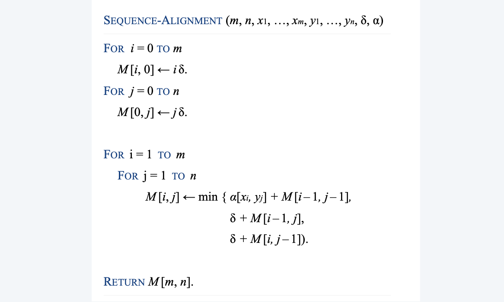
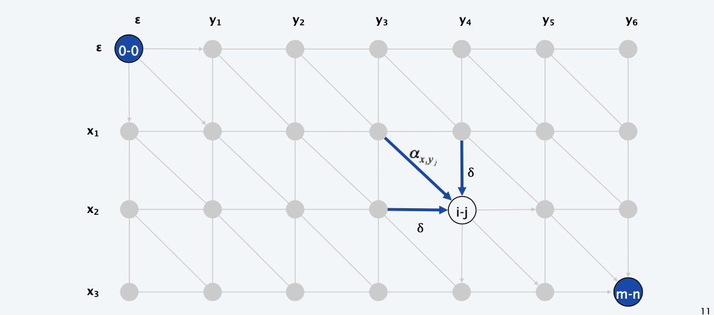
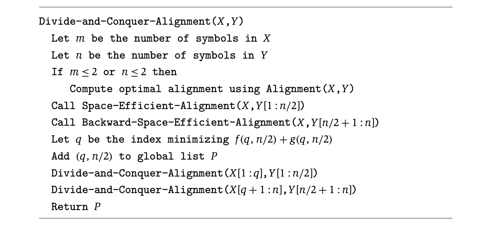

Application of **Dynamic programming** in Interval Matching & Graphs

<!--more-->

[toc]

## Sequence Alignment

### String Similarity

> Recall: we've counted inversions to compare similarity

Use mismatches and gap to compare strings.

**Edit Distance**.
- Gap penalty $\delta$, mismatch penalty $\alpha_{pq}$
- Cost = sum of gap and mismatch penalties

**Applications**. Unix diff, speech recognition, computational biology, ...

### Problem Definition

**Goal.** Given two strings $x_1, x_2, ... x_m$ and $y_1, y_2, ..., y_n$ find min cost alignment.

**Def.**  An alignment M is a set of ordered pairs $x_i – y_j$ such that each item occurs in at most one pair and no crossings. 
- crossing is $x_i –y_j$ and $x_i^{\prime} –y_j^{\prime}$ cross if $i<i'$,but $j>j'$

**Def**. The cost of an alignment M is:

### Analysis

**Def**. OPT(i, j) = min cost of aligning prefix strings $x_1,x_2, ..., x_i$ and $y_1, y_2, ...,y_j$. 

**Case 1**. OPT matches $x_i – y_j$.
Pay mismatch for $x_i – y_j$ + min cost of aligning $x_1, x_2, ..., x_{i–1}$ and $y_1, y_2, ... y_{j–1}$. 

**Case 2a**. OPT leaves $x_i$ unmatched.
Pay gap for $x_i$ + min cost of aligning $x_1, x_2, ..., x_{i–1}$ and $y_1, y_2, ... y_{j}$.

**Case 2b**. OPT leaves $y_j$ unmatched.
Pay gap for $y_j$ + min cost of aligning $x_1, x_2, ..., x_{i}$ and $y_1, y_2, ... y_{j-1}$.

### Implementation

### Analysis

**Theorem**. The dynamic programming algorithm computes the edit distance (and optimal alignment) of two strings of length m and n in $\Theta(mn)$ time and $\Theta(mn)$ space.
**Pf**.
- Algorithm computes edit distance.
- Can trace back to extract optimal alignment itself.

> When matching, `m` and `n` can be very large
> Space is a problem
**Q**. Can we avoid using quadratic space?
**A**. Easy to compute optimal value in $O(mn)$ time and $O(m + n)$ space.
> Note, when we are computing `M[i,j]`, we only need `M[i-1,j]`, `M[i,j-1]` and `M[i-1,j-1]`
> A simple implementation: We only need two rows of data, update them as we go forward
- Compute `OPT(i, •)` from `OPT(i – 1, •)`.
- **But**, no longer easy to recover optimal alignment itself.
  > The following algorithm can keep space complexity small while preserving the possibility of recovering

## Hirschberg's algorithm

### Sequence alignment in linear space
**Theorem**. There exist an algorithm to find an optimal alignment in O(mn) time and O(m + n) space.
- Clever combination of *divide-and-conquer* and *dynamic programming*.
- Inspired by idea of Savitch from complexity theory.

### Hirschberg's algorithm

> Idea: view the DP process as a directed graph, find the shortest path

> The path view and the orginal DP view are equivalent in semantics, pF by strong induction on `i+j`

> observation: the shortest path must pass one node in a middle column

> Note: when you are dividing, you are cutting the problem into a even smaller problem (instead of half-half), so the master theorem will give a loser bound

## Bellman-Ford

**Dijkstra**. Can fail if negative edge weights. (Check assumption of Dijkstra)

**Reweighting**. Adding a constant to every edge weight can fail.

> The foundamental reason why Dijkstra fails:
> exist negative cycles

**Lemma1:** if negative cycles exist, no shortest path can be found.
**Lemma2:** If G has no negative cycles, then there exists a cheapest path from v to t that is simple ( and has $\le n–1$ edges). (Otherwise, we can remove the cycle)

