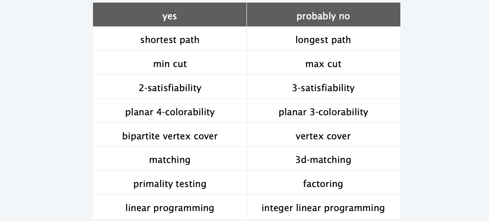
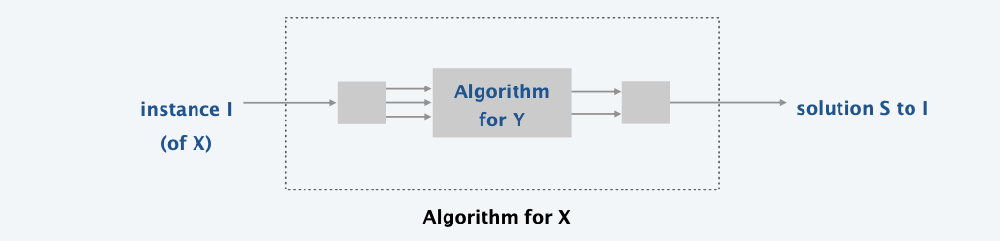
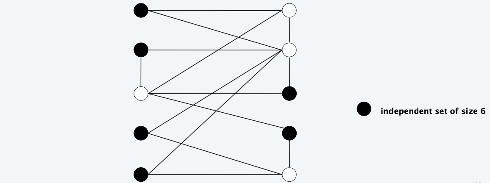
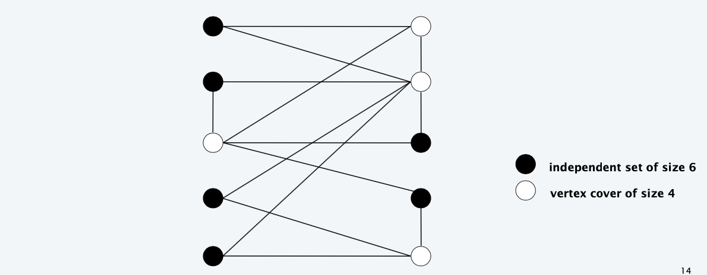
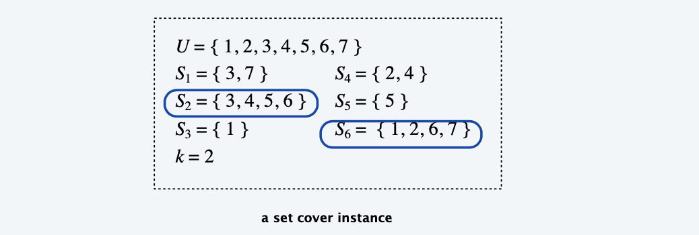
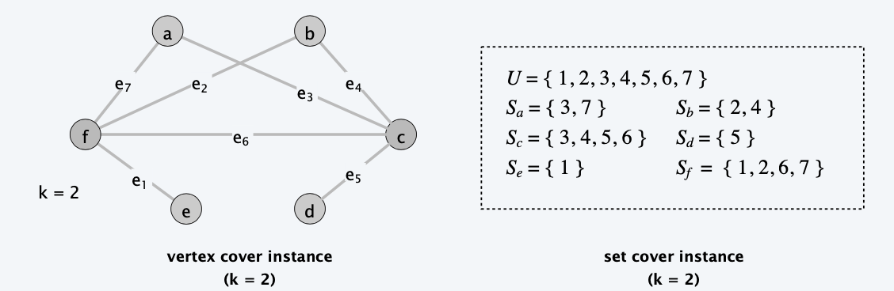
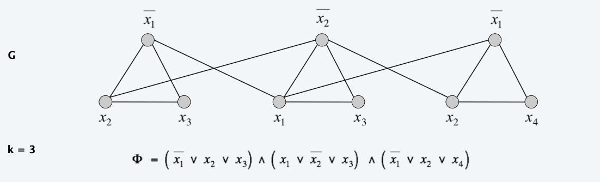

<!--more-->

[toc]

## Poly-time reductions

> Reduction: 规约

### Algorithm design patterns and antipatterns
- Algorithm design patterns.
  - Greedy.
  - Divide and conquer. 
  - Dynamic programming. 
  - Duality.
  - Reductions.
  - Local search. 
  - Randomization.
- Algorithm design antipatterns.
  - NP-completeness. $O(n^k)$ algorithm unlikely. 
  - PSPACE-completeness. $O(n^k)$ certification algorithm unlikely. 
  - Undecidability. No algorithm possible.

### Classify problems according to computational requirements

**Q**. Which problems will we be able to solve in practice?
**A working definition**. Those with polynomial-time algorithms.

**Theory**. Definition is broad and robust.
**Practice**. Poly-time algorithms scale to huge problems.

> 3 is a magic number

### Classic Problems

**Desiderata**. Classify problems according to those that can be solved in polynomial time and those that cannot.

**Provably requires exponential time.**
- Given a constant-size program, does it halt in at most k steps? 
- Given a board position in an n-by-n generalization of checkers, can black guarantee a win?

**Frustrating news**. Huge number of fundamental problems have defied classification for decades.

### Polynomial-time Reductions
> We can only gather these problems together
**Desiderata'**. Suppose we could solve X in polynomial-time. What else could we solve in polynomial time?

**Reduction**. Problem X **polynomial-time (Cook) reduces** to problem Y if arbitrary instances of problem X can be solved using:
- Polynomial number of standard computational steps, plus 
- Polynomial number of calls to oracle that solves problem Y.
  > In many cases, maybe call once is enough
> oracle: computational model supplemented by special piece of hardware that solves instances of Y in a single step

**Notation**. $X \le_{P} Y$.
**Note**. We pay for time to write down instances sent to oracle $\Rightarrow$
instances of Y must be of polynomial size. 

**Caveat**. Don't mistake $X \le_{P} Y$ with $Y \le_{P} X$

**Design algorithms**. 
- If $X \le_{P} Y$ and Y can be solved in polynomial time, then X can be solved in polynomial time.
- Establish intractability. If $X \le_{P} Y$ and X cannot be solved in polynomial time, then Y cannot be solved in polynomial time.
- Establish equivalence. If both $X \le_{P} Y$ and $Y \le_{P} X$ we use notation $X \mod_{P} Y$. In this case, X can be solved in polynomial time iff Y can be.

**Bottom line**. Reductions classify problems according to relative difficulty.

> We build the reduce relation for the following six sets of problems

## packing and covering problems 

### Independent Set

> Note the problem comes with a size $k$ and is a yes-or-no problem
**INDEPENDENT-SET**. Given a graph $G=(V, E)$ and an integer $k,$ is there a subset of vertices $S \subseteq V$ such that $|S| \geq k,$ and for each edge at most one of its endpoints is in $S ?$
> The greater k, the harder
Ex. Is there an independent set of size $\geq 6 ?$
Ex. Is there an independent set of size $\geq 7 ?$

### Vertex Cover

**VERTEX-COVER**. Given a graph $G=(V, E)$ and an integer $k,$ is there a subset of vertices $S \subseteq V$ such that $|S| \leq k$, and for each edge, at least one of its endpoints is in $S ?$
> The smaller k the harder
Ex. Is there a vertex cover of size $\leq 4 ?$
Ex. Is there a vertex cover of size $\leq 3 ?$

> Independ set and vertex cover are dual problems

### Vertex cover and independent set reduce to one another

**Theorem**. VERTEX-COVER $\equiv_{P}$ INDEPENDENT-SET.
**Pf**. We show $S$ is an independent set of size $k$ iff $V-S$ is a vertex cover
of size $n-k$
$\Rightarrow$
- Let $S$ be any independent set of size $k$.
- $V-S$ is of size $n-k$
- Consider an arbitrary edge $(u, v)$
- $S$ independent $\Rightarrow$ either $u \notin S$ or $v \notin S$ (or both)
  > by def of independent sets
  $\Rightarrow$ either $u \in V-S$ or $v \in V-S$ (or both).
  > Taking complement
- Thus, $V-S$ covers $(u, v)$
$\Leftarrow$
- Let $V-S$ be any vertex cover of size $n-k$
- $S$ is of size $k$
- Consider two nodes $u \in S$ and $v \in S$.
- Observe that $(u, v) \notin E$ since $V-S$ is a vertex cover.
- Thus, no two nodes in $S$ are joined by an edge $\Rightarrow S$ independent set.
> Proof by definition and basic set operation

### Set Cover

**SET-COVER**. Given a set $U$ of elements, a collection $S_{1}, S_{2}, \ldots, S_{m}$ of subsets of $U$, and an integer $k$, does there exist a collection of $\leq k$ of these sets whose union is equal to $U ?$
**Sample application**.
- $m$ available pieces of software.
- Set $U$ of $n$ capabilities that we would like our system to have.
- The $i^{t h}$ piece of software provides the set $S_{i} \subseteq U$ of capabilities.
**Goal**: achieve all $n$ capabilities using fewest pieces of software.

### Vertex Cover reduces to Set Cover

> Reverse, not, because in vertex cover, an edge has exactly 2 vertex, but in set cover, there is no such constraint.

**Theorem**. VERTEX-COVER $\leq_{P}$ SET-COVER.
**Pf**. Given a VERTEX-COVER instance $G=(V, E),$ we construct a SET-COVER
instance $(U, S)$ that has a set cover of size $k$ iff $G$ has a vertex cover of size $k$.

**Construction**.
- Universe $U=E$.
- Include one set for each node $v \in V: S_{v}=\{e \in E: e$ incident to $v\}$.

**Lemma**. $G=(V,E)$ contains a vertex cover of size $k$ iff $(U,S)$ contains a set cover of size $k$.
**Pf.** 
$\Rightarrow$ Let $X\subset V$ be a vertex cover of size $k$ in $G$.
- Then $Y = \{S_v: v\in X\}$ is a set cover of size k.
$\Leftarrow$ Let $Y\subset S$ be a set cover of size $k$ in $(U,S)$.
- Then $X = \{v: S_v\in Y\}$ is a vertex cover of size k.

## Constraint satisfaction problems 
> The core of intractability

### Satisfiability
**Literal**. A boolean variable or its negation.
$$
x_{i} \text { or } \bar{x}_{i}
$$

**Clause**. A disjunction of literals.
$$
C_{j}=x_{1} \vee \overline{x_{2}} \vee x_{3}
$$

**Conjunctive normal form**. A propositional formula $\Phi$ that is the conjunction of clauses.
$$
\Phi=C_{1} \wedge C_{2} \wedge C_{3} \wedge C_{4}
$$

**SAT**. Given CNF formula $\Phi$, does it have a satisfying truth assignment?

**3-SAT**. SAT where each clause contains exactly 3 literals (and each literal corresponds to a _different_ variable).
$$
\begin{array}{c}
\Phi=\left(\overline{x_{1}} \vee x_{2} \vee x_{3}\right) \wedge\left(x_{1} \vee \overline{x_{2}} \vee x_{3}\right) \wedge\left(\overline{x_{1}} \vee x_{2} \vee x_{4}\right) \\
\text { yes instance: } x_{1}=\text { true, } x_{2}=\text { true, } x_{3}=\text { false, } x_{4}=\text { false }
\end{array}
$$

**Key application.** Electronic design automation (EDA).
- Frontend Design, Synthesis

### 3-satisfiability reduces to independent set

**Theorem**. 3-SAT $\le_P$ INDEPENDENT-SET.
**Pf**. Given an instance $\Phi$ of 3-SAT, we construct an instance $(G, k)$ of INDEPENDENT-SET that has an independent set of size k iff $\Phi$ is satisfiable.

**Construction**.
- G contains 3 nodes for each clause, one for each literal. 
- Connect 3 literals in a clause in a triangle.
  > Clause is true $\iff$ any literal is true
  > Once one point is selected, the other set in the triangle needn't be selected
- Connect literal to each of its negations.
  > Once one assignment to a variable is selected, its negation mustn't be selected

**Lemma**. $G$ contains independent set of size $k=|\Phi|$ iff $\Phi$ is satisfiable.
**Pf**. $\Rightarrow$ Let $S$ be independent set of size $k$.
- $S$ must contain exactly one node in each triangle.
- Set these literals to true (and remaining variables consistently).
- Truth assignment is consistent and all clauses are satisfied.
**Pf**. $\Leftarrow$ Given satisfying assignment, select one true literal from each triangle. This is an independent set of size $k$

### Review
**Basic reduction strategies**.
- Simple equivalence: INDEPENDENT-SET $\equiv{ }_{P}$ VERTEX-COVER.
- Special case to general case: VERTEX-COVER $\leq_{P}$ SET-COVER.
- Encoding with gadgets: 3-SAT $\leq_{P}$ INDEPENDENT-SET.
  
**Transitivity**. If $X \leq_{P} Y$ and $Y \leq_{P} Z$, then $X \leq_{P} Z$.
**Pf idea**. Compose the two algorithms.

**Ex**. 3-SAT $\leq$ p INDEPENDENT-SET $\equiv_{P}$ VERTEX-COVER $\leq_{P}$ SET-COVER.
> If we prove 3-SAT is NP, then all the following problems will be NP

### Search Problems
**Decision problem**. Does there exist a vertex cover of size $\le$ k ? 
**Search problem**. Find a vertex cover of size $\le$ k.

**Ex**. To find a vertex cover of size $\leq k$ :
- Determine if there exists a vertex cover of size $\leq k$
- Find a vertex $v$ such that $G-\{v\}$ has a vertex cover of size $\leq k-1$ (any vertex in any vertex cover of size $\leq k$ will have this property)
- Include $v$ in the vertex cover.
- Recursively find a vertex cover of size $\leq k-1$ in $G-\{v\}$.

**Bottom line**. VERTEX-COVER $\equiv_P$ FIND-VERTEX-COVER.

### Optimization Problems
**Decision problem**. Does there exist a vertex cover of size $\le$ k ? 
**Search problem**. Find a vertex cover of size $\le$ k.
**Optimization problem**. Find a vertex cover of minimum size.

**Ex**. To find vertex cover of minimum size: 
- (Binary) search for size $k^*$ of min vertex cover. 
- Solve corresponding search problem.

**Bottom line**. VERTEX-COVER $\equiv_P$ FIND-VERTEX-COVER $\equiv_P$ OPTIMAL-VERTEX-COVER.

## Sequencing problems

## partitioning problems

## graph coloring

## numerical problems