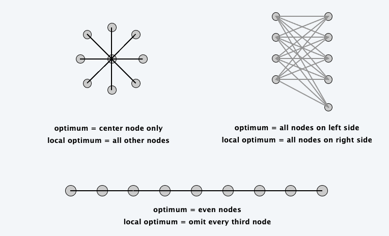

<!--more-->

[toc]

## gradient descent

### Vertex Cover

**Vertex cover**. Given a graph $G=(V, E),$ find a subset of nodes $S$ of minimal
cardinality such that for each $(u, v) \in E,$ either $u$ or $v$ (or both) are in $S .$

**Neighbor relation**. $S \sim S^{\prime}$ if $S^{\prime}$ can be obtained from $S$ by adding or deleting a single node. Each vertex cover $S$ has at most $n$ neighbors.

**Gradient descent**. Start with $S=V .$ If there is a neighbor $S^{\prime}$ that is a vertex
cover and has lower cardinality, replace $S$ with $S^{\prime}$.

**Remark**. Algorithm terminates after at most $n$ steps since each update decreases the size of the cover by one.

> A classical approach in neural network training

> We need to deal with local optimal, how to jump out of that?

> Local optimal may or may not differ a lot to true optimal

### Local Search

**Local search**.  Algorithm that explores the space of possible solutions in sequential fashion, moving from a current solution to a "nearby" one.

**Neighbor relation**.  Let $S \sim S'$ be a neighbor relation for the problem.

**Gradient descent**.  Let S denote current solution. If there is a neighbor S ' of S  with strictly lower cost, replace S with the neighbor whose cost is as small as possible. Otherwise, terminate the algorithm.

## Metropolis algorithm

- Simulate behavior of a physical system according to principles of statistical mechanics.
- Globally biased toward "downhill" steps, but occasionallymakes "uphill" steps to break out of local minima.

**Gibbs-Boltzmann function.** The probability of finding a physical system in a
state with energy $E$ is proportional to $e^{-E /(k T)},$ where $\mathrm{T}>0$ is temperature and $k$ is a constant.
- For any temperature $T>0,$ function is monotone decreasing function of energy $E$.
- System more likely to be in a lower energy state than higher one.
  - $T$ large: high and low energy states have roughly same probability
  - $T$ small: low energy states are much more probable

**Metropolis algorithm**.
- Given a fixed temperature $T,$ maintain current state $S$.
- Randomly perturb current state $S$ to new state $S^{\prime} \in N(S)$.
- If $E\left(S^{\prime}\right) \leq E(S),$ update current state to $S^{\prime}$. Otherwise, update current state to $S^{\prime}$ with probability $e^{-\Delta E /(k T)}$, where $\Delta E=E\left(S^{\prime}\right)-\mathrm{E}(\mathrm{S})>0$

> Better solution will always be taken
> Worse solution will have a probability of $e^{-\Delta E /(k T)}$ to be selected

**Theorem**. Let $f_{S}(t)$ be fraction of first $t$ steps in which simulation is in state $S .$ Then, assuming some technical conditions, with probability 1 :
$$
\begin{array}{l}
\lim _{t \rightarrow \infty} f_{S}(t)=\frac{1}{Z} e^{-E(S) /(k T)} \\
\text { where } Z=\sum_{S \in N(S)} e^{-E(S) /(k T)}
\end{array}
$$

**Intuition**. Simulation spends roughly the right amount of time in each state, according to Gibbs-Boltzmann equation.

> Problem: in Metropolis, T is fixed
> An improvement, from open to conservative

**Simulated annealing**.  
- T large $\Rightarrow$  probability of accepting an uphill move is large.
- T small  $\Rightarrow$  uphill moves are almost never accepted.
- Idea:  turn knob to control T.
- Cooling schedule:  $T = T(i)$ at iteration i.

**Physical analog.**
- Take solid and raise it to high temperature, we do not expect it to maintain a nice crystal structure.
- Take a molten solid and freeze it very abruptly, we do not expect to get a perfect crystal either.
- Annealing:  cool material gradually from high temperature, allowing it to reach equilibrium at succession of intermediate lower temperatures.

## Hopfield neural networks

## maximum cut

## Nash equilibria
