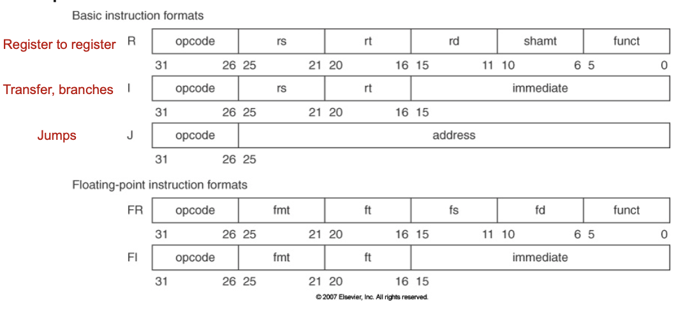

<!--more-->

[toc]

## Introduction

### Traditional Conventional Wisdom VS Modern CW

- Old: Power is free, transistors expensive
  New: **"Power wall"**, power expensive, transistors free
  (can put more on chip than can afford to turn on)
- Old: Instruction-level parallelism (throught compiler, instruction set)
  New: **"ILP wall"**
- Old: Multiplies slow, memory access is fast
  New: **Memory Wall**
- Old: Uniprocessor 2X/1.5yrs
  New: **Brick Wall**, 2X/5yrs -> multiple "cores"

### Limits to Pipelining

**Hazards** prevent next instruction from executing during its designated clock cycle
- Structural
- Data
- Control

### Principle of Locality
- temporal
- spatial
- cache

## Quantitative Principles of Computer Design

### Amdahl's Law
$$
\text{ExecutionTime}_{\text{new}} = \text{ExecutionTime}_{\text{old}} \times \left[ \left(1 - \text{Fraction}_{\text{enhanced}} \right) + \frac{\text{Fraction}_\text{enhanced}}{\text{SpeedUp}_\text{enhanced}} \right]
$$

> Example
> I/O bound server, CPU 10x faster, only provides 1.6x boost
> $$
> \begin{aligned}
> \text { Speedup }_{\text {overall }} &=\frac{1}{\left(1-\text { Fraction }_{\text {enhanced }}\right)+\frac{\text { Fraction }_{\text {enhanced }}}{\text { Speedup }_{\text {enhanced }}}} \\
> &=\frac{1}{(1-0.4)+\frac{0.4}{10}}=\frac{1}{0.64}=1.56
> \end{aligned}
> $$

### Processor performance equation

$$
\text{CPU Time} = \frac{\text{Seconds}}{\text{Program}} = \frac{\text{Instructions}}{\text{Program}} \times \frac{\text{Cycles}}{\text{Instruction}} \times \frac{\text{Seconds}}{\text{Cycle}}
$$
  Parts | Instr Cnt | CPI | Clock Rate
---------|----------|--------- | ---
 Program | X |  | 
 Compiler | X | (X) |
 Instr Set | X | X | 
 Organization | X | | X
 Technology | | | X

$$
\begin{array}{ll}
\text { CPU time }=\text { CPU clock cycles for a program } \times \text { Clock cycle time } &\\
\text { CPU time }=\frac{\text { CPU clock cycles for a program }}{\text { Clock rate }} &\\
\text { CPI }=\frac{\text { CPU clock cycles for a program }}{\text { Instruction count }} \quad \text{(useful if we only want to compare CPU performace)} &\\
\text { CP time = Instruction count } \times \text { Cycles per instruction } \times \text { Clock cycle time }&
\end{array}
$$

## Computer Architecture

### Parallelism
- Classes of parallelism in applications: 
  - Data-Level Parallelism (DLP)
  - Task-Level Parallelism (TLP)
- Classes of architectural parallelism:
  - Instruction-Level Parallelism (ILP)
  - Vector architectures/Graphic Processor Units (GPUs)
  - Thread-Level Parallelism 
  - Request-Level Parallelism

### Flynn's Taxonomy
focus on the relationship between instruction-strem & data-stream
- SISD: single i-stream, single d-stream
  - ILP
- SIMD
  - GPU
- MISD (no commercial implementation)
- MIMD
  - Tightly-coupled
  - Loosely-coupled

### Instruction Set Architecture
- interface of sw & hw
- difference with OS?
  - OS deals with runtime interface, while ISA deals with design-time interface
  - OS is the manager (cooperation), ISA is the technician (exploit the performance)
- Properties of an ISA
  - portability, as for hardware
  - generality, as for software
  - efficient implementation at lower levels
  - convenient functionality to higher levels

### What to define in ISA
MIPS as example
- data types
- instruction format
  - 
- addressing modes
- programmable storage:
  - $2^{32} x$ bytes
  - 31 32-bit General Purpose Registers (r0=0)
  - 31 32-bit Float-point registers
  - HI LO PC

