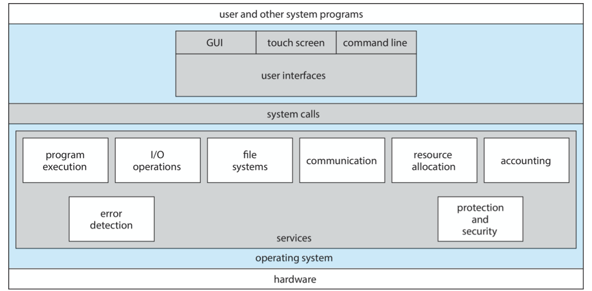
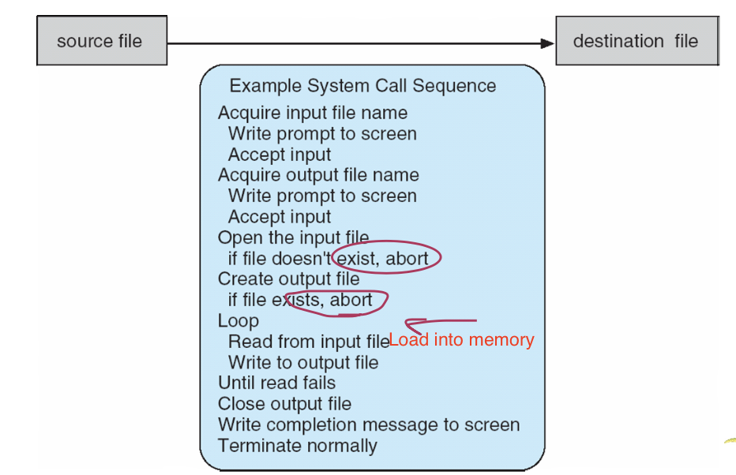
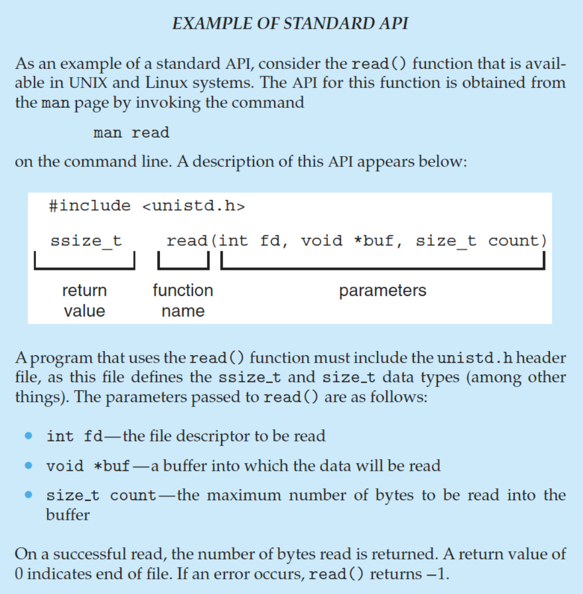
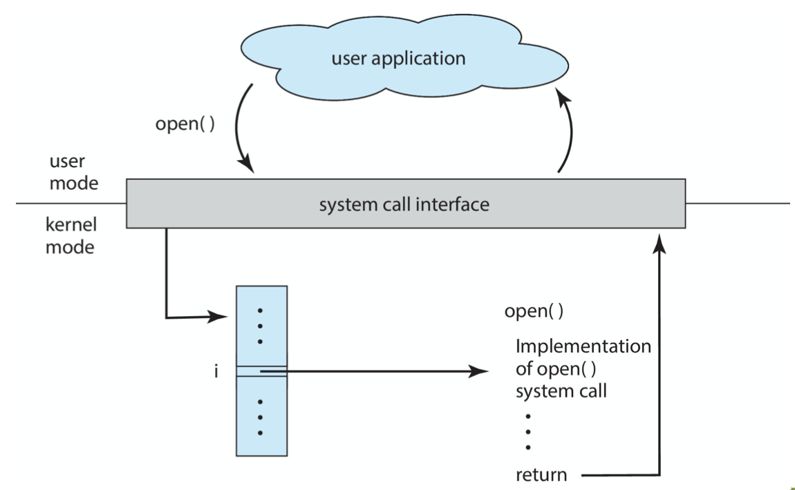
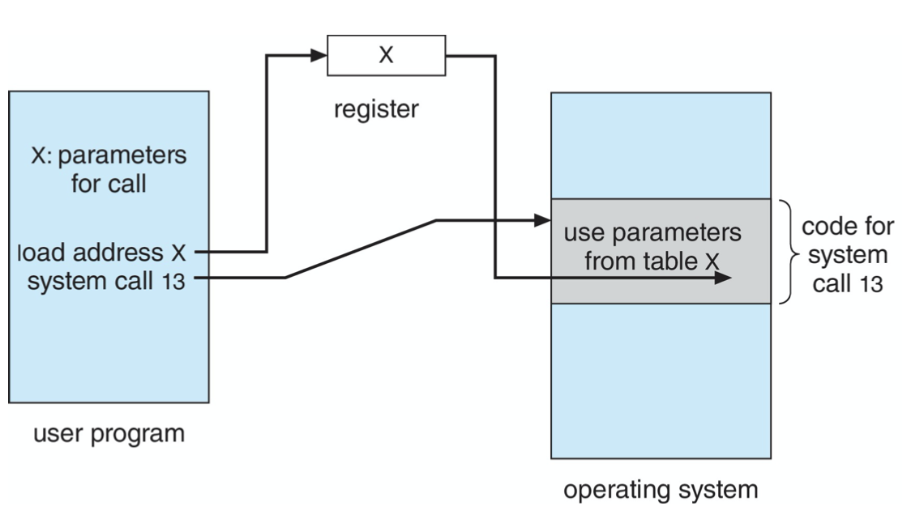

- Identify **services** provided by an operating system
- Illustrate how **system calls** are used to provide operating system services
- Compare and contrast monolithic单体, layered分层, microkernel微内核, modular, and hybrid **strategies for designing operating systems**
- Illustrate the process for **booting** an operating system
- Apply **tools for monitoring** operating system performance
- Design and implement kernel modules for interacting with a Linux kernel
 

<!--more-->

[toc]

## Operating System Services

Functions that are **helpful to user**
- **User interface** - Almost all operating systems have a user interface (UI).
  - Varies between Command-Line (CLI), Graphics User Interface (GUI), touch-screen, Batch
- **Program execution** - The system must be able to load a program into memory and to run that program, end execution, either normally or abnormally (indicating error)
- **I/O operations** - A running program may require I/O, which may involve a file or an I/O device
- **File System Manipulation**
- **Communications** between users/processes
- **Error Detection**  OS needs to be constantly aware of possible errors
  - May occur **in the CPU and memory hardware** *(especially for memories. 'Assuming every hardware functions 100% well' is A typical pitfall among most programmers)*, in I/O devices, in user program
  - For each type of error, OS should take the appropriate action to ensure correct and consistent computing
  - **Debugging facilities** (*requires OS support*) can greatly enhance the user’s and programmer’s abilities to efficiently use the system
 

Functions that ensure the **efficient operation** of the system iteself via *resource sharing*

- **Resource allocation** - When multiple users or multiple jobs running concurrently, resources must be allocated to each of them
  - Many types of resources - CPU cycles, main memory, file storage, I/O devices.
- **Logging** - To keep track of which users use how much and what kinds of computer resources
- **Protection and security** - The owners of information stored in a _multiuser_ or networked computer system may want to control use of that information, concurrent processes should _not interfere_ with each other
  - Protection involves ensuring that all access to system resources is controlled
  - Security of the system from outsiders requires user authentication, extends to defending external I/O devices from invalid access attempts

## System Calls

- Programming interface to the services provided by the OS
- Typically written in a high-level language (C or C++)
- Mostly accessed by programs via a high-level **Application Programming Interface (API)** rather than direct system call use
  - Win32 API for windows
  - POSIX API for POSIX-based systems (all UNIX/Linux/Mac OS X)
  - Java API for JVM
- Note that the system-call names used throughout this text are generic

### Programmer's Perspective: An Example
`cp` sequence:

### Insider's Perspective: Implementation

- **System-call interface** maintains a table indexed according to the numbers associated with each system call.
- The system-call interface **invokes** the intended system call in OS kernal and returns status (success/failure code) of the call + return values
- Most details of OS interface hidden from programmer by API
  - managed by run-time support library (included with compiler)

### Parameter Passing
- simplest: through registers
- stored in memory, address through registers
- through stack

### Types of System Calls
- Process control (创建、终止、中断、恢复、数据，获取进程属性，等待、内存管理、出错dump，**debugger (single step execution)**，locks)
- File Management (读写、属性)
- Device Management （request & release, read and write, attributes）
- Information Maontenance (date, time, system attribute)
- Communications (link & unlink, **shared-memory model**)
- Protection (access, deny & allow)

## System Services

## Linkers and Loaders

## Why Applications are Operating System Specific 

## Operating-System Design and Implementation 

## Operating System Structure

## Building and Booting an Operating System

## Operating System Debugging