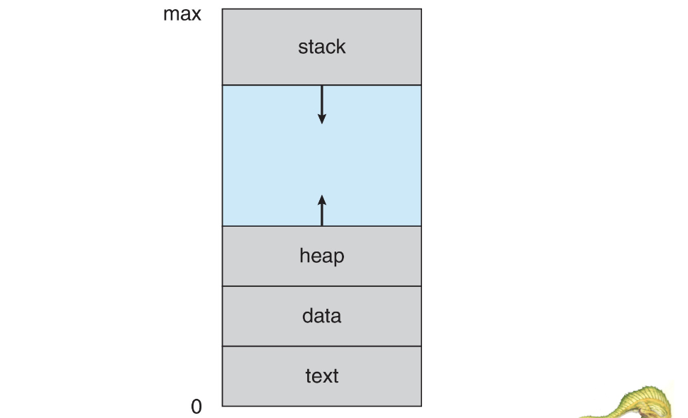
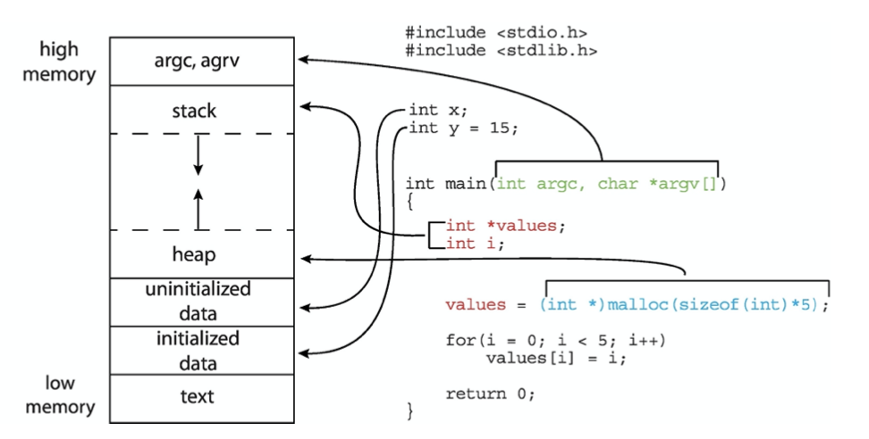
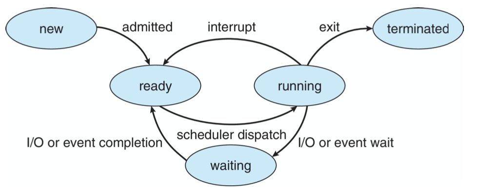
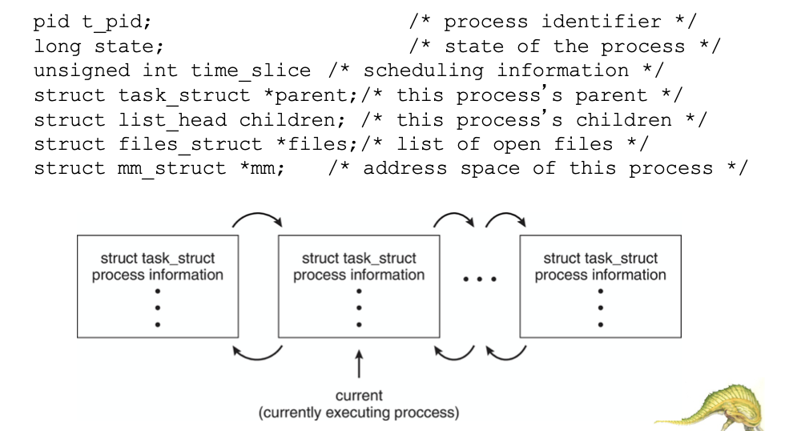
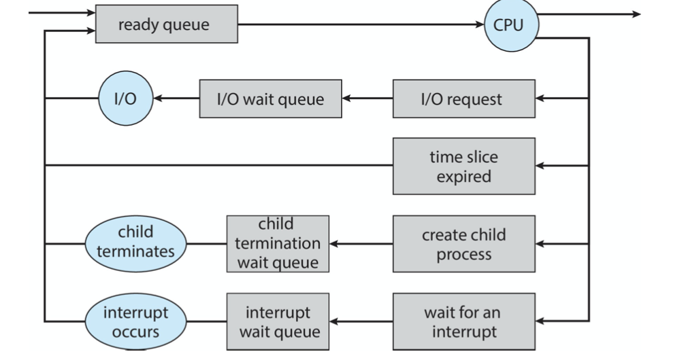
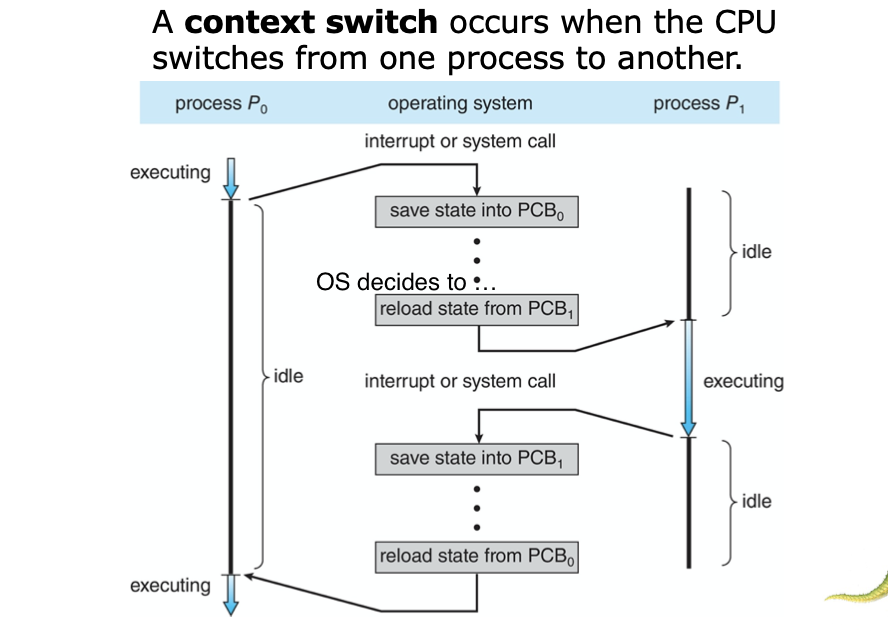
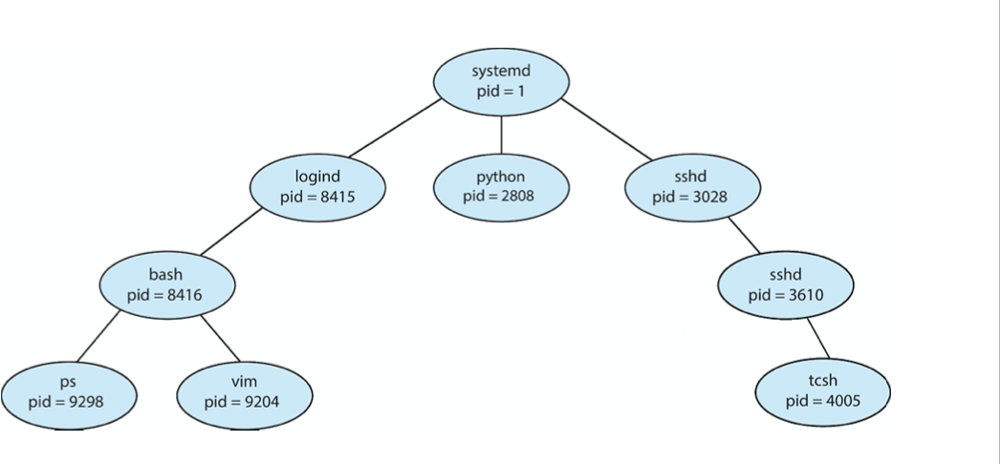
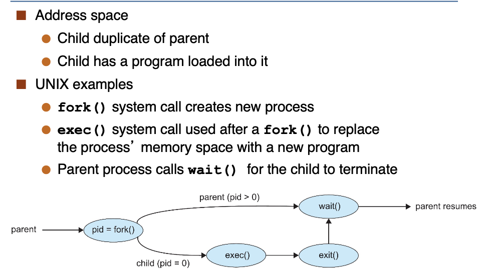
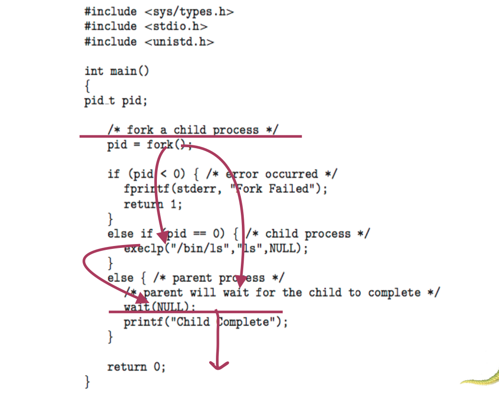
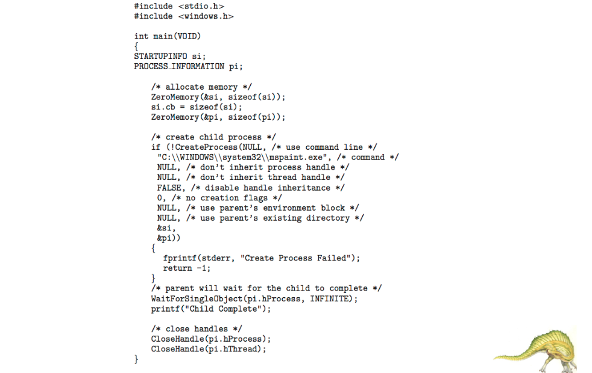

<!--more-->

[toc]

## Process Concept

- **Process** - a program in execution, must progress in sequential fashion
  > A dynamic concept
- Compositions
  - **text section** the program code
  - current activity such as **program counter**, registers
  - **Stack** containing temporary data
    - args, ret add, local vars
  - **Data section** containing global variables
  - **Heap** containing memory dynamically allocated during run time

- Program is passive entity stored on disk **(executable file)**; process is **active**
  - Program becomes process when executable file loaded into memory
- Execution of program started via GUI mouse clicks, command line entry of its name, etc.
- One program can be several processes
  - Consider multiple users executing the same program

### Memory Layout of a process

> The more related to user-defined program, the higher its addresses are.
> Since stack and heap data are determined during runtime, such implementation can avoid overflow AMAP

### Process State
> It is necessary for us to know the status of the process to manage them well

- As a process executes, it changes state
  - New: The process is being created
  - Running: Instructions are being executed
  - Waiting: The process is waiting for some event to occur
    > waiting for I/O, interrupts, ... (to notify that CPU doesn't need to schedule me)
  - Ready: The process is waiting to be assigned to a processor
    > To tell CPU to schedule
  - Terminated: The process has finished execution

> The only entry to running is that CPU schedules the process from ready state

### Process Control Block

Information associated with each process (also called **task control block**)
- Process state – running, waiting, etc
- Program counter – location of instruction to next execute
- CPU registers – contents of all process- centric registers
- CPU scheduling information- priorities, scheduling queue pointers
- Memory-management information – memory allocated to the process
  > No overlap between processes
- Accounting information – CPU used, clock time elapsed since start, time limits
- I/O status information – I/O devices allocated to process, list of open files

> Note the difference between **THREADS** and **PROCESSES**

### Threads
- Consider having _multiple program counters_ per process
- So far, process has a single thread of execution
  - Multiple locations can execute at once
    - Multiple threads of control -> threads
- Must then have storage for thread details, multiple program counters in PCB
- Explore in detail in Chapter 4

### Process Representation in Linux

> `*parent` e.g. `CUI`,`GUI`, etc
> The scheduling algorithm will run based on the information above

## Process Scheduling

- Maximize CPU use, quickly switch processes onto CPU core
- **Process scheduler** selects among available processes for next execution on CPU core
- Maintains **scheduling queues** of processes
  - **Ready queue**– set of all processes residing _in main memory, ready and waiting to execute_
  - **Wait queues** – set of processes waiting for an event (i.e. I/O)
  - Processes migrate among the various queues
> Implemented in Linked-lists of `struct task_struct`

> The algorithm may look through the queue, find the next process to dispatch (e.g. process that has run the least of time)

> Such patterns apply to a variety of strategies, such as parent-child processes, interrupts
> Alternate implementation is that we can maintain multiple types of queues (e.g. IO queue, ...)

### Context Switch

> CPU switch will creates overhead (idling)
> don't abuse switch

- The more complex the OS and the PCB $\implies$ the longer the context switch
> Beacuse the load/store PCB information will increase
> Some (microkernel-) OS will reduce the scale of kernel, to improve performance, so that less information can be maintained about the switching context

- Time dependent on hardware support
  - Some hardware provides multiple sets of registers per CPU $\implies$ multiple contexts loaded at once
    > Essential for multi-x systems

### Multitasking on Mobile Systems

- Some mobile systems (e.g., early version of iOS) allow only one process to run, others suspended
- Due to screen real estate, user interface limits iOS provides for 
  - Single foreground process- controlled via user interface
  - Multiple background processes– in memory, running, but not on the display, and with limits
  - Limits include single, short task, receiving notification of events, specific long-running tasks like audio playback
- Android runs foreground and background, with fewer limits
  - Background process uses a service to perform tasks
  - Service can keep running even if background process is suspended
  - Service has no user interface, small memory use

## Operations on Processes

### Process Creation

- **Parent** process create **children** processes, which, in turn create other processes, forming a **tree** of processes
- Generally, process identified and managed via a **process identifier (pid)**
- Resource sharing options
  > Different OS has different options
  - Parent and children share all resources
  - Children share subset of parent’s resources 
  - Parent and child share no resources
- Execution options
  > Similarly, options
  - Parent and children execute concurrently
  - Parent waits until children terminate

> Linux will handle memory allocation in `fork()`, while windows doesn't

### Process Termination

- Process executes last statement and then asks the operating system to delete it using the `exit()` system call.
  - Returns status data from child to parent (via `wait()`)
  - Process’ resources are deallocated by operating system
- Parent may terminate the execution of children processes using the `abort()` system call. Some reasons for doing so:
  - Child has exceeded allocated resources
  - Task assigned to child is no longer required
  - The parent is exiting and the operating systems does not allow a child to continue if its parent terminates

## Interprocess Communication

## IPC in Shared-Memory Systems

## IPC in Message-Passing Systems

## Examples of IPC Systems

## Communication in Client-Server Systems