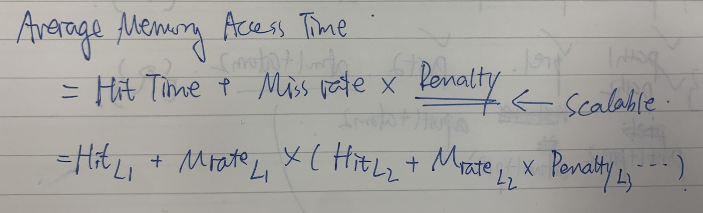
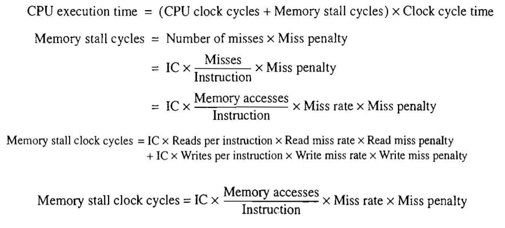

<!--more-->

[toc]

## Introduction
1. Programmers want unlimited amounts of memory with low latency
2. Fast memory technology is more expensive per bit than slower memory
3. Solution: organize memory system into a hierarchy
4. Temporal and spatial locality insures that nearly all references can be found in smaller memories

- Memory Performance Gap
- Memory hierarchy design becomes more crucial with recent multi-core processors
  - 400 GB/s CPU bandwidth VS 25GB/s DRAM bandwidth
- Power and Performance
  - High-end microprocessors have >10 MB on-chip cache
  - Consumes large amount of area and power budget
  > The larger the cache, the more power required

## Memory Hierarchy Basics

- When a word is not found in the cache, a miss occurs:
  - Fetch word from lower level in hierarchy, requiring a higher latency reference
  - Lower level may be another cache or the main memory
  - Also fetch the other words contained within the block
    - Takes advantage of spatial locality
  - Place block into cache in any location within its **set** *(groups of blocks to facilitate indexing)*, determined by address
    - block address MOD number of sets

- Block Organization
  - n sets => n-way set associative
  - Direct-mapped cache => one block per set 
  - Fully associative => one set
  > Typically, within set, fully associative

- Writing to cache: two strategies
  > Cache coherence
  - Write-through
    - Immediately update lower levels of hierarchy
  - Write-back
    - Only update lower levels of hierarchy when an updated block is replaced
  - Both strategies use **write buffer** to make writes asynchronous

- Miss rate
  - Fraction of cache access that result in a miss

- Causes of misses 
  - **Compulsory** First reference to a block 
  - **Capacity** Blocks discarded and later retrieved
  > come with compulsory miss
  - **Conflict** Program makes repeated references to multiple addresses from different blocks that map to the same location in the cache

$$
\frac{Misses}{Instructions} = \frac{MissRate\times TotalMemoryAccessCnt}{InstructionCount} = MissRate\times  \frac{MemoryAccess}{Instruction} (\leftarrow \text{can be statically analyzed})
$$

Note that speculative and multithreaded processors may execute other instructions during a miss

