<!--more-->

[toc]

## Overview

### Motivation
- Most modern applications are multithreaded
- Threads run within application
- Multiple tasks with the application can be implemented by separate threads
  - Update display
  - Fetch data
  - Spell checking
  - Answer a network request
- Process creation is heavy-weight while thread creation is light-weight
> Chrome uses process to switch tabs, process is a heavier concept than thread
> Thousands of threads are OK, but not for process
- Can simplify code, increase efficiency
> To program processes, a lot more will need to be dealt with
- Kernels are generally multithreaded

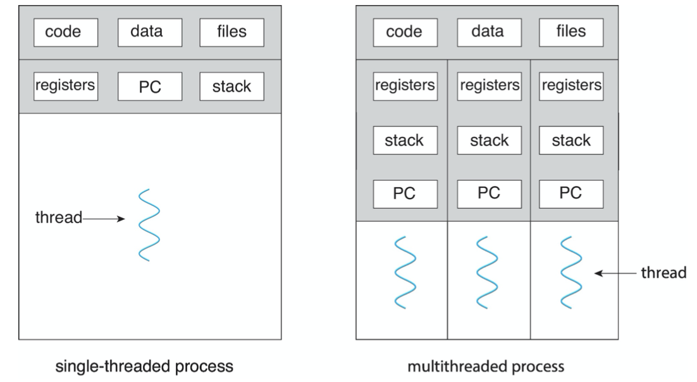
> One major reason why thread is lighter than process is that more things are shared
> e.g. code, data, files.
> Recall: shared memory model VS message passing

For web servers, multi-threading is a must
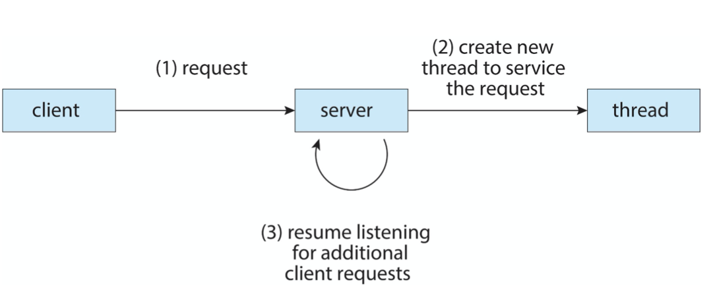

### Benefits

- Responsiveness – may allow continued execution if part of process is blocked, especially important for user interfaces
  > e.g. for a multi-thread process, it will not easily get stuck
- Resource Sharing – threads share resources of process, easier than shared memory or message passing
- Economy – cheaper than process creation, thread switching lower overhead than context switching
- Scalability – process can take advantage of multicore architectures

## Multicore Programming

- **Multicore** or **multiprocessor** systems putting pressure on programmers, challenges include:
  - Dividing activities
  - Balance
  - Data splitting
  - Data dependency
  - Testing and debugging


### Concurrency VS Parallelism
- **Parallelism** implies a system can perform more than one task simultaneously
- **Concurrency** supports more than one task making progress 描述多个任务同时演进的现象，物理上可能不是同时执行
  - Single processor / core, scheduler providing concurrency
- Concurrent execution on single-core system
  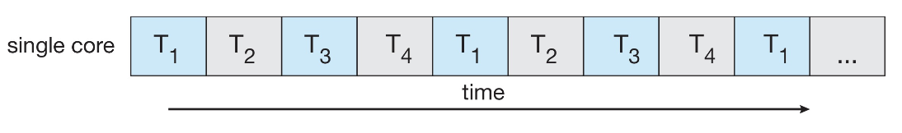
- Parallelism on a multi-core system
  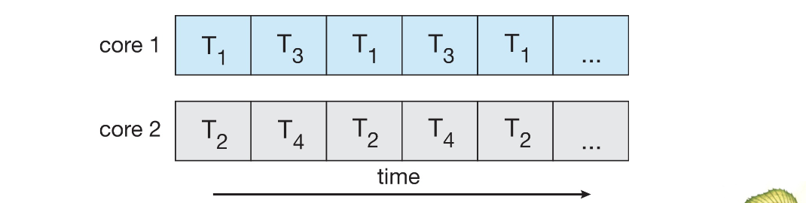


### Types of Parallelism
> Remember, the instructions should be similar in parallelism
- Data parallelism – distributes subsets of the same data across multiple cores, same operation on each
- Task parallelism – distributing threads across cores, each thread performing unique operation
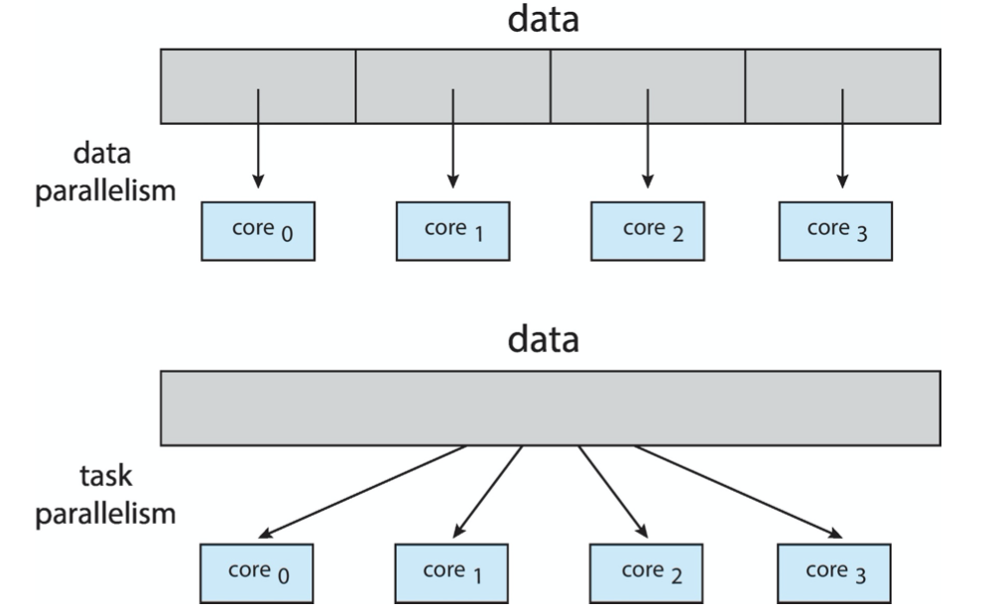

### Amdahl's Law

- Identifies performance gains from adding additional cores to an application that has both serial and parallel components
- $S$ is serial portion
- $N$ processing cores
  $$
  speedup \le \frac{1}{S+\frac{1-S}{N}}
  $$
- That is, if application is $75\%$ parallel / $25\%$ serial, moving from 1 to 2 cores results in speedup of $1.6$ times
- As $N$ approaches infinity, speedup approaches $\frac{1}{S}$
  > A promising search area, use DNN(highly-parallelized) to reduce the serial portion(especially with random or probabilistic outputs) of an application
> Serial portion of an application has disproportionate effect on performance gained by adding additional cores
- But does the law take into account contemporary multicore systems?
   
### User Threads and Kernel Threads
- **User threads** - management done by user-level threads library
- Three primary thread libraries:
  - POSIX Pthreads
  - Windows threads
  - Java threads
- **Kernel threads** - Supported by the Kernel
- Examples – virtually all general purpose operating systems, including:
  - Windows 
  - Linux
  - MacOSX 
  - iOS
  - Android

## Multithreading Models
> User and kernel threads run in separate spaces, but **how they interact with each other**?
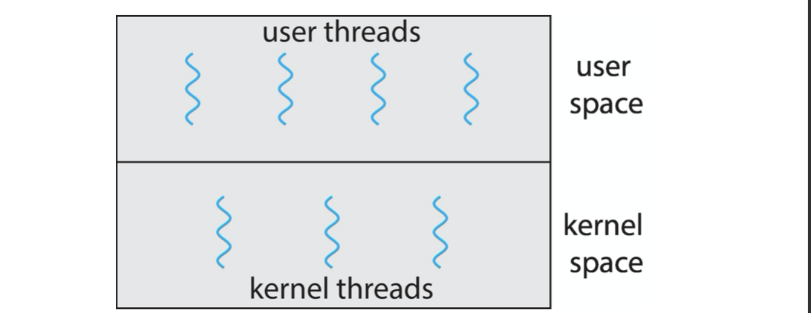

### Many-to-One 

- Many user-level threads mapped to single kernel thread
- One thread blocking **causes all to block**
- Multiple threads may not run in parallel on muticore system because only one may be in kernel at a time
- **Few** systems currently use this mode
> Despite simplicity in implementation, it fails to make use of the parallelisim provided by the OS
- Examples:
  - Solaris Green Threads 
  - GNU Portable Threads

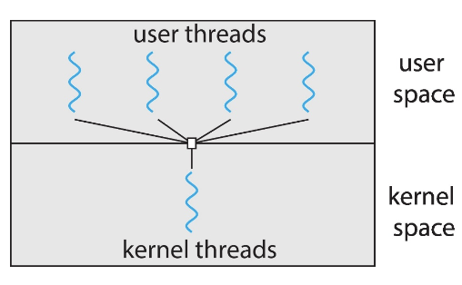

### One-to-One

- Each user-level thread maps to kernel thread
- Creating a user-level thread creates a kernel thread
- More concurrency than many-to-one
- Number of threads per process sometimes restricted due to overhead
- Examples
  - Windows 
  - Linux
> Risk: user can create as many threads as they want, which may become an overhead to system

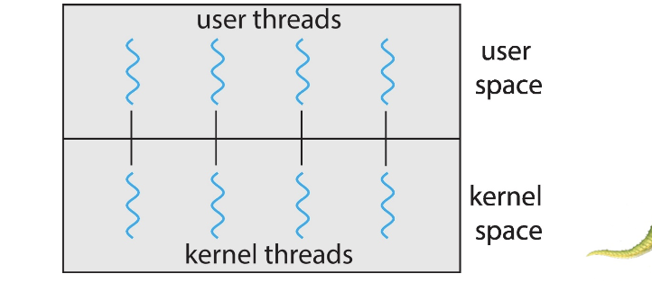

### Many-to-Many
- Allows many user level threads to be mapped to many kernel threads
  > Thread Pool
- Allows the operating system to create a sufficient number of kernel threads
  > OS create kernel threads as it demands, restrict the total number of use by user threads
- Windows with the *ThreadFiber* package
- Otherwise not very common

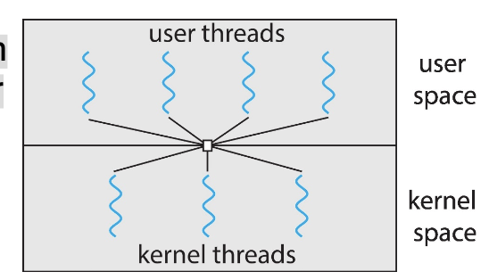

### Two Level Model

Similar to M:M, except that it allows a user thread to be bound to kernel thread

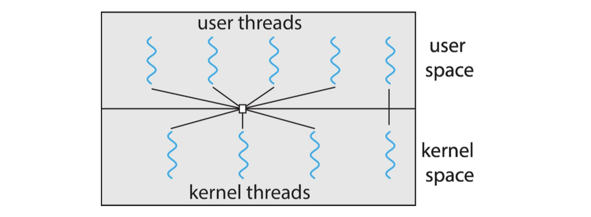


## Thread Libraries


- **Thread library** provides programmer with API for creating and managing threads
- Two primary ways of implementing
  - Library entirely in user space
  - Kernel-level library supported by the OS

### PThreads

- May be provided **either as user-level or kernel-level**
- A POSIX standard (IEEE 1003.1c) API for thread creation and synchronization
- **Specification, not implementation**
- API specifies behavior of the thread library, implementation is up to development of the library
- Common in UNIX operating systems (Linux & Mac OS X)

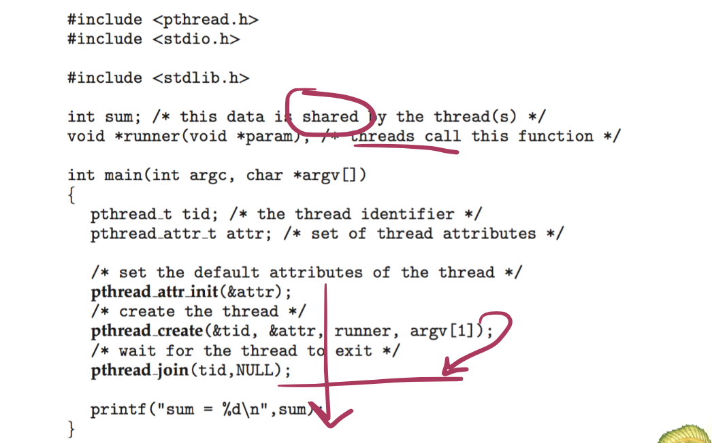
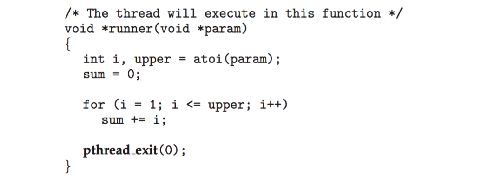

#### Generate multiple threads

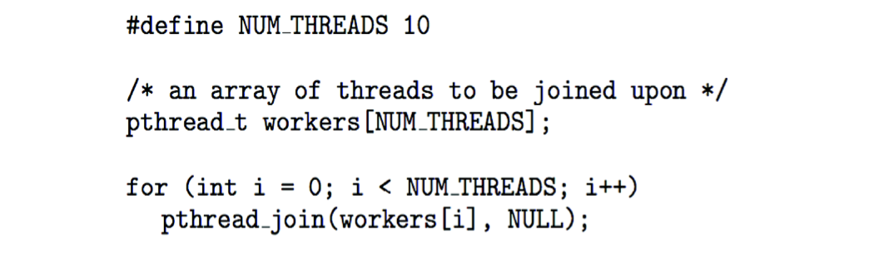

### Java Threads

- Java threads are managed by the JVM
- Typically implemented using the threads model provided by underlying OS
- Java threads may be created by:
  - Extending Thread class
  - Implementing the Runnable interface
    ```Java
    public interface Runnable
    {
        public abstract void run()
    }
    ```
  - Standard practice is to implement Runnable interface

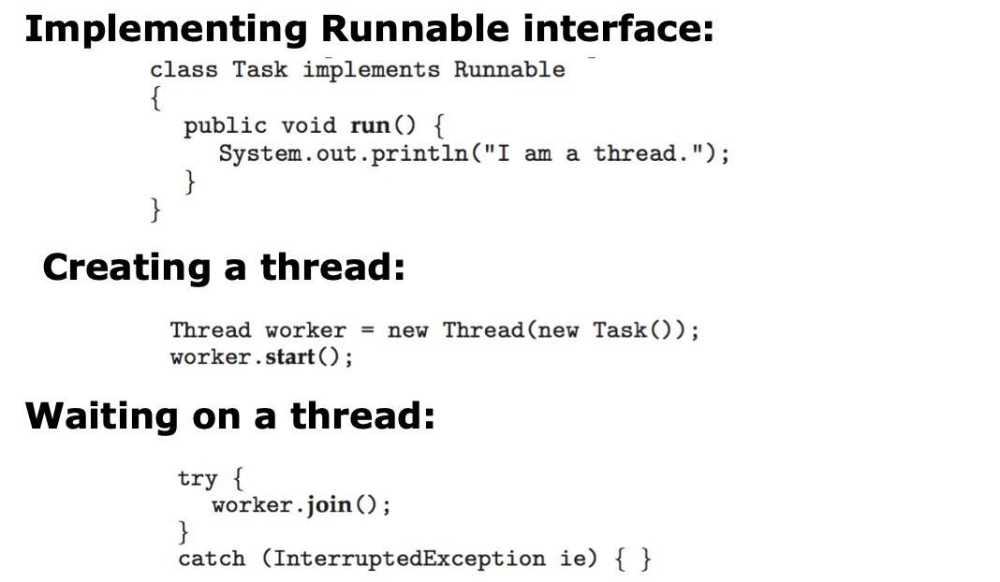

### Java Executor Framework
> Implicit multi-thread programming
- Rather than explicitly creating threads, Java also allows thread creation around the Executor interface:
  ```Java
  public interface Executor
  {
      void execute (Runnable command)l
  }
  ```
- The Executor is used as follows:
  ```Java
  Executor service = new Executor;
  service.execute(new Task());
  ```

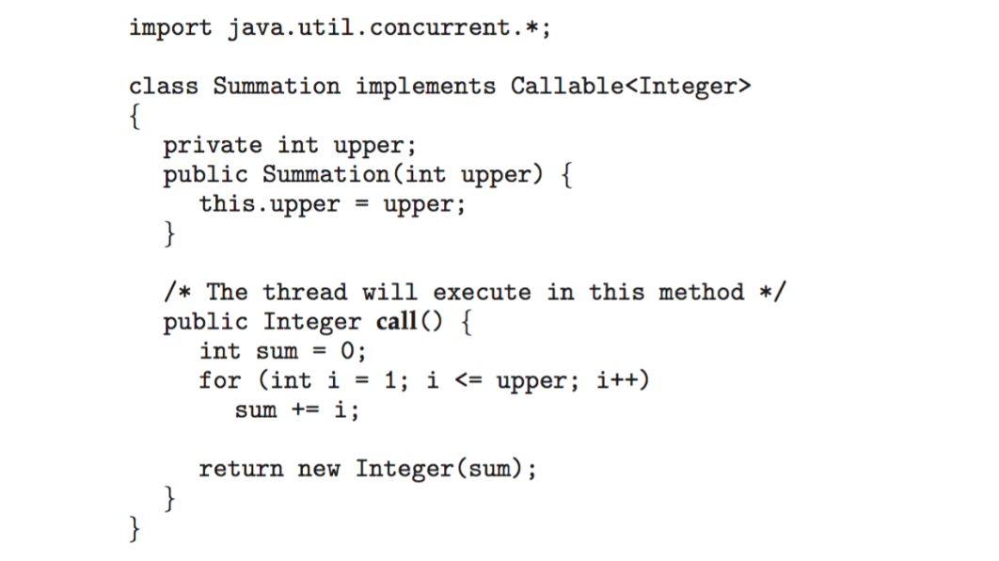

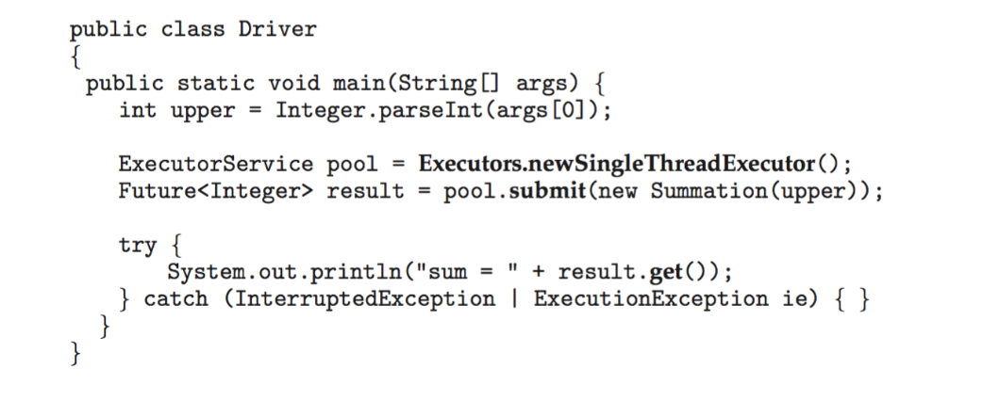

## Implicit Threading

> To ensure safety, many libraries have been created to pack multi-threading, instead of programming with `pthread` from scratch, several libraries are provided as follows

- Growing in popularity as numbers of threads increase, program correctness more difficult with explicit threads
- Creation and management of threads done by compilers and run-time libraries rather than programmers
- Five methods explored 
  - Thread Pools
  - Fork-Join
  - OpenMP
  - Grand Central Dispatch
  - Intel Threading Building Blocks

### Thread Pools

- Create a number of threads in a pool where they **await** work
  > threads are precreated, might get better performance
- Advantages:
  - Usually **slightly faster** to a service a request with anexisting thread than creating a new thread
  - Allows the number of threads to be **bound** by the size of the pool
  - separating task to be performed from mechanics of creating task allows **different strategies** for running task
    - i.e.Tasks could be scheduled to run periodically
- Example:
  - Windows API
    
  - Java Thread Pools
    
    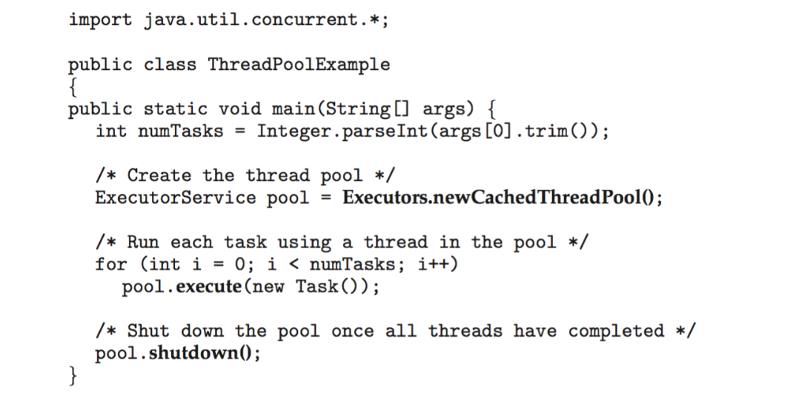


## Threading Issues


## Operating System Examples