<!--more-->

[toc]

## Basic Concepts

- Maximum CPU utilization obtained with multiprogramming
- CPU–I/O Burst Cycle – Process execution consists of a **cycle** of CPU execution and I/O wait
- **CPU burst** followed by **I/O burst**
- CPU burst distribution is of main concern

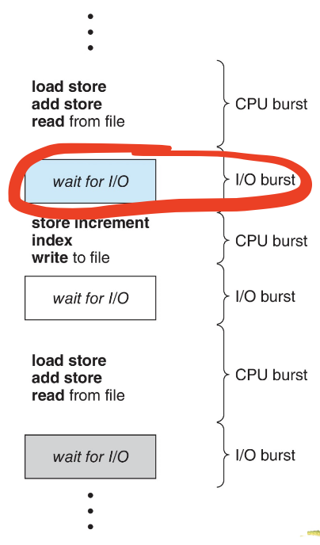

Histogram of CPU-burst Times(连续使用的时间)
- **Large** number of **short** bursts 
- Small number of longer bursts

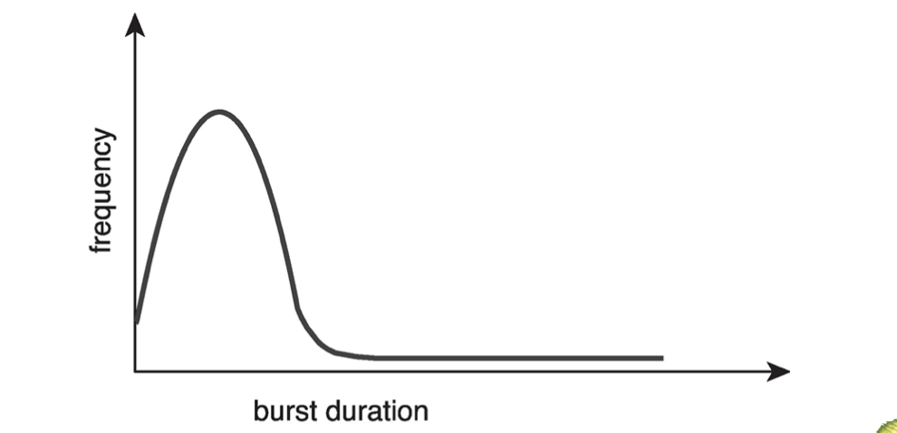

### CPU Scheduler
- The CPU scheduler selects from among _the processes in ready queue,_ and allocates the a CPU core to one of them
  - Queue may be ordered in various ways
- CPU scheduling _decisions may take place_ when a process:
  1. Switches from running to waiting state 
  2. Switches from running to ready state 
  3. Switches from waiting to ready
  4. Terminates
- Scheduling under 1 and 4 is **nonpreemptive** (非抢占式)
- All other scheduling is **preemptive** (抢占式)
  - Consider access to shared data
  > update to a half, and is scheduled away
  > we should consider the cosistency of the data shared (for other processes, the data may be reached incomplete)
  - Consider preemption while in kernel mode
  > interrupting critical processes may cause risks
  - Consider interrupts occuring during crucial OS activities
> We will discuss preemptive techniques in the next chapter

### Dispatcher

- Dispatcher module gives control of the CPU to the process selected by the short- term scheduler; this involves:
  - Switching Context
  - Switching to User Mode
  - jumping to proper location in the user program to restart that program
- **Dispatch latency** – time it takes for the dispatcher to stop one process and start another running
  > During which period, the CPU is not doing any job

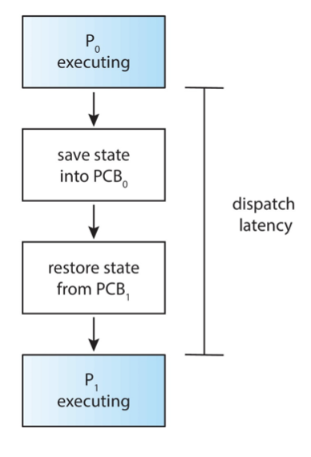

## Scheduling Criteria

> Globally, maximize ...
- **CPU utilization** – keep the CPU as busy as possible
  > By checking CPU profile
- **Throughput** – # of processes that complete their execution per time unit
  > In OS scenerio, particular def here

> The following criteria are w.r.t. Process, to minimize....
- **Turnaround time** – amount of time to execute a particular process
  > At least the program time, may be larger due to other reasons
- **Waiting time** – amount of time a process has been waiting **in the ready queue**
  > The waiting time for IO is NOT counted
- **Response time** – amount of time it takes from when a request was submitted until the first response is produced, not output (for time-sharing environment)
> Turnarount time and response time are usually counted in time chips 时间片

### Scheduling Algorithm Optimization Criteria
- Max CPU utilization 
- Max throughput
- Min turnaround time 
- Min waiting time
- Min response time (variance > avarage)

## Scheduling Algorithms

### First-Come, First-Served (FCFS) Scheduling

Process | Burst Time
----- | ------
$P_1$ | 24
$P_2$ | 3
$P_3$ | 3

Suppose that the processes arrive in the order: $P_1 , P_2 , P_3$
- Waiting time for $P_1 =0;P_2 =24;P_3=27$
- Average waiting time: $(0 + 24 + 27)/3 = 17$

Suppose that the processes arrive in the order: $P_2 ,P_3 ,P_1$
- Waitingtime for $P_1=6;P_2 =0;P_3=3$
- Average waiting time: $(6 + 0 + 3)/3 = 3$
- Much better than previous case
- **Convoy effect** - short process behind long process
  - Consider one CPU-bound and many I/O-bound processes
  - Troublesome for interactive system
  > In interactive systems, it is usually composed with a very long CPU burst and many short IO bursts.

### Shortest-Job-First (SJF) Scheduling

> Unlike CS222, the optimization goal here is ... the average waiting time, and can be solved in a greedy way.

- Associate with each process the length of its next CPU burst 
  - Use these lengths to schedule the process with the shortest time
- SJF is optimal – gives minimum average waiting time for a given set of processes
  - The difficulty is knowing the length of the next CPU request
  - Could ask the user

Process | Arrival Time | Burst Time 
----- | ------ | -----
$P_1$ | 0 | 6
$P_2$ | 2 | 8
$P_3$ | 4 | 7
$P_4$ | 5 | 3

- Schedule: 1, 4, 3, 2
- Average Waiting Time: $(0 + 1 + 5 + 14) / 4 = 5$

> In practice, challenges are that we don't know the coming time of the next request, or even know the length of the request

### Shortest Remaining Time First

#### Determining Length of Next CPU Burst

- Can only estimate the length - should be similar to the previous one
  - Then pick process with shortest predicted next CPU burst
  > Which is rather inaccurate
- Can be done by using the length of previous CPU bursts, using **exponential averaging**
  > To eliminate sawtooth
  1. $t_{n}=$ actual length of $n^{t h}$ CPU burst
  2. $\tau_{n+1}=$ predicted value for the next CPU burst
  3. $\alpha, 0 \leq \alpha \leq 1$
  4. Define: $\tau_{n+1}=\alpha t_{n}+(1-\alpha) \tau_{n}$
- Commonly, $\alpha$ set to $1 / 2$
- Preemptive version called shortest-remaining-time-first

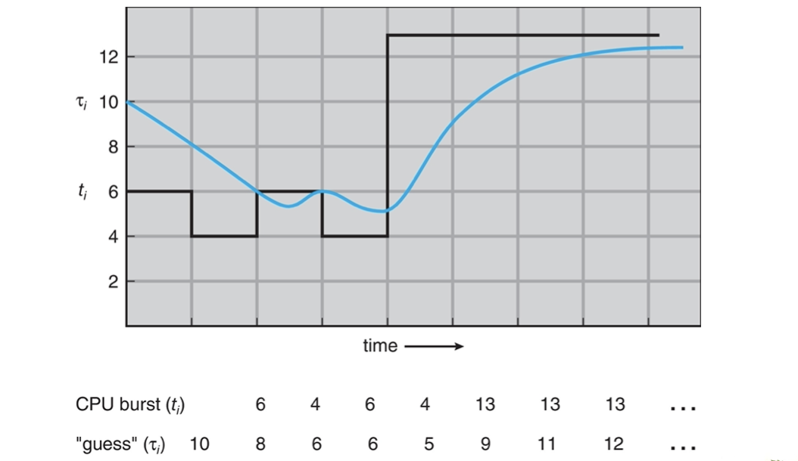

- $\alpha=0$
  - $\tau_{\mathrm{n}+1}=\tau_{\mathrm{n}}$
  - Recent history does not count
- $\alpha=1$
  - $\tau_{\mathrm{n}+1}=\alpha t_{\mathrm{n}}$
  - Only the actual last CPU burst counts
- If we expand the formula, by substituting $\tau_{i},$ we get:
    $$
    \begin{aligned}
    \tau_{n+1}=\alpha & \mathrm{t}_{n}+(1-\alpha) \alpha t_{n-1}+\ldots \\
    &+(1-\alpha)^{j} \alpha t_{n-j}+\ldots \\
    &+(1-\alpha)^{n+1} \tau_{0}
    \end{aligned}
    $$
- since both $\alpha$ and $(1-\alpha)$ are less than or equal to $1,$ each successive term has *less weight than its predecessor*

####  Example of Shortest-remaining-time-first

Now we add the concepts of **varying** arrival times and **preemption** to the analysis

Process | Arrival Time | Burst Time 
----- | ------ | -----
$P_1$ | 0 | 8
$P_2$ | 1 | 4
$P_3$ | 2 | 9
$P_4$ | 3 | 5

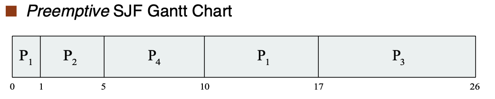

- Average waiting time=$[(10-1)+(1-1)+(17-2)+5-3)]/4=26/4= 6.5$ msec

### Round Robin (RR)
> 依次来
- Each process gets a small unit of CPU time (**time quantum q**), usually 10-100 milliseconds. After this time has elapsed, the process is **preempted** and added to the end of the ready queue.
- If there are n processes in the ready queue and the time quantum is q, then each process gets 1/n of the CPU time in chunks of at most q time units at once. _No process waits more than (n-1)q time units._
- Timer interrupts every quantum to schedule next process
  > Implemented in HW, to notify CPU when to make the schedule
- Performance
  - q large $\Rightarrow$ FIFO
  > q is so large that all processes can be completed in a quantum
  - q small $\Rightarrow$ q must be large with respect to context switch, otherwise overhead is too high
  > q is the same level as to context switch
> 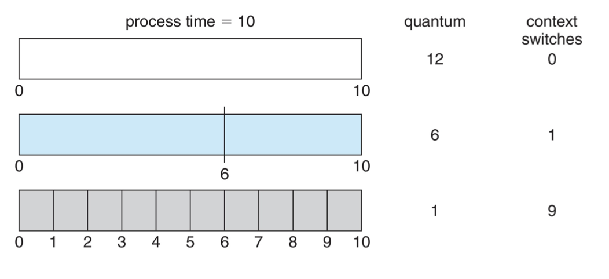

#### Example with q=4

Process | Burst Time 
----- |  -----
$P_1$ | 24 
$P_2$ | 3
$P_3$ | 3 

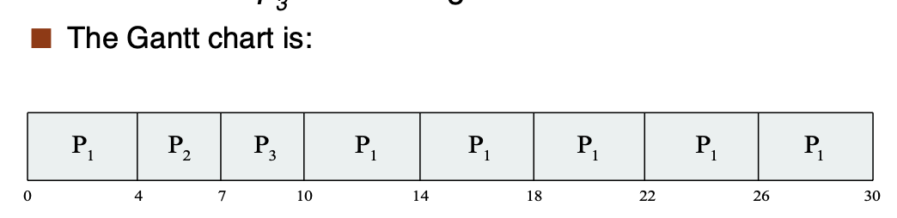

- Typically, **higher average turnaround** than SJF, but **better response**
  > in SJF, the job will be executed until end
  > long burst will be incrementally proceeded and short job can be quickly responded
- q should be large compared to context switch time 
- q usually 10ms to 100ms, context switch < 10 usec

#### Relation of Turnaround Time and Time Quantum

> 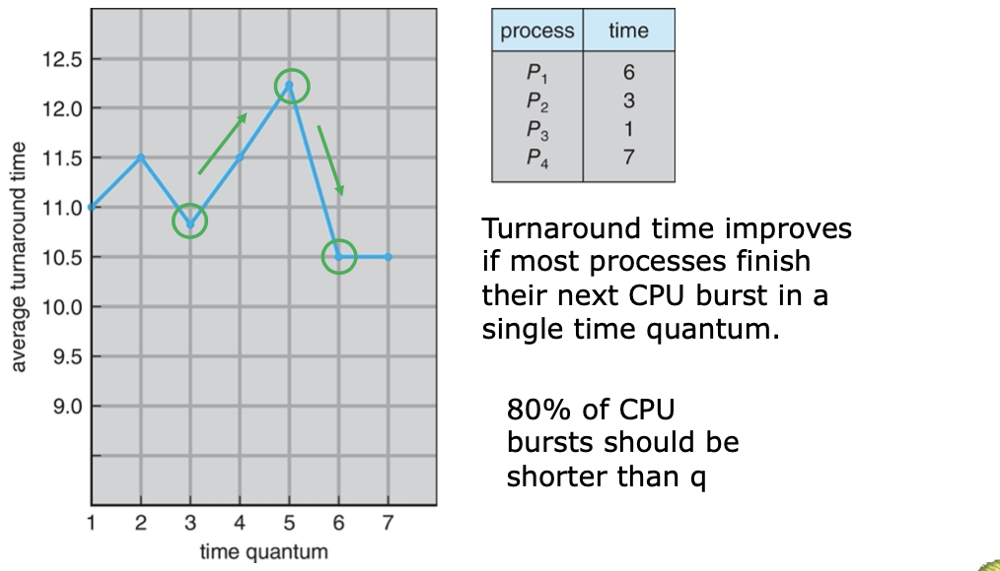
> 3->4->5, 4/5 units of $P_4$ time is inserted into $P_3$ :(
> 6->7, since 1,2,3 are executed at last, no more burst will be inserted into 4

> The main issue here is that longer quantum means that more other jobs may be counted on the turnaround time of the job in case
> Less switch =dom=> less overlapping overhead w.r.t turnaround time
>             -less dom=> switch overhead

**80% of CPU bursts should be shorter than q**

### Priority Scheduling

- A priority number (integer) is associated with each process
- The CPU is allocated to the process with the highest priority (smallest integer o highest priority) 
  - Preemptive
  - Nonpreemptive
- SJF is priority scheduling where priority is the inverse of predicted next CPU burst time
  > The shorter the job, the higher the priority
- Problem $\equiv$ **Starvation** – low priority processes may never execute
- Solution $\equiv$ **Aging** – as time progresses increase the priority of the process

#### Example of Priority Scheduling

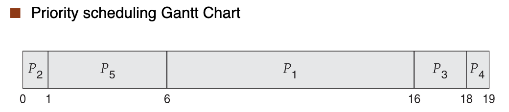

Average waiting time = 8.2 msec

#### Example of Priority Scheduling w/ RR
> Use RR to deal with jobs that have same priority

- Run the process with the highest priority. Processes with the same priority run round-robin

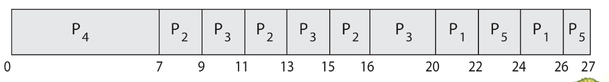

#### Multilevel Queue
- With priority scheduling, have separate queues for each priority.
- Schedule the process in the highest-priority queue!

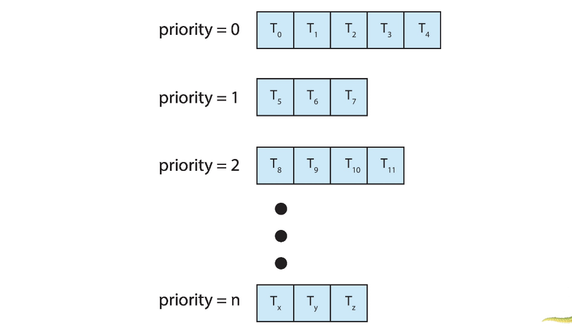

- Prioritization based upon process type

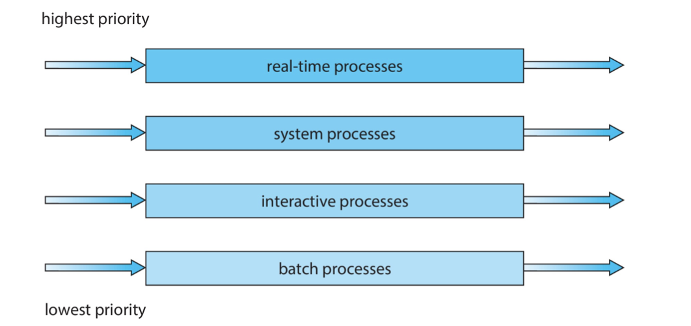
- real-time process:
  - Media
  - w/ Deadline (realtime driving)
- System
- Interactive
- Batch (background process)

#### Multilevel Feedback Queue

- A process can move between the various queues; **aging** can be implemented this way
- Multilevel-feedback-queue scheduler defined by the following parameters:
  - number of queues
  - scheduling algorithms for each queue
  - method used to determine when to upgrade a process
  - method used to determine when to demote a process
  - method used to determine which queue a process will enter when that process needs service
> Application
> e.g. large-scale batch process, or small quantums to achieve full utilization of CPU

#### Putting Together: Example of Multilevel Feedback Queue
- Three queues:
  - $Q_{0}-$ RR with time quantum 8 milliseconds
  - $Q_{1}-$ RR time quantum 16 milliseconds
  - $Q_{2}-\mathrm{FCFS}$
- Scheduling
  - A new job enters queue $Q_{0}$ which is served FCFS
    - When it gains CPU, job receives 8 milliseconds
    - If it does not finish in 8 milliseconds, job is moved to queue $Q_{1}$
- At $Q_{1}$ job is again served FCFS and receives 16 additional milliseconds
- If it still does not complete, it is preempted and moved to queue $Q_{2}$
  > Where quantum may not work, just follow first in first serve

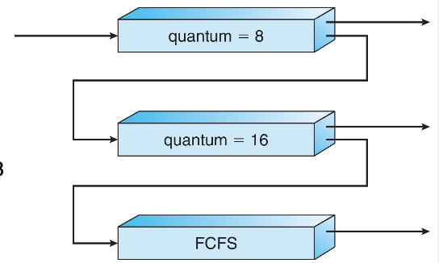

## Thread Scheduling

## Multi-Processor Scheduling

## Real-Time CPU Scheduling 

## Operating Systems Examples 

## Algorithm Evaluation