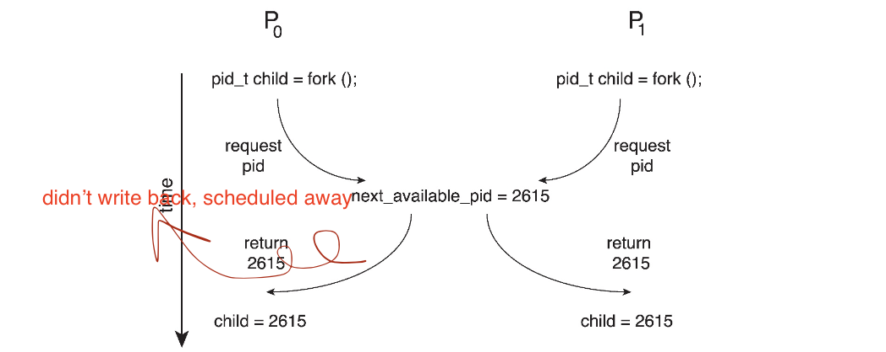
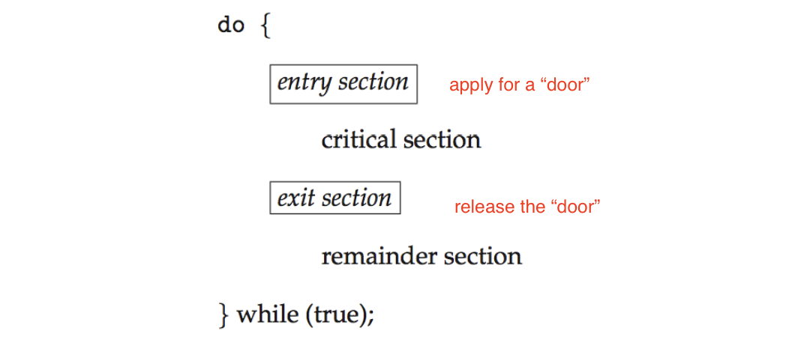
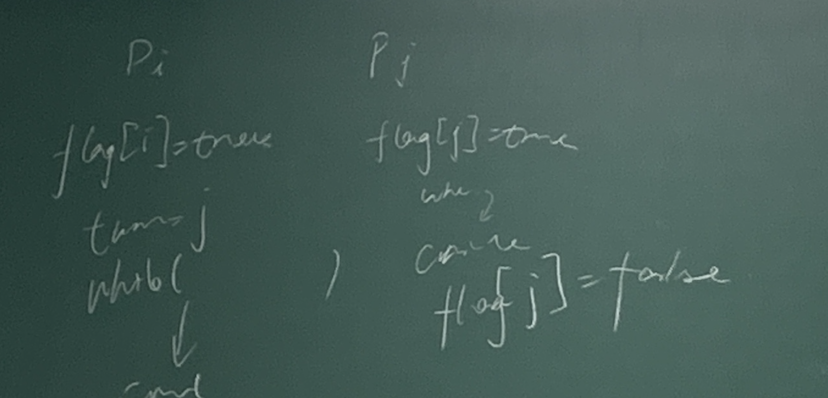

<!--more-->

[toc]


## Background

> Process Perspective: concurrency and interrupt
- Processes can execute concurrently
  - May be interrupted at any time, partially completing execution
> Data Perspective: consistency
- Concurrent access to shared data may result in data inconsistency
- Maintaining data consistency requires mechanisms to ensure the orderly execution of cooperating processes
- Illustration of the problem:
  Suppose that we wanted to provide a solution to the *consumer- producer* problem that fills all the buffers. We can do so by having an integer **counter** that keeps track of the number of full buffers. Initially, **counter** is set to 0. It is incremented by the producer after it produces a new buffer and is decremented by the consumer after it consumes a buffer.

### Producer
```cpp
while (true) {
      /* produce an item in next produced */
      while (counter == BUFFER_SIZE)
            ; /* do nothing, wait until the buffer is available */
      buffer[in] = next_produced;
      in = (in + 1) % BUFFER_SIZE;
      counter++;
}
```

### Consumer
```cpp
while (true) {
      while (counter == 0)
            ; /* do nothing, wait until the buffer has something */
      next_consumed = buffer[out];
      out = (out + 1) % BUFFER_SIZE;
        counter--;
      /* consume the item in next consumed */
}
```

> Recall, in multi-threading, we can make sure that the counter modification won't happen in both clients
> But in CPU implementation, since scheduling is involved, we will have a race

### Race Condition : client and server

- `counter++` could be implemented as
```
register1 = counter
register1 = register1 + 1
counter = register1
```
- `counter--` could be implemented as
```
register2 = counter
register2 = register2 - 1
counter = register2
```
- Consider this execution interleaving with “count = 5” initially:
  > An undeterministic issue 
```
S0: producer execute register1 = counter            {register1 = 5}
S1: producer execute register1 = register1 + 1      
{register1 = 6, but does not write back to counter cache} 
S2: consumer execute register2 = counter            {register2 = 5}
S3: consumer execute register2 = register2 – 1      {register2 = 4}
S4: producer execute counter = register1            {counter = 6 }
S5: consumer execute counter = register2            {counter = 4}
```
- inconsistency happens!

### Race Condition Example : fork

- Processes P0 and P1 are creating child processes using the `fork()` system call
- Race condition on _kernel variable_ `next_available_pid` which represents the next available process identifier (pid)
- Unless there is **mutual exclusion**, the same pid could be assigned to two different processes!


> Actually, in OS, a lot sync work is required
> We should always ensure **mutual exclusion**


## The Critical-Section Problem

- Consider system of n processes $\{p_0, p_1, ... p_{n-1}\}$
- Each process has **critical section** segment of code
  - Process may be changing common variables, updating table, writing file, etc
  > e.g. pid allocation, write files, update table ...
  - When one process in critical section, no other may be in its critical section
- **Critical section problem** is to design **protocol** to solve this
- Each process must ask permission to enter critical section in **entry section**, may follow critical section with **exit section**, then **remainder section**
- General structure of process Pi


> Why remainder section?
> See progress section

### Solution to Critical Section Problem

1. Mutual Exclusion - If process Pi is executing in its critical section, then no other processes can be executing in their critical sections
2. Progress - If no process is executing in its critical section and there exist some processes that wish to enter their critical section, then _only those processes that are not executing in their remainder sections can enter the critical section next_, this selection cannot be postponed indefinitely
   - 不可以一直出于critical section中，需要执行remainder，确保其他等待中的进程有机会进入
3. Bounded Waiting - A bound must exist on the number of times that other processes are allowed to enter their critical sections after a process has made a request to enter its critical section and before that request is granted
   - 当前critical section，持续使用的事件是受限的，不能拒绝其他请求无限多次，防止队列无限增长
   - Assume that each process executes at a nonzero speed
   - No assumption concerning relative speed of the n processes

### Critical-Section Handling in OS
- Two approaches depending on if kernel is preemptive or non- preemptive
  - Preemptive – allows preemption of process when running in kernel mode
  - Non-preemptive – runs until exits kernel mode, blocks, or voluntarily yields CPU
    - Essentially free of race conditions in kernel mode
    > Though simple, modern OS won't take this approach

> With preemptive, what if I am scheduled away while I am running the critical section?


## Peterson’s Solution
> A mathematical/theoritical solution, but won't be actually adopted by modern OS

- Not guaranteed to work on modern architectures! (But good algorithmic description of solving the problem)
- Two process solution
- Assume that the `load` and `store` machine-language instructions are **atomic**; that is, cannot be interrupted
  > but in fact, leads to low performance
- The two processes share two variables:
  - `int turn`; (轮到谁了)
  - `boolean flag[2]` （准备好了吗？）
- The variable `turn` indicates whose turn it is to enter the critical section
- The `flag` array is used to indicate if a process is ready to enter the critical section. flag[i] = true implies that process Pi is ready!
- Algorithm for Process Pi
```cpp
while (true){
      flag[i] = true;
      turn = j;
      while (flag[j] && turn = = j); /* waiting for j to execute, j is executing critical */
      /* ... critical section ....*/
      flag[i] = false;
      /* ... remainder section ....*/
}
```

> 看谁先执行到`turn=对方`，谁先等
> when `i` is executing, it gives the turn to `j`, we can make sure that `i` won't run twice, because after running, it will give turn to `j`
> If no turn, only flag, condition 2 won't be satisfied.

- Provable that the three CS requirement are met:
1. Mutual exclusion is preserved Pi enters CS only if: either `flag[j] = false or turn = i`
2. Progress requirement is satisfied
3. Bounded-waiting requirement is met *(the bound is 1)*


## Hardware Support for Synchronization 


## Mutex Locks


## Semaphores


## Monitors


## Liveness


## Evaluation