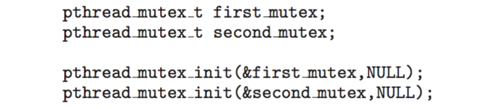
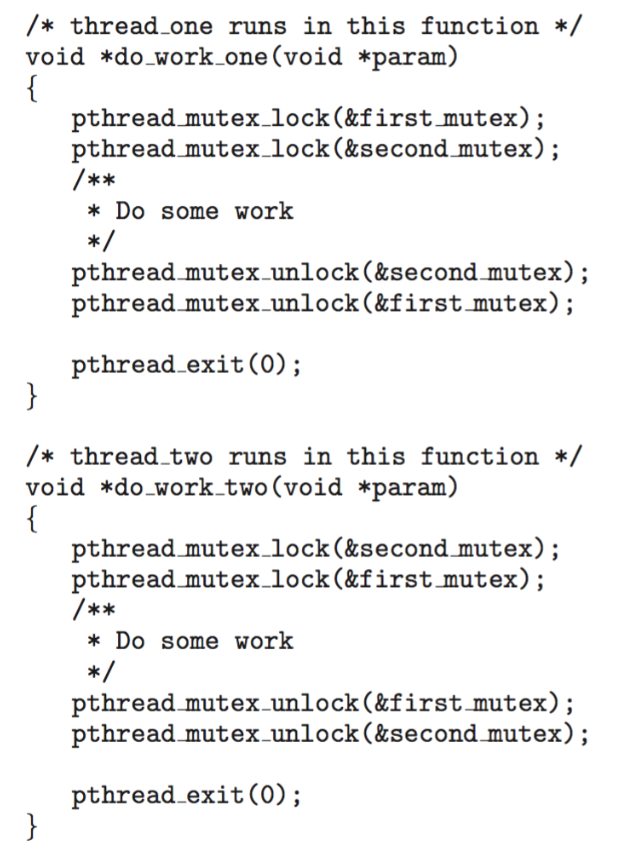
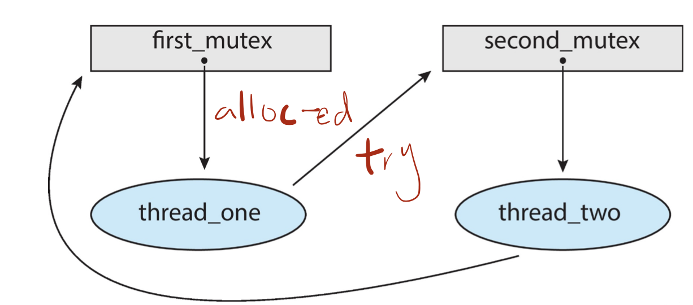
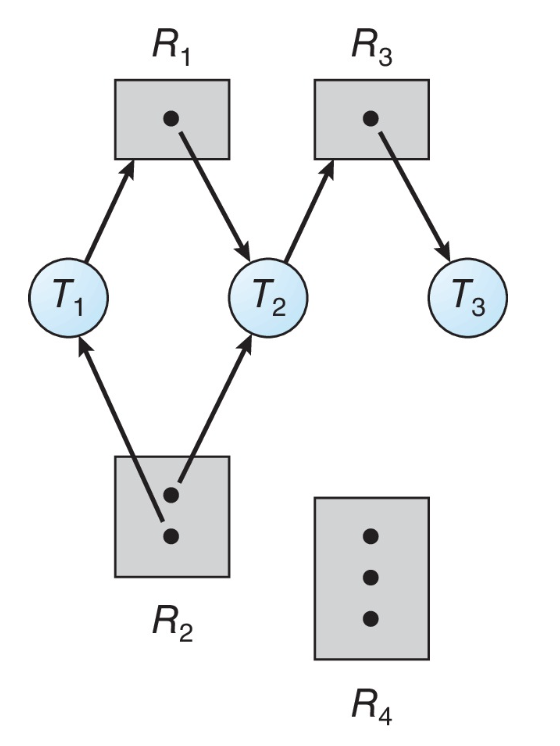
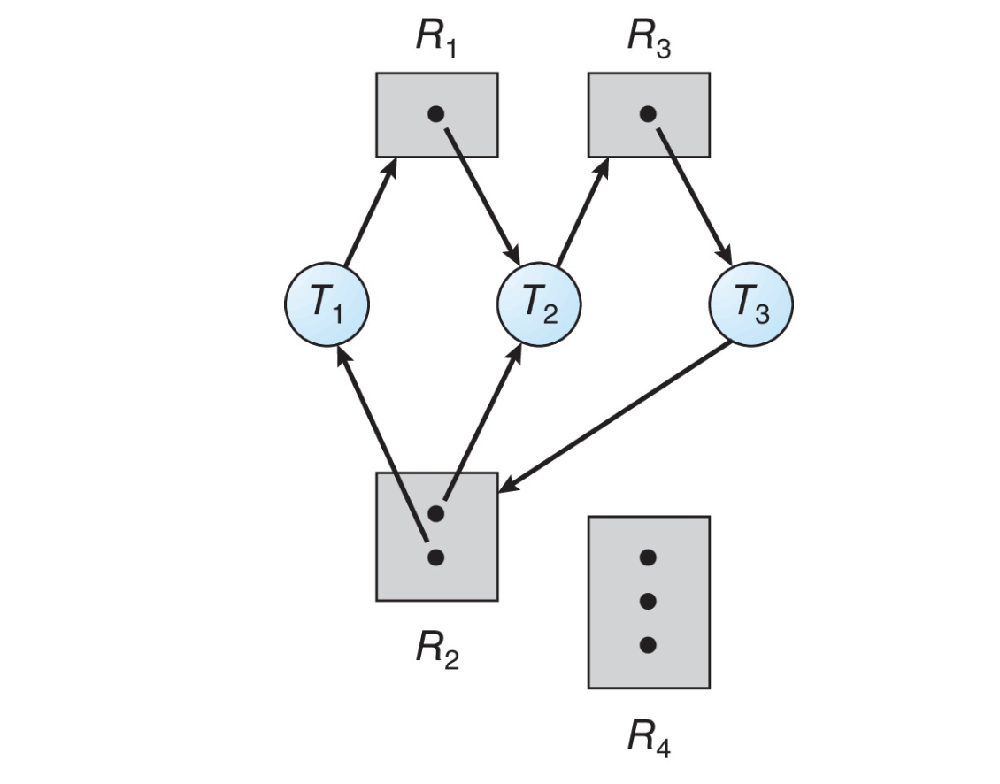
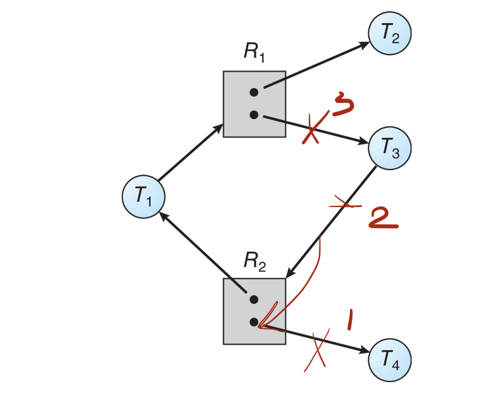

- Illustrate how deadlock can occur when mutex locks are used
- Define the **four necessary conditions** that characterize deadlock
- Identify a deadlock situation in a **resource allocation graph**
- Evaluate the **four different approaches** for preventing deadlocks
  > Corresponding to 4 necessary conditions
- Apply the banker’s algorithm for deadlock avoidance
- Apply the deadlock detection algorithm
- Evaluate approaches for recovering from deadlock

<!--more-->

[toc]

## System Model

- System consists of resources 
- Resource types `R1, R2, . . ., Rm`
    CPU cycles, memory space, I/O devices 
- Each resource type `Ri` has `Wi` instances.
- Each process utilizes a resource as follows:
  - **request** 
  - **use**
  - **release**

> REQUEST resource vs. ACQUIRE lock
> release resource vs. release lock

## Deadlock in Multithreaded Applications 

Two mutex locks are created an initialized:

- Deadlock is possible if thread1 acquires first_mutex and thread 2 acquires second_mutex. Thread 1 then waits for second_mutex and thread 2 waits for first_mutex.
- Can be illustrated with a resource allocation graph:

## Deadlock Characterization

Deadlock can arise if four conditions hold **simultaneously**.
- **Mutual exclusion**: only one process at a time can use a resource
- **Hold and wait**: a process holding at least one resource is waiting to acquire additional resources held by other processes
- **No preemption**: a resource can be released only voluntarily by the process holding it, after that process has completed its task
  > The resource should be released based on the process's will
- **Circular wait**: there exists a set {P0, P1, ..., Pn} of waiting processes such that P0 is waiting for a resource that is held by P1, P1 is waiting for a resource that is held by P2, ..., Pn–1 is waiting for a resource that is held by Pn, and Pn is waiting for a resource that is held by P0.

### Resource-Allocation Graph

A set of vertices $V$ and a set of edges $E$.
- $\mathrm{V}$ is partitioned into two types:
  - $P=\left\{P_{1}, P_{2}, \ldots, P_{n}\right\},$ the set consisting of all the processes in the system
  - $R=\left\{R_{1}, R_{2}, \ldots, R_{m}\right\},$ the set consisting of all resource types in the system
- **request edge** - directed edge $P_{i} \rightarrow R_{j}$
- **assignment edge** - directed edge $R_{j} \rightarrow P_{i}$

Example 1: No deadlock, the locks will be released in a backward-DFS order. From $T_3$

Example 2: Deadlock, $T_3$ requires $R_2$, because $R_2$'s instances are all allocated,

> Not simple loop, we should also check whether the loop can be unknotted, we should revisit all the paths in the graph

Example 3: Graph With A Cycle But No Deadlock

### Basic Facts

- If graph contains no cycles $\Rightarrow$ no deadlock
- If graph contains a cycle $\Rightarrow$
  - if only one instance per resource type, then deadlock
  - if several instances per resource type, possibility of deadlock
> In real system, the problem is more complicated because the graph is *dynamic*

## Methods for Handling Deadlocks
- Ensure that the system will never enter a deadlock state:
  - Deadlock prevention
  - Deadlock avoidance
- Allow the system to enter a deadlock state and then recover
- Ignore the problem and pretend that deadlocks never occur in the system.

## Deadlock Prevention

Invalidate one of the four necessary conditions for deadlock:
- **Mutual Exclusion** – not required for sharable resources (e.g., read-only files); must hold for non-sharable resources
  > In fact very difficult to erase all. But can be done for some special cases
  > Only partially resolve the issue
- **Hold and Wait** – must guarantee that whenever a process requests a resource, it does not hold any other resources
  - Require process to request and be allocated all its resources before it begins execution, or allow process to request resources only when the process has none allocated to it.
  - Low resource utilization; starvation possible

## Deadlock Avoidance

## Deadlock Detection

## Recovery from Deadlock