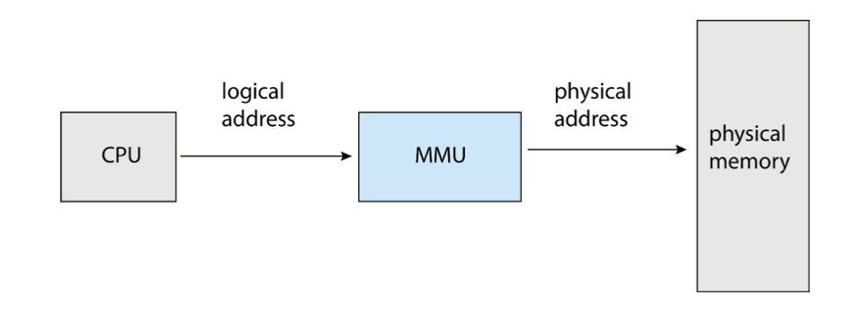
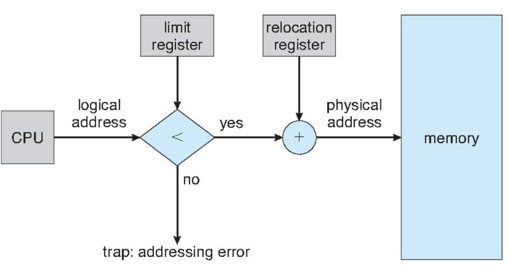
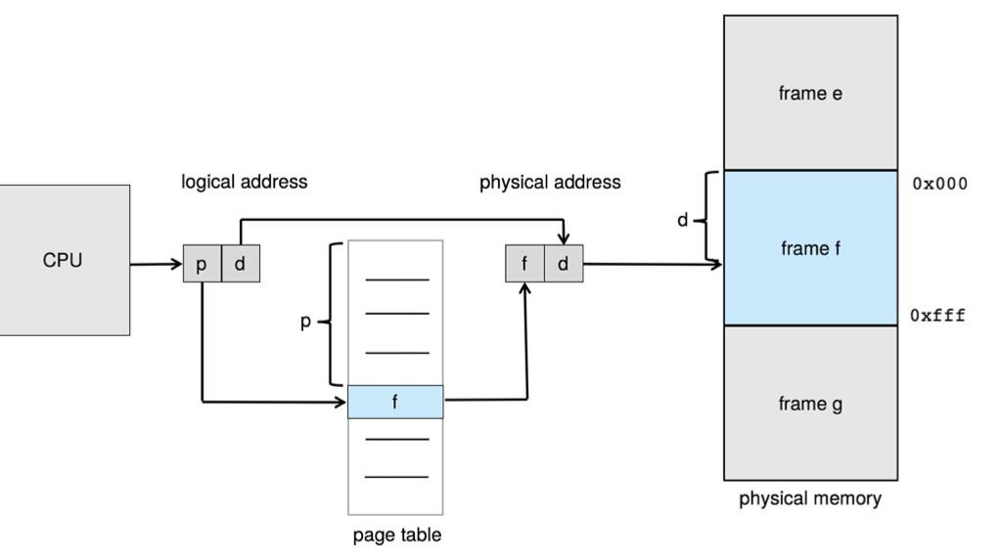
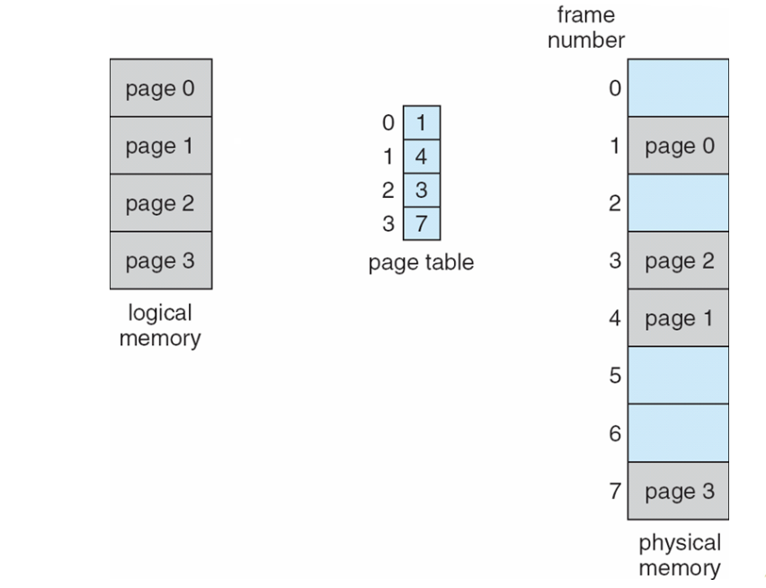
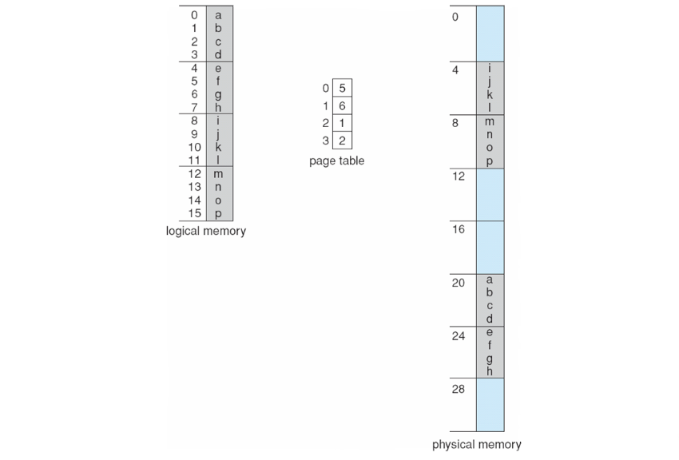

- To provide a detailed description of various ways of organizing memory hardware
- To discuss various memory-management techniques,
- To provide a detailed description of the Intel Pentium, which supports both pure segmentation and segmentation with paging

<!--more-->

[toc]


## Background


- Program must be brought (from disk) into memory and placed within a process for it to be run
- Main memory and registers are only storage CPU can access directly
- Memory unit only sees a stream of: 
  - addresses + read requests, or
  - address + data and write requests
- Register access is done in one CPU clock (or less)
- Main memory can take many cycles, causing a **stall**
- **Cache** sits between main memory and CPU registers
- Protection of memory required to ensure correct operation

### Protection

- Need to censure that a process can only access those addresses in its address space.
- We can provide this protection by using a pair of **base** and **limit registers** define the logical address space of a process


### Hardware Address Protection

- CPU must check every memory access generated in user mode to be sure it is between base and limit for that user


- the instructions to loading the base and limit registers are privileged

### Address Binding

- Programs on disk, ready to be brought into memory to execute form an **input queue**
  - Without support, must be loaded into address 0000
- Inconvenient to have first user process physical address always at 0000
  - How can it not be?
- Addresses represented in different ways at different stages of a program's life
  - Source code addresses usually symbolic
  - Compiled code addresses **bind** to relocatable addresses
    - i.e. "14 bytes from beginning of this module"
  - **Linker or loader will bind** _relocatable addresses_ to _absolute addresses_
    - i.e. 74014
  - Each binding maps one address space to another


### Binding of Instructions and Data to Memory

- Address binding of instructions and data to memory addresses can happen at three different stages
  -  Compile time: If memory location known a priori, _absolute code_ can be generated; must _recompile_ code if starting location changes
  - Load time: Must generate _relocatable code_ if memory location is not known at compile time
  - Execution time: **Binding delayed until run time** if the process _can be moved during its execution_ from one memory segment to another
    - Need hardware support for address maps (e.g., base and limit registers)

### Multistep Processing of a User Program


### Logical vs. Physical Address Space
> physical address space may be limited, but a program may need more than that
- The concept of a logical address space that is bound to a separate **physical address space** is central to proper memory management
  - **Logical address** – _generated by the CPU_; also referred to as virtual address
  - **Physical address** – address seen by the memory unit
- Logical and physical addresses are the same in compile-time and load-time address-binding schemes; logical (virtual) and physical addresses differ in execution-time address-binding scheme
- **Logical address space** is the set of all logical addresses generated by a program
- **Physical address space** is the set of all physical addresses generated by a program


### Memory-Management Unit (MMU)
> To accelerate translation of address, it is implemented by HW

- Hardware device that at run time maps virtual to physical address


- Many methods possible, covered in the rest of this chapter
- Consider simple scheme. which is a generalization of the base-register scheme.
- The base register now called **relocation register**
- The value in the relocation register is added to every address generated by a user process at the time it is sent to memory
- The user program deals with *logical* addresses; it never sees the real *physical* addresses
  - Execution-time binding occurs when reference is made to location in memory
  - Logical address bound to physical addresses

#### Example of MMU

> 14000 (base) + 346 (relocatable address) = 14356


### Dynamic Loading

- The entire program does need to be in memory to execute 
  - Sizes of process may be limit by the size of memory?
- Routine is _not loaded until it is called_
  > One is that it conforms to programming intuition, the other is that it saves memory space
  - Better memory-space utilization; unused routine is never loaded
  - All routines kept on disk in relocatable load format
- Useful when large amounts of code are needed to handle infrequently occurring cases
- No special support from the operating system is required
  - Implemented through program design
  - OS can help by providing libraries to implement dynamic loading

### Dynamic Linking
> Load is after linking, what if we put backward the dynamic phase? (for better performance)

- **Static linking** – system libraries and program code combined by the loader into the binary program image
- Dynamic linking –_linking postponed until execution time_
  - Small piece of code, **stub**, used to locate the appropriate memory-resident library routine
  - Stub replaces itself with the address of the routine, and executes the routine
- Operating system _checks if routine is in_ processes’ memory address 
  - If not in address space, add to address space
- Dynamic linking is particularly useful for libraries
- System also known as **shared libraries**, by need _OS’s help_
- Consider applicability to patching system libraries
  - **Versioning** may be needed
  > Most cases where 'segment error' occurs


## Contiguous Memory Allocation
> Early convention for allocating address

- Main memory must support both OS and user processes 
- Limited resource, must allocate efficiently
- Contiguous allocation is one early method
- Main memory usually into two **partitions**:
  - Resident operating system, usually held in low memory with interrupt vector
  - User processes then held in **high memory** 
  - Each process contained in single contiguous section of memory
> User process high->low, system low->high address
> every process has contiguous space

- Relocation registers used to protect user processes from each other, and from changing operating-system code and data
  - Base register contains value of smallest physical address
  - Limit register contains range of logical addresses – each logical address must be less than the limit register
  - MMU maps logical address dynamically
> Basic Principles as described above

### Hardware Support for Relocation and Limit Registers
within MMU, ...


### Variable Partition
> If contiguous, some may require more while others don't need such large space
> It is necessary to support variable address segment

- Multiple-partition allocation
  - Degree of multiprogramming limited by number of partitions
  - **Variable-partition** sizes for efficiency (sized to a given process’ needs)
  - **Hole** – block of available memory; holes of various size are scattered throughout memory
  - When a process arrives, it is allocated memory from a hole large enough to accommodate it
  - Process exiting frees its partition, adjacent free partitions combined
  - Operating system maintains information about:
    a) allocated partitions b) free partitions (hole)

> As time grows, many fragments in memory space will be small

### Solution for Dynamic Storage-Allocation Problem
> One solution, when allocating, make as few fragments as possible
How to satisfy a request of size n from a list of free holes? 
- **First-fit**: Allocate the ***first*** hole that is big enough
  > does not resolve fragmentation at all
- **Best-fit**: Allocate the ***smallest*** hole that is big enough; must search entire list, unless ordered by size
  - Produces the smallest leftover hole
  > needs to scan the memory space
  > but a table can be maintained!
- **Worst-fit**: Allocate the ***largest*** hole; must also search entire list
  - Produces the largest leftover hole
> First-fit and best-fit better than worst-fit in terms of speed and storage utilization
> needs experiments to decide which better
### Fragmentation


- **External Fragmentation** – total memory space exists to satisfy a request, but it is not contiguous
  > Not contiguous
- **Internal Fragmentation** – allocated memory may be slightly larger than requested memory; this size difference is memory internal to a partition, but not being used
  > Redudant space for a particular process
- First fit analysis reveals that given N blocks allocated, 0.5 N blocks lost to fragmentation
  - 1/3 may be unusable -> **50-percent rule**
- Reduce **external** fragmentation by **compaction**
  - Shuffle memory contents to place all free memory together in one large block
  - Compaction is possible _**only if relocation is dynamic**_ ,and is done at execution time


## Paging
> The limitation of contiguous memory for early OS is such that we introduce paging
- Physical address space of a process can be noncontiguous; process is allocated physical memory whenever the latter is available
  - Avoids external fragmentation
  - Avoids problem of varying sized memory chunks
- Divide **physical memory** into fixed-sized blocks called **frames**
  - Size is power of 2,between 512 bytes and 16 Mbytes
- Divide **logical memory** into blocks of _same size_ called **pages**
- Keep track of all free frames
- To run a program of size N pages, need to find N free frames and load program
- Set up a **page table** to translate logical to physical addresses
- Still have *Internal* fragmentation

> Still far from modern OS practice

### Address Translation Scheme

- Address generated by CPU is divided into:
- Page number $(p)$ - used as an index into a page table which contains base address of each page in physical memory
- Page offset (d) - combined with base address to define the physical memory address that is sent to the memory unit
```
   page number             +         page offset
                           |
+------------------------------------------------------+
|         p                |             d             |
+------------------------------------------------------+
       m-n length          |         n length
                           +

```
- For given logical address space $2^m$ and page size $2^n$


### Paging Hardware



> Page table establishes a 1-to-1 correspondence from logical mem to physical mem
> 
> Logical address: $\mathrm{n}=2$ and $\mathrm{m}=4 .$ Using a page size of 4 bytes and a physical memory of 32 bytes ( 8 pages)
> 


### Paging - Calculating Internal Fragmentation
- Page size $=2,048$ bytes
- Process size $=72,766$ bytes
- 35 pages +1,086 bytes
- Internal fragmentation of $2,048-1,086=962$ bytes
- Worst case fragmentation $=1$ frame -1 byte
- On average fragmentation $=1 / 2$ frame size
- So small frame sizes desirable?
- But each page table entry takes memory to track
- Page sizes growing over time
  - Solaris supports two page sizes - 8 KB and 4 MB
  > In the Middle Age of OS, two page sizes are adopted


## Implementation of Page Table

- Page table is kept in main memory
  - **Page-table base register (PTBR)** points to the page table
  - **Page-table length register (PTLR)** indicates size of the page table
  > because we need to know whether an address is inside of a page
- In this scheme every data/instruction access requires **two** memory accesses
  - One for the page table and one for the data / instruction
  > 1. check table for add, 2. for real data
  > Solution: Hardware cache (like cache)
- The two memory access problem can be solved by the use of a special fast-lookup hardware cache called **translation look-aside buffers (TLBs)** (also called **associative memory**).

### Translation Look-Aside Buffer

- Some TLBs store address-space identifiers (ASIDs) in each TLB entry – uniquely identifies each process to provide address-space protection for that process
  - Otherwise need to flush at every context switch
- TLBs typically small (64 to 1,024 entries)
- On a TLB **miss**, value is loaded into the TLB for faster access next time
  - Replacement policies must be considered
  - Some entries can be **wired down**(断电) for permanent fast access


### Paging Hardware with TLB
> Basically same as memory cache
- Associative memory – **parallel** search
    
- Address translation (p, d)
  - If p is in associative register, get frame # out
  - Otherwise get frame # from page table in memory


### Effective Access Time
- Hit ratio - percentage of times that a page number is found in the TLB
- An $80 \%$ hit ratio means that we find the desired page number in the TLB $80 \%$ of the time.
- Suppose that 10 nanoseconds to access memory.
  - If we find the desired page in TLB then a mapped-memory access take 10 ns
  - Otherwise we need two memory access so it is 20 ns
- **Effective Access Time (EAT)**
    $$
    \mathrm{EAT}=0.80 \times 10+0.20 \times 20=12 \text { nanoseconds }
    $$
  implying $20 \%$ slowdown in access time
- Consider amore realistic hit ratio of $99 \%$
    $$
    \mathrm{EAT}=0.99 \times 10+0.01 \times 20=10.1 \mathrm{nS}
    $$
  implying only $1 \%$ slowdown in access time.

## Structure of the Page Table


## Swapping


## Example: The Intel 32 and 64-bit Architectures 


## Example: ARMv8 Architecture