- Define virtual memory and describe its benefits.
  > 简答题
- Illustrate how pages are loaded into memory using **demand paging**.
- Apply the FIFO, optimal, and LRU **page-replacement algorithms**.
- Describe the working set of a process, and explain how it is related to program locality.
- Describe how Linux, Windows 10, and Solaris manage virtual memory.
- Design a virtual memory manager simulation in the C programming language.

<!--more-->

[toc]

## Background

- Code needs to be in memory to execute, but entire program rarely used
  - Error code, unusual routines, large data structures 
  > These programs may be less likely to be executed
- Entire program code not needed at same time
- Consider ability to execute partially-loaded program
  > 只load一部分代码，使得程序能够正常执行，但对程序员无感
  - Program no longer constrained by limits of physical memory
  - Each program takes less memory while running -> more programs run at the same time
    - Increased CPU utilization and throughput with no increase in response time or turnaround time
  - Less I/O needed to load or swap programs into memory -> each user program runs faster
> minor effects on latency, but greatly improves throughput

### Virtual memory

- **Virtual memory** – separation of user logical memory from physical memory
  - Only part of the program needs to be in memory for execution
  - Logical address space can therefore be _much larger_ than physical address space
  - Allows address spaces to be shared by several processes
  - Allows for more efficient process creation
  - More programs running concurrently
  - Less I/O needed to load or swap processes
- **Virtual address space** – logical view of how process is stored in memory
  - Usually start at address 0, contiguous addresses until end of space
  - Meanwhile, physical memory organized in page frames
  - MMU must map logical to physical
- Virtual memory can be implemented via:
  - Demand paging
  - Demand segmentation

### Virtual Memory That is Larger Than Physical Memory

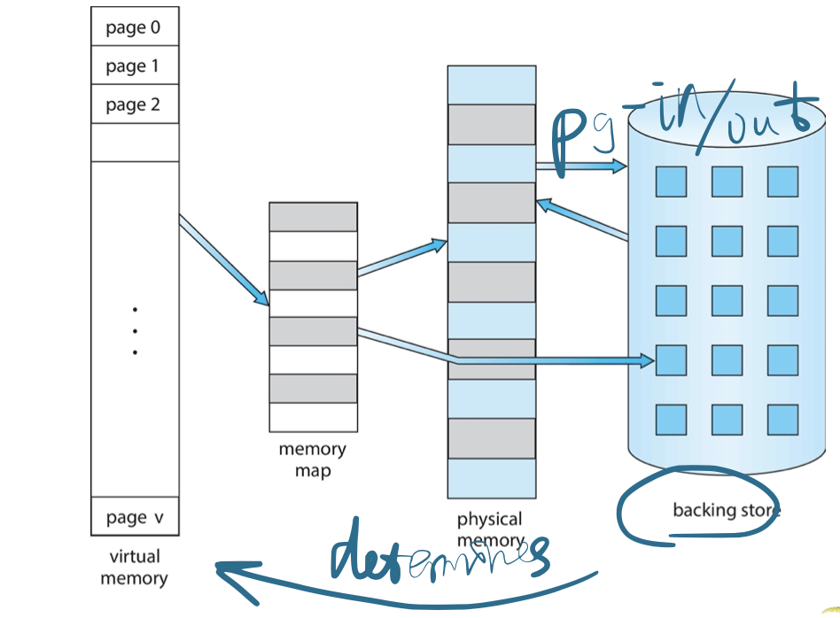

### Virtual-address Space

- Usually design logical address space for stack to start at Max logical address and grow “down” while heap grows “up”
  - Maximizes address space use
  - Unused address space between the two is hole
    - No physical memory needed until heap or stack grows to a given new page
- Enables **sparse** address spaces _with holes left for growth, dynamically linked libraries, etc_
- System libraries shared via **mapping into** virtual address space
  > Shared resources can simply create a "copy" in the virtual space, implemented easily through a mapping (instead of concrete copy)
  > e.g. Shared Library Using Virtual Memory
  > 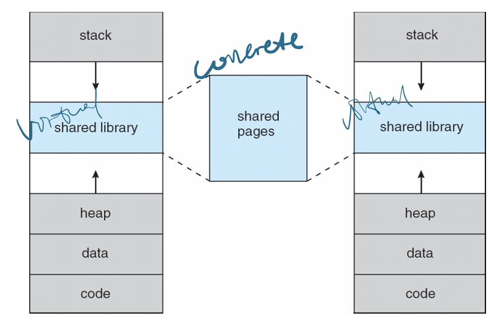
- Shared memory by mapping pages read-write into virtual address space
- Pages can be shared during `fork()`, speeding process creation

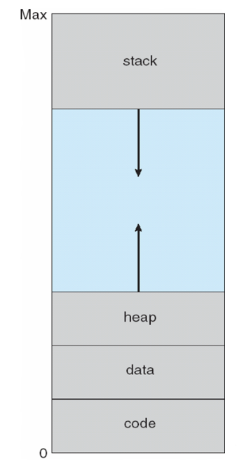

## Demand Paging

- Could bring entire process into memory at load time
- Or bring a page into memory only when it is needed
  - Less I/O needed, no unnecessary I/O
  - Less memory needed
  - Faster response
  - More users
- Similar to paging system with swapping
  > Same w.r.t. grain & basic idea
  > the difference is that loading(swap) only when the page is required (*lazy*)
  > instead of swapping out only when the global free space is small
- Page is needed $\Rightarrow$ reference to it
  - invalid reference $\Rightarrow$ abort
  - not-in-memory $\Rightarrow$ bring to memory
- **Lazy swapper** – never swaps a page into memory unless page will be needed
  - Swapper that deals with pages is a **pager**

### Basic Concepts

- With swapping, pager guesses which pages will be used before swapping out again
- Instead, pager brings in only those pages into memory
- How to determine that set of pages?
  - Need ***new MMU functionality*** to implement demand paging
- If pages needed are already **memory resident**
  - No difference from non demand-paging
- If page needed and not memory resident
  - Need to detect and load the page into memory from sotrage
    - **Without changing program behavior**
    - Without programmer needing to change code

### Valid-Invalid Bit

- With each page table entry a valid–invalid bit is associated 
  (v $\Rightarrow$ in-memory – memory resident, i  $\Rightarrow$  not-in-memory)
- Initially valid–invalid bit is set to i on all entries
  > When visiting an i entry, a **page fault** will occur, indicating that the page should be loaded from backing store
- Example of a page table snapshot:
    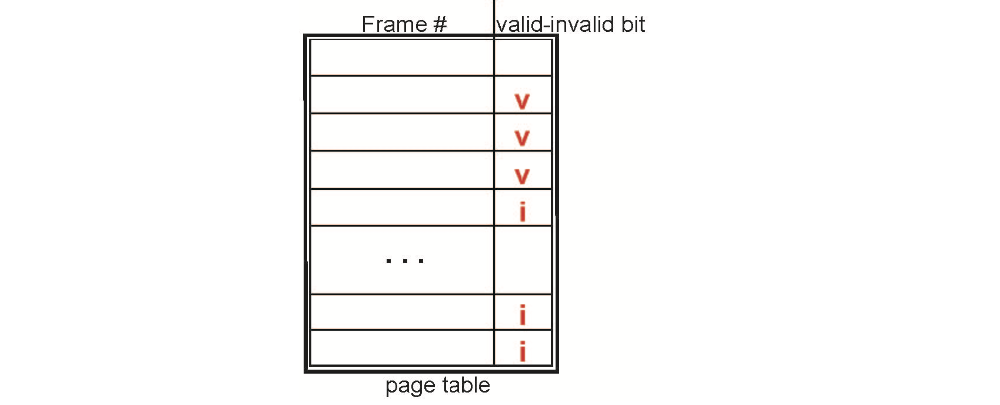
- During MMU address translation, if valid–invalid bit in page table entry is i  $\Rightarrow$  page fault
  
### Example: Page Table When Some Pages Are Not in Main Memory

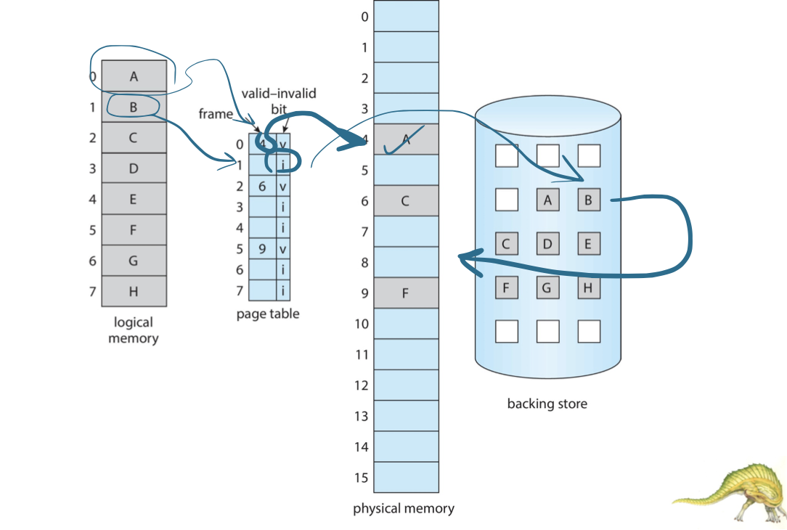

### Steps in Handling Page Fault

1. If there is a reference to a page, first reference to that page will **trap** to operating system
   - Page fault
   > Trap means entering the kernel mode
   > To load the memory from backing store into physical memory
2. Operating system looks at another table to decide:
   - Invalid reference - abort
   - Just not in memory
3. Find free frame
   > If no free frame, a substitution should happen (find a victim and write back to backing store)
4. Swap page into frame via scheduled disk operation
5. Reset tables to indicate page now in memory Set `validation bit = v`
6. Restart the instruction that caused the page fault
> HW support is required: CPU should support paging
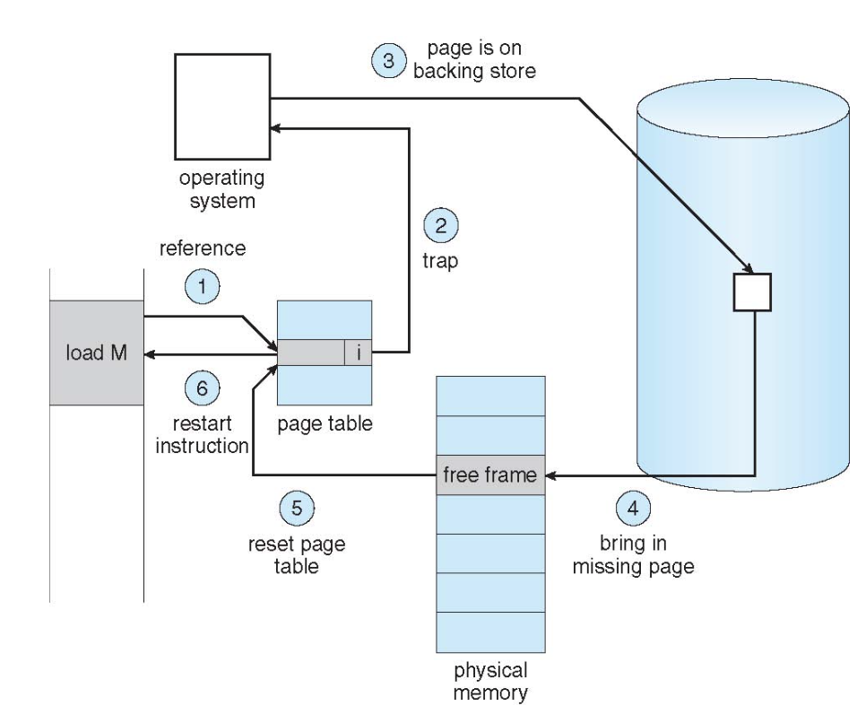

### Aspects of Demand Paging
> Issues with demand paging
- Extreme case – start process with no pages in memory
   - Os sets instruction pointer to first instruction of process, non-memory-resident -> page fault
   - And for every other process pages on first access
   - **Pure demand paging**
- Actually, a given instruction could access multiple pages -> multiple page faults
   - Consider fetch and decode of instruction which adds 2 numbers  from memory and stores result back to memory
   > Multiple traps can be executed for a single instruction if the three operands are separate in memory
   - Pain decreased because of **locality of reference**
- Hardware support needed for demand paging
  - Page table with valid/invalid bit
  - Secondary memory(Swap device with **swap space**) 
  - Instruction restart
 
### Instruction Restart
- Consider an instruction that could access several different locations
  - Block move
  > very likely to cross-pages
  - Auto increment/decrement location
  > Lots of traps!!
  - Restart the whole operation?
    - What if source and destination **overlap**?
    > Some moved, other not
  - Solution
    - Predict and incur page fault in advance
    > So that restart won't happen at all
    - **Restore** the overwritten data by _temporal registers_

### Free-Frame Lost

- When a page fault occurs, the operating system must bring the desired page from secondary storage into main memory.
- Most operating systems maintain **a free-frame list** -- a pool of free frames for satisfying such requests.
  
- Operating system typically allocate free frames using a technique known as **zero-fill-on-demand** -- the content of the frames zeroed-out before being allocated.
  > In case we need to restore exactly the swiped out page into the physical memory again, then no copy is needed
- When a system starts up, all available memory is placed on the free-frame list.

### Stages in Demand Paging – Worse Case
> Combined with process scheduling
1. Trap to the operating system
2. Save the user registers and process state
3. Determine that the interrupt was a page fault
4. Check that the page reference was legal and determine the location of the page on the disk
5. Issue a read from the disk to a free frame:
   1. Wait in a queue for this device until the read request is serviced
   2. Wait for the device seek and/or latency time 
   3. Begin the transfer of the page to a free frame
6. While waiting, allocate the CPU to some other user
7. Receive an interrupt from the disk I/O subsystem (I/O completed)
8. Save the registers and process state for the other user
9. Determine that the interrupt was from the disk 
10. Correct the page table and other tables to show page is now in memory
11. Wait for the CPU to be allocated to this process again
12. Restore the user registers, process state, and new page table, and then resume the interrupted instruction

### Performance of Demand Paging

- Three major activities
  - Service the interrupt - careful coding means just several hundred instructions needed
  - Read the page - lots of time
  - Restart the process - again just a small amout of time
- **Page fault Rate** $0 \le p \le 1$
  - if $p = 0$, no page faults
  - if $p = 1$, every reference is a fault
- Effective Access Time (EAT)
  $EAT = (1 – p) \times memoryAccess + p (pageFaultOverhead + \underbrace{\textbf{swapPageOut} + \textbf{swapPageIn}}_{overhead})$

#### Example

- Memory access time $=200$ nanoseconds
- Average page-fault service time $=8$ milliseconds
- $\mathrm{EAT}=(1-\mathrm{p}) \times 200+\mathrm{p}(8$ milliseconds $)$
  $=(1-p \times 200+p \times 8,000,000$
  $=200+p \times 7,999,800$
- If one access out of 1,000 causes a page fault, then
  $\mathrm{EAT}=8.2$ microseconds.
  This is a slowdown by a factor of $40 ! !$
- If want performance degradation $<10$ percent
  - $220>200+7,999,800 \times p$
    $20>7,999,800 \times p$
  - $p<.0000025$
  - _< one page fault in every 400,000 memory accesses_ **(very demanding)**
> Although demand paging can increase the utilities of CPU and memory
> but once page fault, it will be a huge overhead

### Demand Paging Optimizations
> Since page fault is critical
- Swap space I/O faster than file system I/O even if on the same device 
  > HW support, better disk for backing store
  > Support burst read (consecutive reading)
  > Compared to typical disks which are very fragmented, redundant
  - Swap allocated in larger chunks, less management needed than file system
- Copy entire process image to swap space at process load time
  - Then page in and out of swap space
  - Used in older BSD Unix
- Demand page in from program binary on disk, but _discard rather than paging out_ when freeing frame
  > maintain a dirty "bit", just mark as invalid
  > eliminate the need of paging out, reduce half of time
  > easy to implement, thus common in OS
  - Used in Solaris and current BSD
  - Still need to write to swap space
    - Pages not associated with a file (like stack and heap) – **anonymous memory**
    - Pages modified in memory but not yet written back to the file system
- Mobile systems
  - Typically don’t support swapping
  - Instead, demand page from file system and reclaim read-only pages (such as code)

> many optimizations work like cache, but managed by OS, instead of HW architecture

## Copy-on-Write

- Copy-on-Write (COW) allows both parent and child processes to initially share the same pages in memory
  - If either process **modifies** a shared page, **only then** is the page copied
- COW allows more efficient process creation as **only modified pages** are copied
  > instead of all pages
- `vfork()` variation on `fork()` system call has parent suspend and child using copy-on-write address space of parent
  - Designed to have child call `exec()` 
  - Very efficient

 Before Modification | After Modification
 ------------------- | -----------------
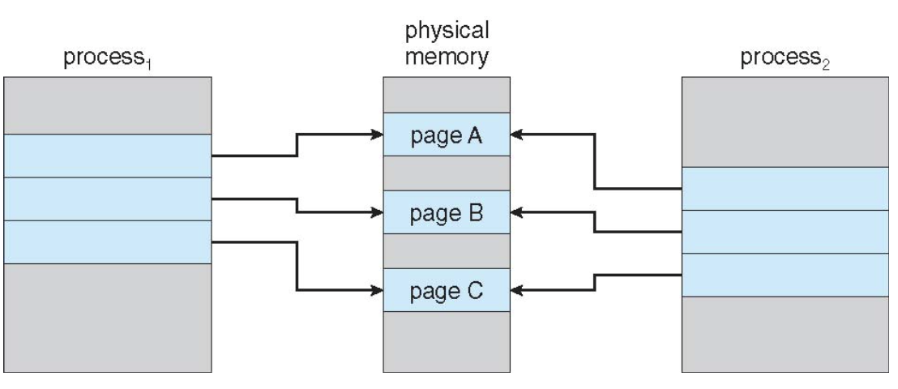 | 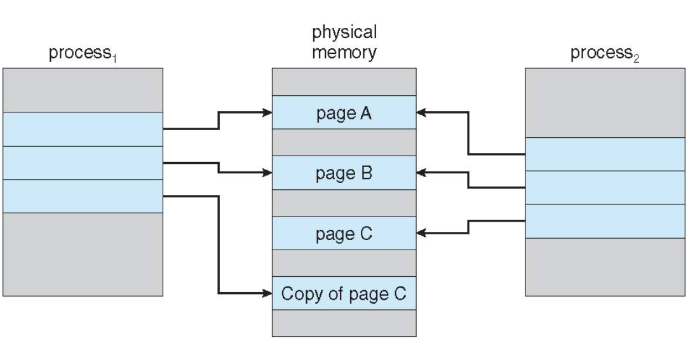

## Page Replacement

### What Happens If there is no free frame

- Used up by process pages (especially, multiprogramming) 
- Also in demand from the kernel, I/Obuffers,etc
- How much to allocate to each?

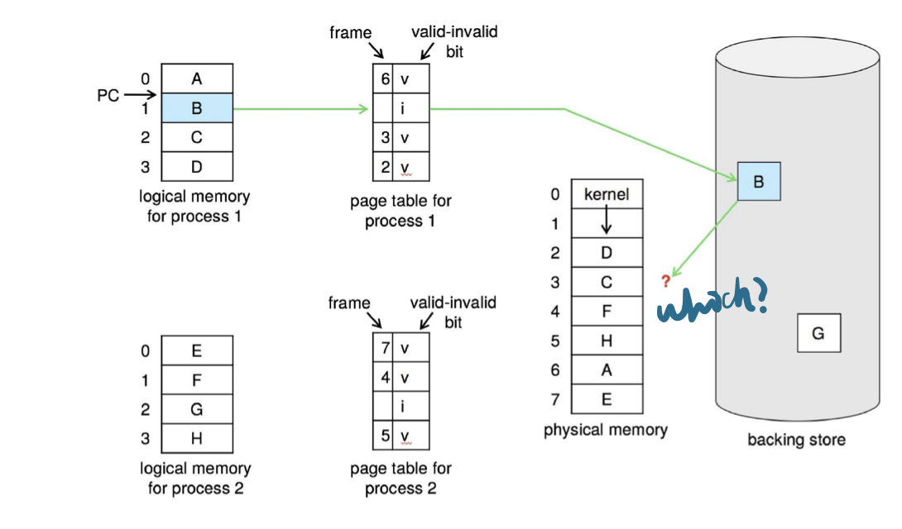

> Need For Page Replacement

### Page Replacement Concepts

- Prevent **over-allocation** of memory by modifying page - *fault service routine to include page replacement*
- Page replacement – *find some page in memory, but not really in use, page it out*
  - Algorithm – *terminate? swap out? replace the page?*
  - Performance – *want an algorithm which will result in minimum number of page faults*
  - Same page may be brought into memory several times
- Use **modify (dirty) bit** to reduce overhead of page transfers – *only modified pages are written to disk*
  > Otherwise, only mark as invalid, as discussed before
- Page replacement completes separation between logical memory and physical memory - large virtual memory can be provided on a smaller physical memory
 
### Basic Page Replacement
1. Find the location of the desired page on disk
2. Find a free frame: 
   - If there is a free frame, use it
   - If there is no free frame, use a page replacement algorithm to select a victim frame
   - Write victim frame to disk **if dirty**
3. Bring the desired page into the (newly) free frame; update the page and frame tables
4. Continue the process by restarting the instruction that caused the trap

> Note now, for every page fault, potentially 2 page transfers for page fault – increasing EAT

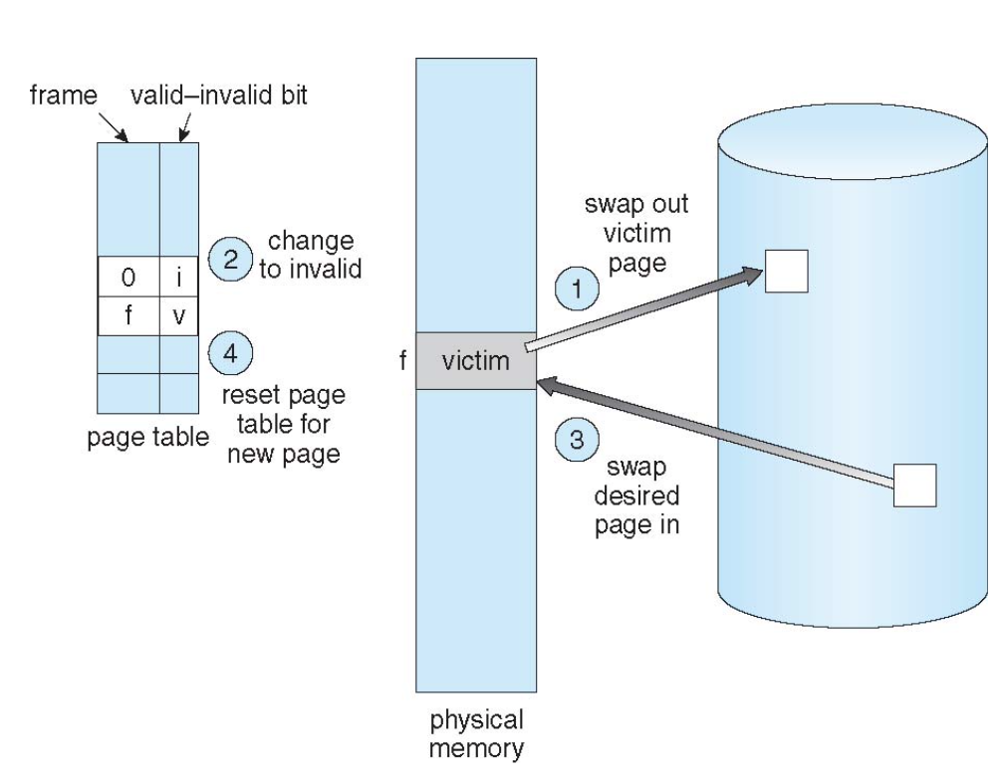
> Critical question: which victim should be chosen to swiped, and how to allocate

### Page and Frame Replacement Algorithms
> Objective: make page fault as few as possible

- **Frame-allocation algorithm** determines
  - How many frames to give each process 
  - Which frames to replace
- **Page-replacement algorithm**
  - Want lowest page-fault rate **on both first access and re-access**
- Evaluate algorithm by running it on a particular string of memory references (**reference string**) and computing the number of page faults on that string
  > Eval Performance by Simulation
  - String is just page numbers,not full addresses
  - Repeated access to the same page does not cause a page fault 
  - Results depend on number of frames available
- In all our examples, the **reference string** of referenced page numbers is
`7,0,1,2,0,3,0,4,2,3,0,3,0,3,2,1,2,0,1,7,0,1`

#### First-In-First-Out (FIFO) Algorithm

- Reference string: `7,0,1,2,0,3,0,4,2,3,0,3,0,3,2,1,2,0,1,7,0,1`
- 3 frames (3 pages can be in memory at a time per process)
  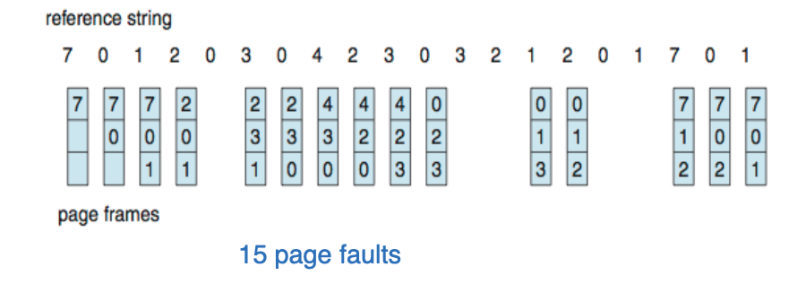
- How to **track** ages of pages? 
  - Just use a FIFO queue

#### FIFO Illustrating Belady’s Anomaly
- Can vary by reference string: consider `1,2,3,4,1,2,5,1,2,3,4,5`
- Adding more frames can cause more page faults! 
- Belady’s Anomaly
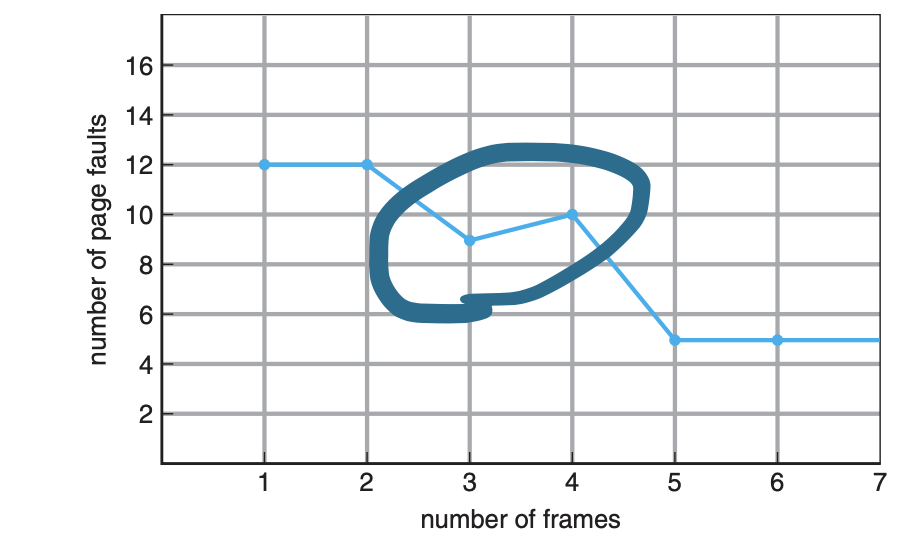
> How to resolve such anomaly?

#### Optimal Algorithm 
> Recall: the optimal alogrihm: FARTHEST IN FUTURE, but an offline solution, impractical
- Replace page that will not be used for longest period of time 
  - 9 is optimal for the example
- How do you know this? 
  - Can’t read the future
- Used for measuring how well your algorithm performs
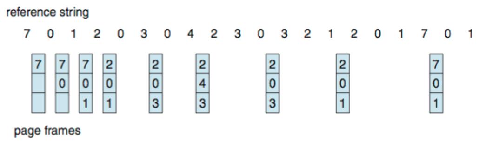

#### Least Recently Used (LRU) Algorithm
- Use past knowledge rather than future
- Replace page that has not been used in the most amount of time
- Associate time of last use with each page
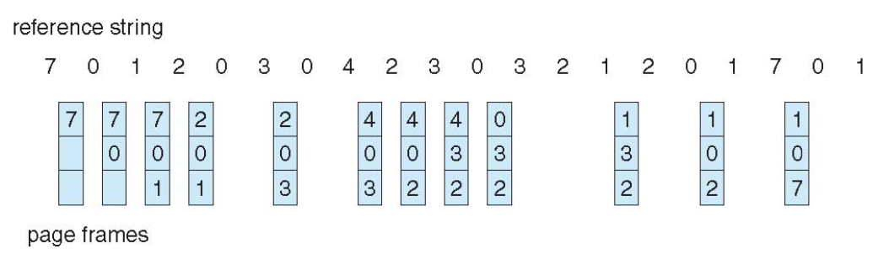
- 12 faults – better than FIFO but worse than OPT
- Generally good algorithm and frequently used
- But how to implement?

#### LRU Implementation

- Counter implementation
  - Every page entry has a counter; every time page is referenced through this entry, copy the clock into the counter
  - When a page needs to be changed,look at the counters to find smallest value
    - Search through table needed
- Stack implementation
  - Keep a stack of pages number in a double link form: 
  - Page referenced:
    - move it to the top
    - requires 6 pointers to be changed 
  - But each update more expensive
  - No search for replacement
  - 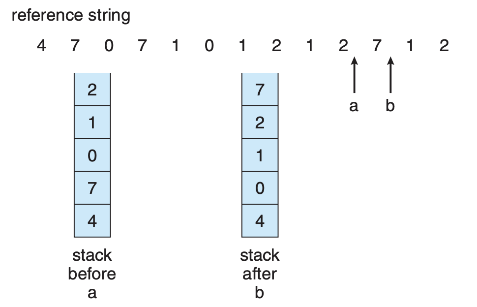
- LRU and OPT are cases of stack algorithms that don’t have Belady’s Anomaly

> Both implementations are costly, counter requires calculations, stack requires pointer moving

#### LRU Approximation Algorithms

- LRU needs special hardware and still slow
- **Reference bit**
  - With each page associate a bit,initially=0
  - When page is referenced bit set to 1
  - Replace any with reference bit = 0 (if one exists)
    - We do not know the order, however
- **Second-chance algorithm**
  - Generally FIFO, plus hardware-provided reference bit 
  - **Clock** replacement
  - If page to be replaced has
    - Reference bit = 0 -> replace it 
    - reference bit = 1 then:
      - set reference bit 0, leave page in memory
      - replace next page , subject to same rules
- Example of second chance
  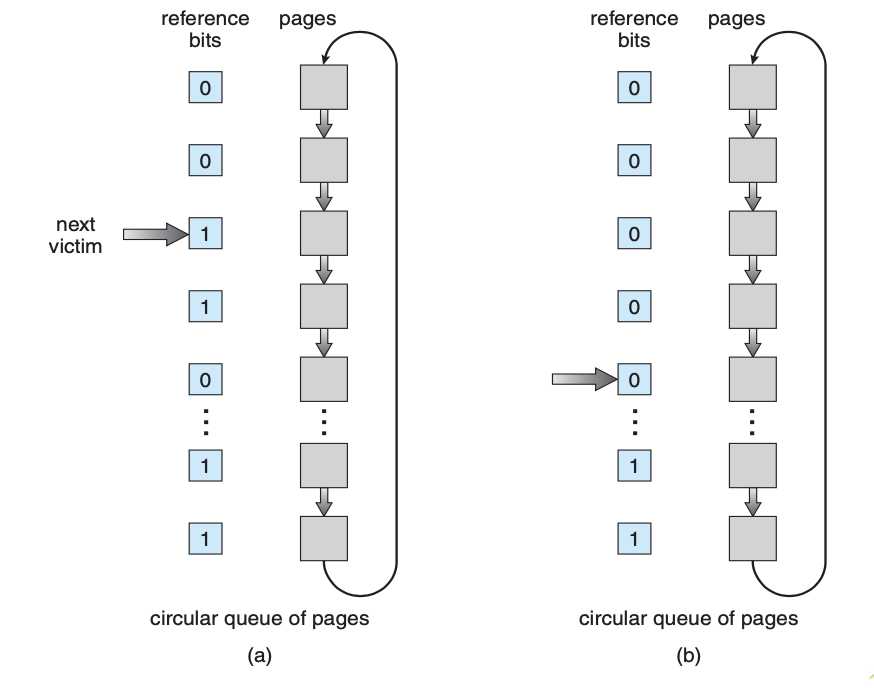

#### Enhanced Second-Chance Algorithm
- Improve algorithm by using reference bit and **modify bit (if available)** in concert
  > If modify bit = 0, the overhead can be reduced
- Take ordered pair (reference, modify):
  1. (0,0) neither recently used not modified - best page to replace
  2. (0,1) not recently used but modified - not quite as good, must write out before replacement
  3. (1,0) recently used but clean - probably will be used again soon
  4. (1,1) recently used and modified - probably will be used again soon and need to write out before replacement
- When page replacement called for, use the clock scheme but use the four classes replace page in lowest non-empty class
  - Might need to search circular queue several times

#### Counting Algorithms
- Keep a counter of the number of references that have been made to each page
  - Not common
- **Lease Frequently Used (LFU) Algorithm:** replaces page with smallest count
- **Most Frequently Used (MFU) Algorithm:** based on the argument that the page with the smallest count was probably just brought in and has yet to be used
  > a little bit counterintuitive
  > but practical in some applications

#### Page-Buffering Algorithms

- Keep a pool of free frames, always
  - Then frame available when needed, not found at fault time
  - Read page into free frame and select victim to evict and add to free pool
  - When convenient, evict victim
- Possibly, keep list of modified pages
  - When backing store otherwise idle, write pages there and set to non-dirty
- Possibly, keep free frame contents intact and note what is in them
  - If referenced again before reused, no need to load contents again from disk
  - Generally useful to reduce penalty if wrong victim frame selected
> Some guessing is imported

### Applications and Page Replacement

- All of these algorithms have OS guessing about future page access
- Some applications have better knowledge -i.e. databases
  > domain specific: databases: always visit from head, here most frequently used counting might work well
- Memory intensive applications can cause double buffering
  - OS keeps copy of page in memory as $1 / \mathrm{O}$ buffer
  - Application keeps page in memory for its own work
- Operating system can given direct access to the disk, getting out of the way of the applications
  - **Raw disk** mode
- Bypasses buffering, locking, etc

## Allocation of Frames

## Thrashing

## Memory-Mapped Files

## Allocating Kernel Memory

## Other Considerations

## Operating-System Examples