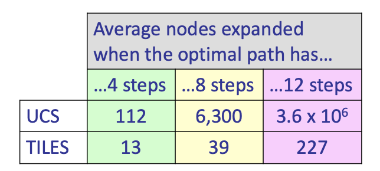
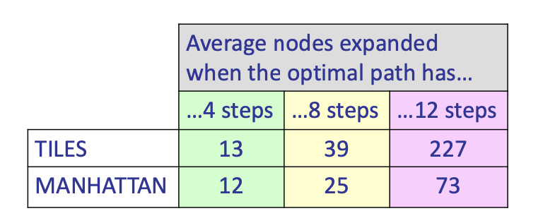
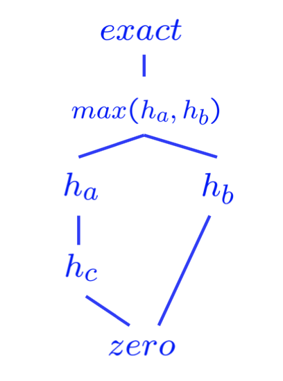
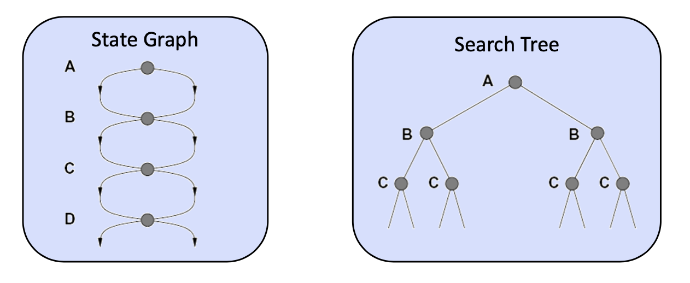
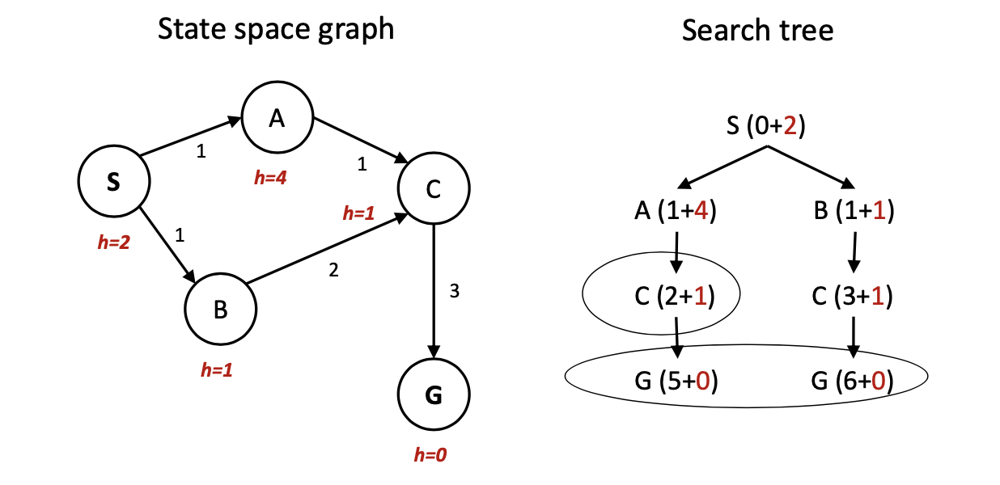
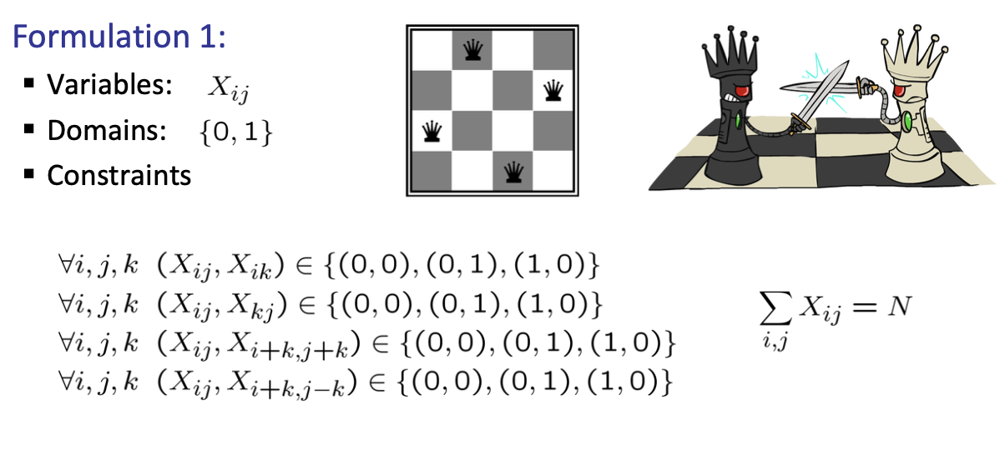
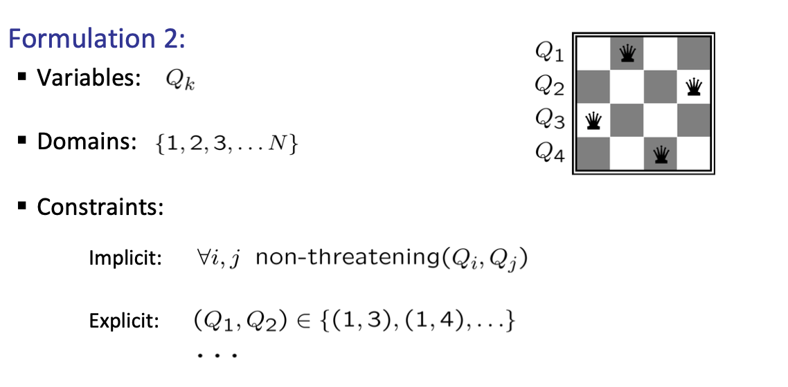
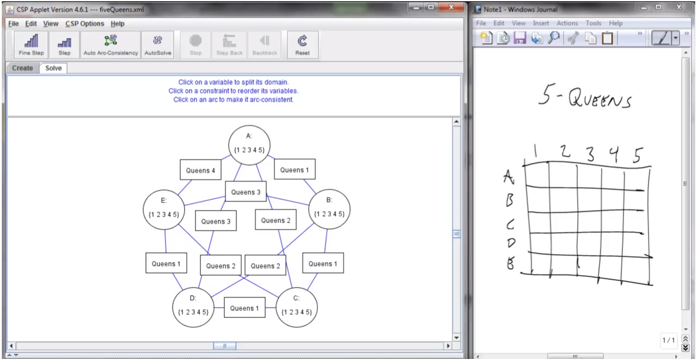
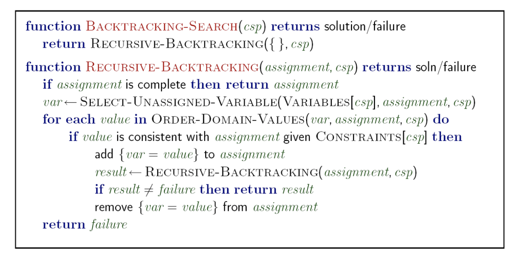
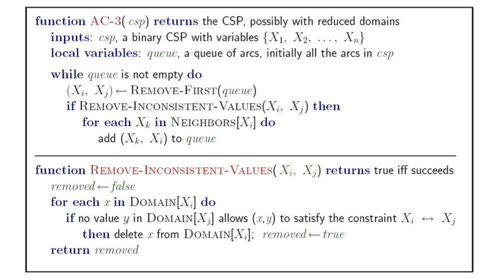

<!--more-->

[toc]

## Heuristics

> Recall: Admissible Heuristics: $0<h(n)\le h^{*}(n)$
> Often, admissible heuristics are solutions to **relaxed problems**, where new actions are available
> 
> Inadmissible heuristics are often useful too (When it comes to greedy)

### Example: 8 puzzle

#### Heuristic 1: Number of tiles misplaced

- Why admissible? `h(start) = 8`
- This is a relaxed-problem heuristic
- Experiment Result:
  

#### Heuristic 2: Total Manhattan distance
- Idea: What if we had an easier 8-puzzle where any tile could slide any direction at any time, ignoring other tiles?
- Why admissible? `h(start) = 3+1+2+2+2+3+3+2=18`
- Experiment Result:
  

> With A*: a trade-off between quality of estimate and work per node
> - As heuristics get closer to the true cost, you will expand fewer nodes but usually do more work per node to compute the heuristic itself

## Semi-Lattice of Heuristics

比较多个启发式
- Dominance: $h_{\mathrm{a}} \geq h_{\mathrm{c}}$ if
    $$
    \forall n: h_{a}(n) \geq h_{c}(n)
    $$
- Heuristics form a semi-lattice:
  - Max of admissible heuristics is admissible
    $$
    h(n)=\max \left(h_{a}(n), h_{b}(n)\right)
    $$

## Graph Search

> For tree search, infinite loop can happen, DFS fails.
> 
> **Idea:** never expand a node twice!

- Implementation
  - Tree search + set of expanded states (“closed set”)
  - Expand the search tree node-by-node, but...
  - Before expanding a node, check to make sure its state has never been expanded before
  - If not new, skip it, if new add to closed set

- **Completeness?**: still holds
- **Optimality?**: yes, but with new requirement **Consistency**
  > A* Graph Search Gone Wrong?
  > Note here, A has a extreme high heruistic of 4, so we explore B before A, but at S, A should be optimal while B should be suboptimal.
  > 

### Consistency of Heuristics:

**Main idea:** estimated heuristic costs $\leq$ actual costs
- Admissibility: heuristic cost $\leq$ actual cost to goal
    $$
    \mathrm{h}(\mathrm{A}) \leq \text { actual cost from } \mathrm{A} \text { to } \mathrm{G}
    $$
- Consistency: heuristic "arc" cost \leq actual cost for each arc
    $$
    h(A)-h(C) \leq \cos t(A \text { to } C)
    $$
**Consequences of consistency:**
- The f value along a path never decreases
    $$
    \begin{aligned}
    h(A) \leq & \cos t(A \text { to } C)+h(C) \\
    f(A)=g(A)+h(A) & \leq g(A)+\operatorname{cost}(A \text { to } C)+h(C)=f(C)
    \end{aligned}
    $$
- $\mathrm{A}^{*}$ graph search is optimal
- Now we can make sure A is explored before C, i.e. For every state s, nodes that reach s optimally are expanded before nodes that reach s suboptimally

### Summary:
- Tree Search:
  - A* is optimal if heuristic is admissible 
  - UCS is a special case (h = 0)
- Graph Search:
  - if Consistent, (which also requires admissible)

## Constraint Satisfaction Problems

Identification: assignments to variables
- The goal itself is important, not the path
- All paths at the same depth (for some formulations) 
- CSPs are a specialized class of identification problems

CSP是搜索问题的一个变式/子集

| Standard Search Problems | Constraint Satisfaction Problems
--| ---------|----------|---------
state | “black box”: arbitrary data structure | State is defined by variables $X_i$ with values from a domain $D$ (sometimes $D$ depends on $i$)
goal test | any function over states | a set of constraints specifying allowable combinations of values for subsets of variables
successor function |  anything |

Allows useful general-purpose algorithms with more power than standard search algorithms

### Example: Map Coloring

- Variables: WA, NT, Q, NSW, V, SA, T
- Domains: $\mathrm{D}=\{$ red, green, blue $\}$
- Constraints: adjacent regions must have different colors, can be implicit or explicit
  - Implicit: $\quad \mathrm{WA} \neq \mathrm{NT}$
  - Explicit: $(\mathrm{WA}, \mathrm{NT}) \in\{(\text { red, green }),(\text { red, blue }), \ldots\}$
- Solutions are assignments satisfying all constraints, e.g.:
  $\{$ WA $=$ red, $N T=g$ reen $, Q=r e d, \quad N S W=g r e e n$ $\mathrm{V}=$ red, $\mathrm{SA}=$ blue, $\mathrm{T}=\mathrm{green}\}$

### Example: N-Queens

A benefit of representation II over I is that we move some of the constraints into the domain.

## Constraint Graphs
- Binary CSP (二元CSP): each constraint relates (at most) two variables
- Binary constraint graph: nodes are variables, arcs show constraints
- General-purpose CSP algorithms use the graph structure to speed up search. E.g., Tasmania is an independent subproblem!

## CSP as incremental function

### Variables Variety

- Discrete Variables 
  - Finite domains
    - n variables, size d means O(dn) complete assignments
    - E.g., Boolean CSPs, including Boolean satisfiability (NP-complete)
  - Infinite domains
    - integers, strings, etc.
    - E.g., job scheduling, variables are start/end times for each job § Linear constraints solvable, nonlinear undecidable
- Continuous variables
  - E.g., start/end times for Hubble Telescope observations
  - Linear constraints solvable in polynomial time by LP methods

### Constraints Variety

- Varieties of Constraints
  - Unary constraints involve a single variable (equivalent to reducing domains), e.g.: `SA != green`
  - Binary constraints involve pairs of variables, e.g.: `SA != WA`
  - Higher-order constraints involve 3 or more variables: 
    - e.g., cryptarithmetic column constraints
- Preferences (soft constraints):
  - E.g., red is better than green
  - Often representable by a cost for each variable assignment 
  - Gives constrained optimization problems
  - (We’ll ignore these until we get to Bayes’ nets)

### Formulation

States defined by the values assigned so far **(partial assignments)**
- Initial state: the empty assignment, {}
- Successor function: assign a value to an unassigned variable that does not conflict with current assignment
  - fail if no legal assignments
- Goal test: the current assignment is **complete** and satisfies all constraints

Naive solution
- What would BFS do?
  - expand $n \cdot d$ states every layer, each layer performs an assignment
  - where n is the variable number, d is the possible assignments
  - we can only perform goal test when all variables are filled.
  - The  **space complexity** will be extremely costly $O(n!\cdot d^n)$
- What would DFS do?
  - with the **backtracking** feature, the space complexity will not be the variable number
  - but the time complexity is still high.

### Backtracking Search
> Idea: One variable at a time
- fix ordering

> Idea: check the (local) validity of each assignment step, check constraints as you go
- i.e. consider only values which do not conflict with previous assignments
- Might have to do some computation to check the constraints 
- “Incremental goal test”

> Backtracking = DFS + variable-ordering + fail-on-violation

## Improving Backtracking

- General-purpose ideas give huge gains in speed
- Ordering: 避免可能造成未来失误的赋值
  - Which variable should be assigned next?
  - In what order should its values be tried?
- Filtering: Can we detect inevitable failure early?
- Structure: Can we exploit the problem structure?

### Filtering

将现有assignment造成的约束向前传播

- **Filtering** Keep track of domains for unassigned variables and cross off bad options
- **Forward checking**: Cross off values that violate a constraint when added to the existing assignment
- **Constraint Propagation**: propagates information from assigned to unassigned variables, but doesn't provide early detection for all failures:
  
  更早发现了问题（某些unassigned变量domin为空），提前回溯

> still reasoning from constraint to constraint, no global information

#### Consistency of A single Arc

define an arc from unassigned(tail) -> assigned(head), to represent the assigning order.
if for node t, it is the tail of some arc pointing to assigned head, it won't have the assigned color. **Delete from the tail**
- for unassigned tail, remove from the domain
- for assigned tail, check conflicts

#### Improved Solution: arc consistency
A simple form of propagation makes sure all arcs are consistent:

- Important Idea: If X loses a value, neighbors of X need to be rechecked! 
- Arc consistency detects failure earlier than forward checking
- Can be run as a preprocessor or after each assignment
- What’s the downside of enforcing arc consistency?

- Runtime: $O(n^2 d^3)$, can be reduced to $O(n^2 d^2)$
  - The `Remove-inconsistent` loop costs $O(d^2)$ 
  - The general `AC-loop` costs $O(n^2)$
- ... but detecting all possible future problems is NP-hard – why?
- **Limitation:** 
  1. one/multiple/no solution can happen
  2. backtracking search is still a huge burden in complexity

> Note! we are only searching the possibilities, but to determine the satisfiability of the problem is SAT, which is NP.

