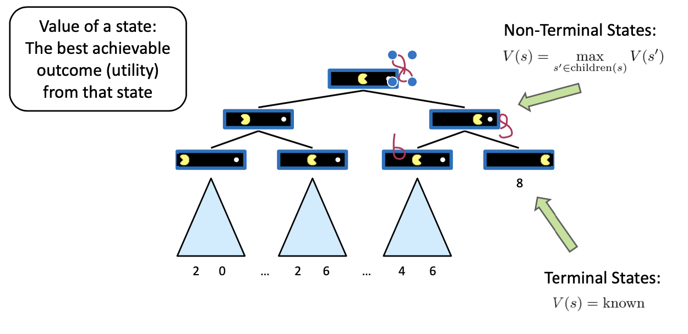
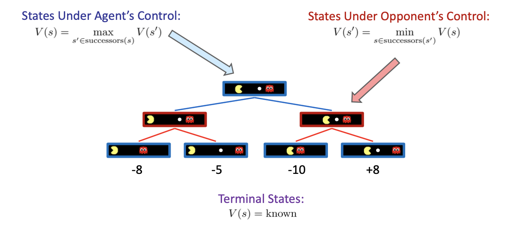
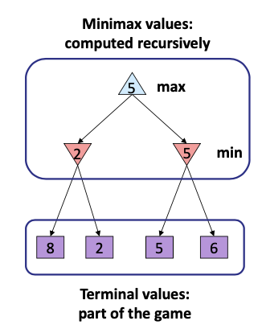
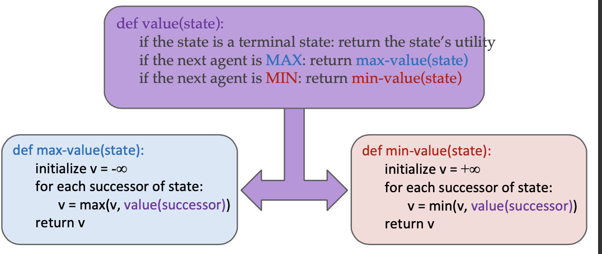
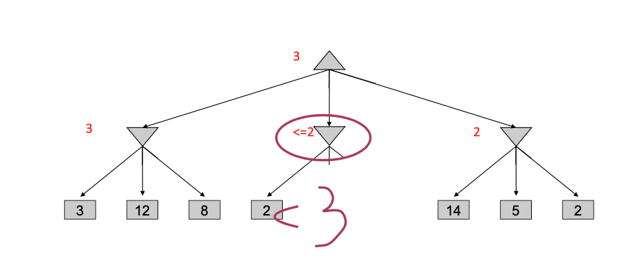
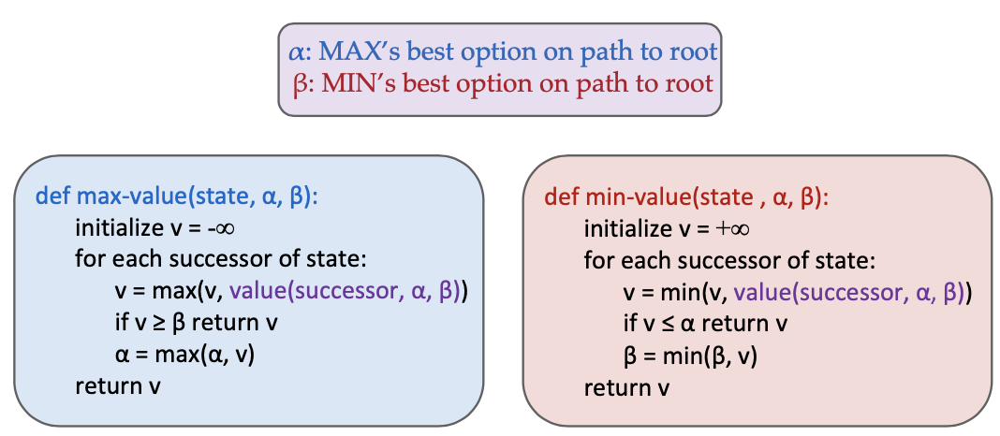
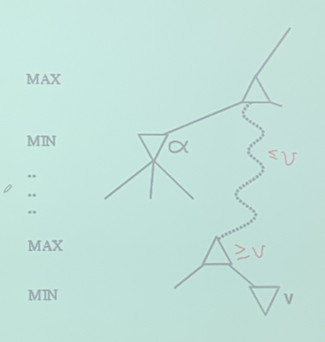

<!--more-->

[toc]

## Introduction

### Gamse VS. Search Problems
- "Unpredictable opponet"
  - specifying a move for every possible opponent reply
- E.g for chess, averaging branching is 35, and search 50 moves by each player (100 total)
  - Time limits $35^100$

### Two-Agent Games
- perfect information
- zero-sum games
- move in turn until either one of them wins or the result is a draw
- each player has a complete model of the environment and of its own and the other's possible actions and their effects.

## Formalization

### Type of Games
- Deterministic or Stochastic(e.g. rolling the dice)
- One, or two, or more players
- Zero Sum? (no double win)
  - General Games
    - Agents have **independent utilities** (values on outcomes)
  - Zero Sum Games
    - Agents have **opposite utilities** (values on outcomes)
- Perfect information (can you see the state)

> Want algorithms for calculating a strategy/policy which recommends a move from each state

### Deterministic Games

- States: `S` (start at `s0`, initial state)
- Players: `P={1,2,...,n}`, usually take turns
- Actions: `A`, may depend on player/state
- Transition Function `S * A -> S`, defines the result of a move
- Terminal Test: `S -> {t, f}`
- Terminal Utilities: `S * P -> R`, a utility function/objective function
- Game: Search in a game tree

- Goal: Output strategy: `S -> A`

### Single Agent Trees

**Utilities** will only be calculated at the terminal state, to evaluate the value of a state, we can calculate the **utility** of that state (the best achievable outcome)

### Adversarial Game Trees

The opponent has different strategy to the player.

## Adversarial Search

- For **deterministic**, **zero-sum** games
  - A state-space search tree 
  - Players alternate turns
  - Compute each node’s minimax value: *the best achievable utility against a rational (optimal) adversary*
  - 

> Reverse Progradation: terminal values have to be determined

### Implementation

> Note, we are considering deterministic games. When there exists uncertainty, some probalistic techniques should be introduced

### Analysis
- Just like exhaustive DFS
- Time $O(b^m)$
- Space $O(bm)$

## Game Tree Pruning

### Alpha-Beta Implementation

every node will maintain a `MaxNode(alpha,  v)` or `MinNode(beta, v)` value, and pass it down to its children, so that useless branches can be pruned.

> if after exploring some children, the current (MIN/MAX) node becomes worse than alpha/beta, we can stop exploring the current node's other children.

> Take away:
> 
> alpha is the value of the best(i.e. highest) choice found so far at any choice point along the path for max
> if v is worse than alpha, max will avoid it, i.e. prune that max-branch

### Optimization

Good child ordering improves effectiveness of pruning

With “perfect ordering”:
- Time complexity drops to $O(b^{m/2})$
- Doubles solvable depth!
- Full search of, e.g. chess, is still hopeless...

We can compute how to compute. **metareasoning**

