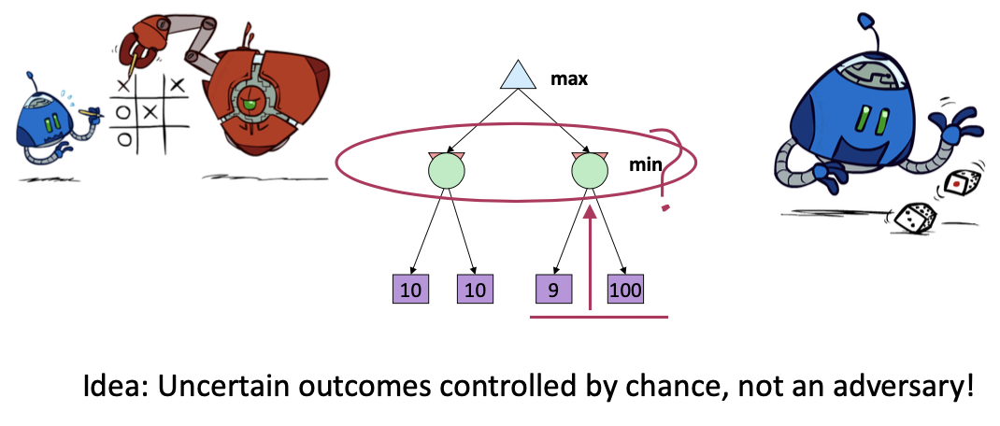
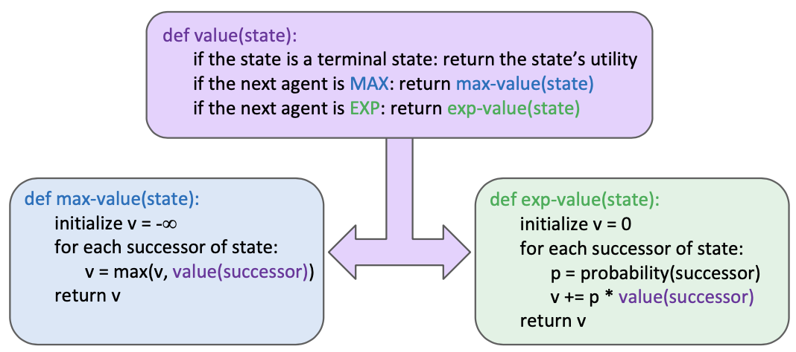
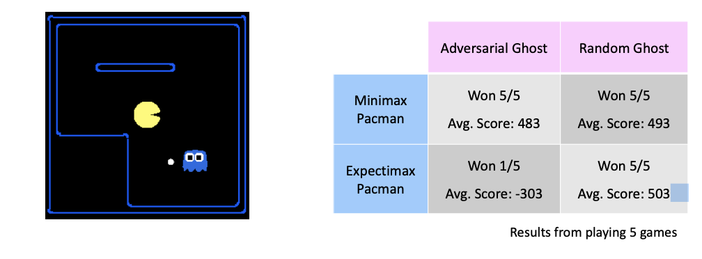
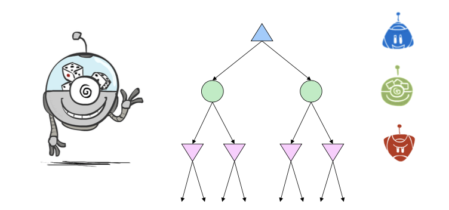
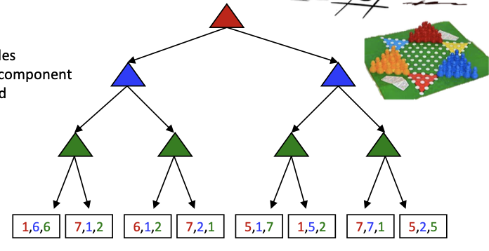

Worst-Case vs. Average Case

<!--more-->

[toc]

## Expectimax Search

Uncertainty may come from...
- Explicit randomness: rolling dice
- Unpredictable opponents: the ghosts respond randomly
- Actions can fail: when moving a robot, wheels might slip

> Values should now reflect average-case (expectimax) outcomes, not worst-case (minimax) outcomes

**Expectimax search**: compute the average score under optimal play
- Max nodes as in minimax search
- Chance nodes are like min nodes but the outcome is uncertain 
- Calculate their **expected utilities**
- I.e. take weighted average (expectation) of children

Later, we’ll learn how to formalize the underlying uncertain- result problems as **Markov Decision Processes**

> pruning is impossible

### Variants
- different probabilities
- Dynamic Probability (opponent with 80% minimax + 20% random = 90% min node + 10 % the other) AKA  Mixture Model

## Modeling Assumptions
- Dangerous Optimism: assuming chance when the world is adversarial
- Dangerous Pessimism: assuming the worst case when it's not likely

## Mixed Layer Types

> Every stage has different strategy?

e.g. Backgammon
Expectiminimax
- Environment is an extra “random agent” player that moves after each min/max agent
- Each node computes the appropriate combination of its children

## Multi-Agent Utilities

> What if the game is not zero-sum, or has multiple players?

Generalization of minimax:
- Terminals have utility tuples
- Node values are also utility tuples
- Each player maximizes its own component 
- Can give rise to cooperation and competition dynamically...

