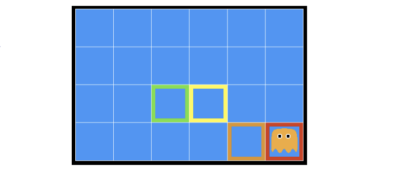
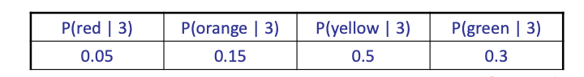
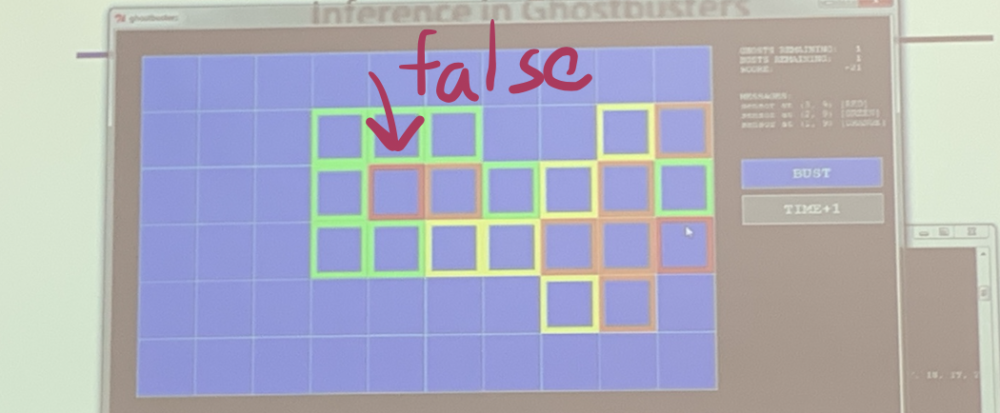
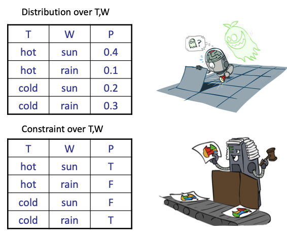
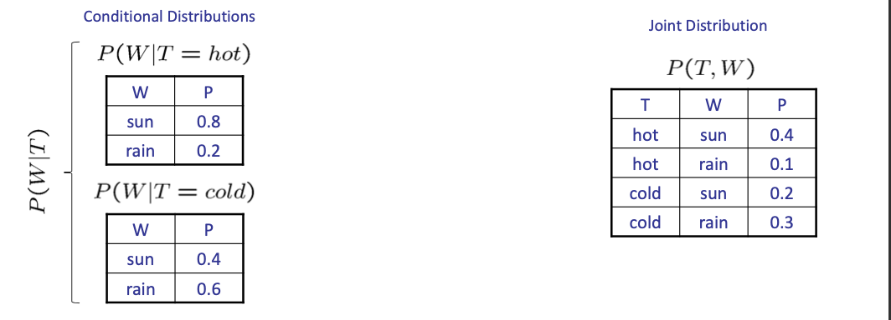
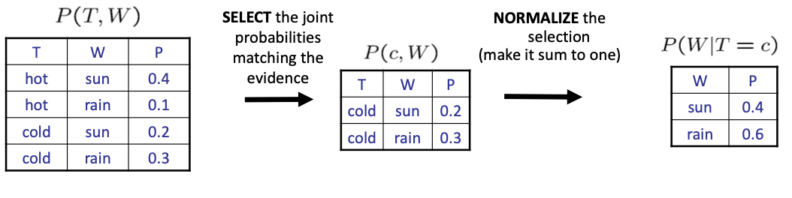

<!--more-->

[toc]

## Recall: Probability Spaces

- Set$\Omega$ 样本空间: certain subsets of $\Omega$ as being events
- Event Field $U$: collection of subsets of $\Omega$
- **DEFINTION**. A $\sigma$ -algebra is a collection $\mathcal{U}$ of subsets of $\Omega$ with these properties:
    (i) $\emptyset, \Omega \in \mathcal{U}$
    (ii) If $A \in \mathcal{U},$ then $A^{c} \in \mathcal{U}$
    (iii) If $A_{1}, A_{2}, \cdots \in \mathcal{U},$ then
    $$
    \bigcup_{k=1}^{\infty} A_{k}, \bigcap_{k=1}^{\infty} A_{k} \in \mathcal{U}
    $$
    Here $A^{c}:=\Omega-A$ is the complement of $A$
- 概率测度$P$
- 概率空间=$\Omega,U,P$

> The examples in EI339 are discrete RVs

## Inference in Ghostbusters

- A ghost is in the grid somewhere
- Sensor readings tell how close a square is to the ghost
  - On the ghost: red
  - 1 or 2 away: orange 
  - 3 or 4 away: yellow 
  - 5+ away: green
- Sensors are *noisy*, but we know $P(Color | Distance)$

> 先验条件概率+evidence => 推断

## Uncertainty
> A bit like CSP, in that graph model is involved
- General situation:
  - Observed variables (evidence): Agent knows certain things about the state of the world (e.g., sensor readings or symptoms)
  - Unobserved variables: Agent needs to reason about other aspects (e.g. where an object is or what disease is present)
  - Model: Agent knows something about how the known variables relate to the unknown variables
- Probabilistic reasoning gives us a framework for managing our beliefs and knowledge

## Random Variables
- Denoted as capital letters
- have domains

## Probabilistic Models
- A probabilistic model is a joint distribution over a set of random variables
- Probabilistic models:
  - (Random) variables with domains
  - Assignments are called **outcomes**
  - Joint distributions: say whether assignments (outcomes) are likely
  - **Normalized**: sum to 1.0
  - Ideally: only certain variables directly interact
> Resemblance to CSP
- Constraint satisfaction problems:
  - Variables with domains
  - Constraints: state whether assignments are possible
  - Ideally: only certain variables directly interact

## Events

- An event is a set E of outcomes
  $$
  P(E) = \sum_{(x_1\ldots x_n) \in E} P(x_1,\ldots,x_n)
  $$
- From a joint distribution, we can calculate the probability of any event
  - Probability that it’s hot AND sunny? 
  - Probability that it’s hot?
  - Probability that it’s hot OR sunny?
- Typically, the events we care about are partial assignments, like P(T=hot)

## Conditional Distributions
- Conditional distributions are probability distributions over some variables given fixed values of others

> In probabilistic models, evidence matters a lot ($T=hot$ or $T=cold$)

### Normalization Trick
> Although we have different conditional distributions table, the sum is always 1.

Given evidence $T=c$, we know the variable $W$, We can normalize them to conditional distribution.

A simple scaling can avoid the redudant computation

