<!--more-->

[toc]

## 基于Boosting的贝叶斯分类

- idea: 多次训练，对误分类的模型，做提升。
- AdaBoost: Adaptive Boosting, bulding a stronger classifier from a lot of weaker ones.
- 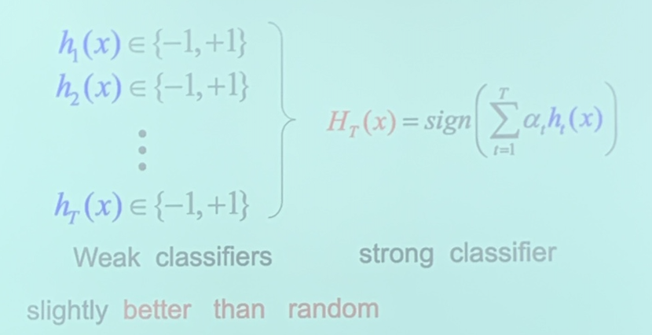
- 每一轮如何改变训练数据的权值或概率分布？
  - AdaBoost:提高那些被前一轮若分类器错误分类样本的权值，降低那些正确分类样本的权值
- 如何将弱分类器组合成一个强分类器
  - AdaBoost:加权多数表决，加大分类误差率小的分类器权值，使其在表决中起较大作用，减小分类误差率大的弱分类器的权值，使其在表决中起较小作用。

### AdaBoost 算法

1. Initialization
$$
D_{1}=\left(w_{1,1}, \cdots, w_{1, i}, \cdots, w_{1, N}\right), \quad w_{1, i}=\frac{1}{N^{\prime}} i=1,2, \cdots, N
$$

2. for m weak classifiers m = 1,2,...M
   1. train under weight $D_m$, get the weak classifier $G_{m}(x): x \rightarrow\{-1,+1\}$
   2. Calculate the training error $e_{m}=P\left(G_{m}\left(x_{i}\right) \neq y_{i}\right)=\sum_{i=1}^{N} w_{m, i} I\left(G_{m}\left(x_{i}\right) \neq y_{i}\right)$
   3. calculate coefficient of $G_m$: $\alpha_{m}=\frac{1}{2} \log \frac{1-e_{m}}{e_{m}}$ (we need to guarantee that $e_m < \frac{1}{2}$, as a weak classifier (slightly better than $\frac{1}{2}$))
   4. Update the weight distribution of the traning data
      $$
      \begin{array}{c}
      D_{m+1}=\left(w_{m+1,1}, \cdots, w_{m+1, i}, \cdots w_{m+1, N}\right) \\
      w_{m+1, i}=\frac{w_{m, i}}{Z_{m}} \exp \left(-\alpha_{m} y_{i} G_{m}\left(x_{i}\right)\right)
      \end{array}
      $$
      where $Z_m$ is the normalization factor $Z_{m}=\sum_{i=1}^{N} w_{m, i} \exp \left(-\alpha_{m} y_{i} G_{m}\left(x_{i}\right)\right)$

3. Build the linear combination of classifiers $f(x)=\sum_{m=1}^{M} \alpha_{m} G_{m}(x)$
4. Final output:
    $$
    f(x)=\operatorname{sign}(f(x))=\operatorname{sign}\left(\sum_{m=1}^{M} \alpha_{m} \hat{G}_{m}(x)\right)
    $$
   

### Example
 0 | 1  | 2  | 3
-- | -- | -- | --
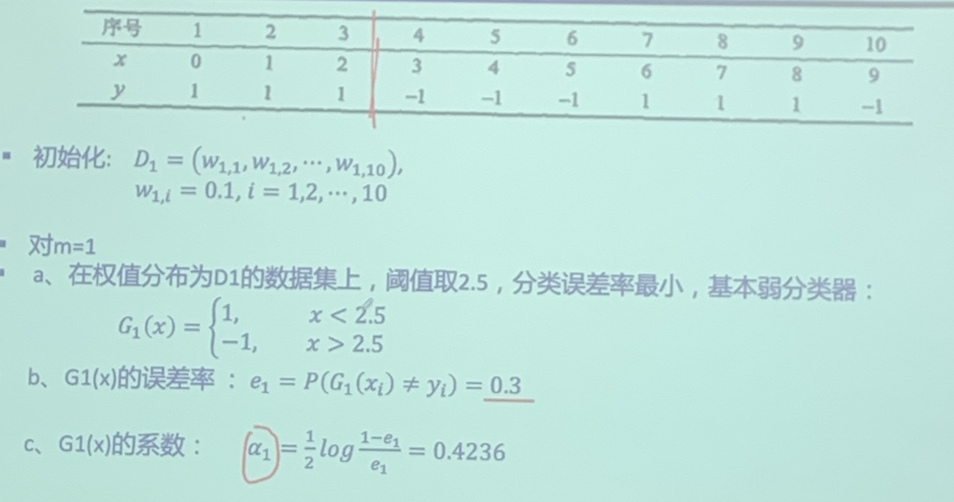 | 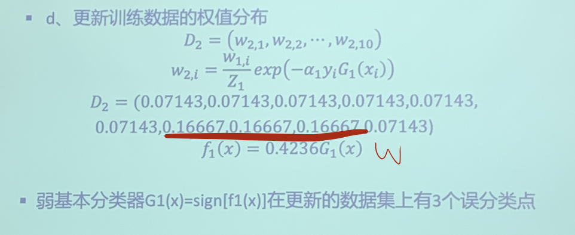 | 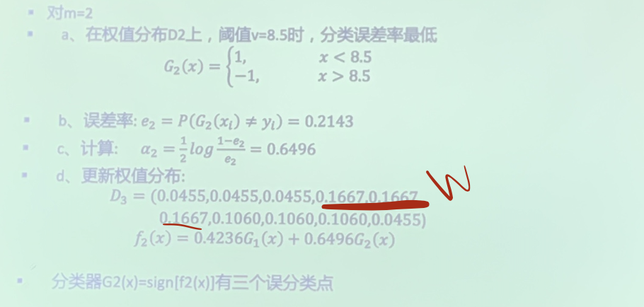 | 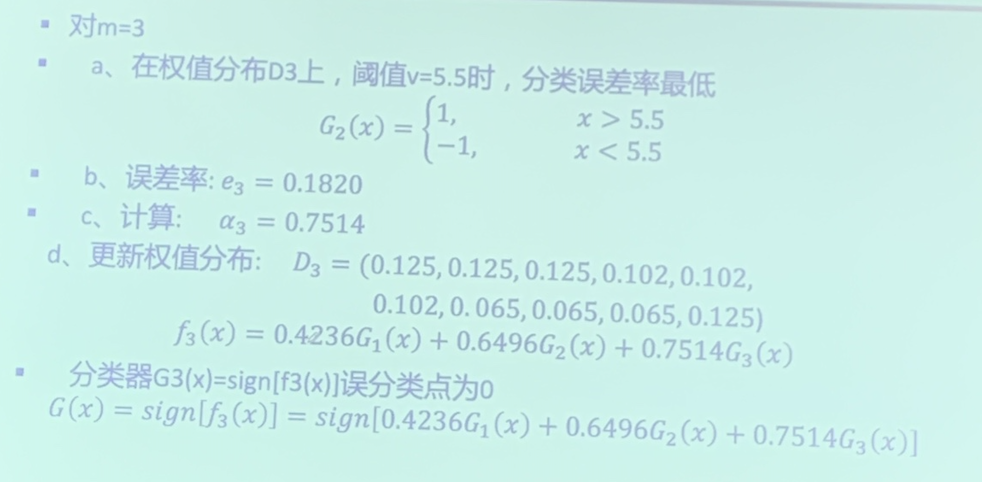

## Linear Classifiers

- Inputs are feature values 
- Each feature has a weight 
- Sum is the activation

$$
\text { activation }_{w}(x)=\sum_{i} w_{i} \cdot f_{i}(x)=w \cdot f(x)
$$

- If the activation is: 
  - Positive, output +1 
  - Negative, output -1

### Weights

- Binary case: compare features to a weight vector
- Learning: figure out the weight vector from examples

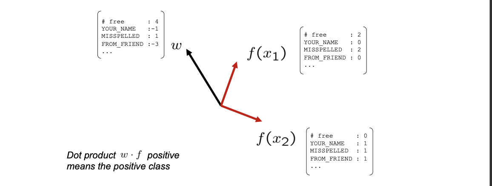
> The classification $sgn(\text{activation})$ is a non-linear transformation

### Binary Decision Rule
> Another view:
- In the space of feature vectors 
  - Examples are points
  - Any weight vector is a **hyperplane**
  > represented by weight parameters (权重向量/法向量 + 偏置)
  - One side corresponds to Y=+1
  - Other corresponds to Y=-1

### Learning: Binary Perceptron

- Start with weights $=0$
- For each training instance:
- Classify with current weights
  $$
  y=\left\{\begin{array}{ll}
  +1 & \text { if } w \cdot f(x) \geq 0 \\
  -1 & \text { if } w \cdot f(x)<0
  \end{array}\right.
  $$
- If correct (i.e., $\left.\mathrm{y}=\mathrm{y}^{*}\right)$, no change!
- If wrong: adjust the weight vector by adding or subtracting the feature vector. Subtract if $y^{*}$ is -1
  $$
  w=w+y^{*} \cdot f
  $$
> 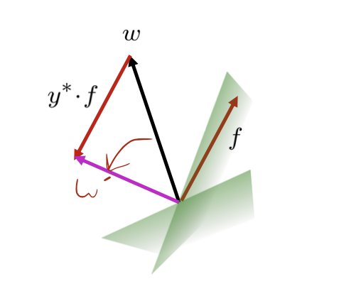
> $w'\cdot f = w \cdot f + y^{*} (f\cdot f)$
> So that after the modification, $f$ will be in the correct area.

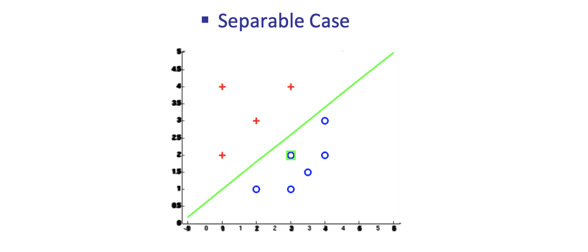

## Multiclass Decision Rule

- If we have multiple classes:
- A weight vector for each class:
  $w_{y}$
- Score (activation) of a class y:
  $w_{y} \cdot f(x)$
- Prediction highest score wins
  $y=\arg \max _{y} w_{y} \cdot f(x)$
  > The larger the size of the reference vector, the greater the probability it will fall into the class (the larger 张角)

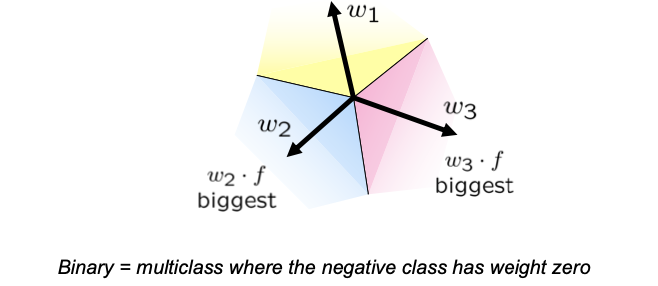
> for any given vector, $|P||\omega_1|\cos\theta_1 = |P||\omega_2|\cos\theta_2$ can solve the size of the angle

### Learning: Multiclass Perceptron

- Start with all weights $=0$ 
- Pick up training examples one by one 
- Predict with current weights
  $$
  y=\arg \max _{y} w_{y} \cdot f(x)
  $$
- If correct, no change!
- If wrong: lower score of wrong answer, raise score of right answer
  $$
  \begin{array}{l}
  w_{y}=w_{y}-f(x) \text{   (wrong answer)}\\
  w_{y^{*}}=w_{y^{*}}+f(x) \text{    (correct answer)}
  \end{array}
  $$

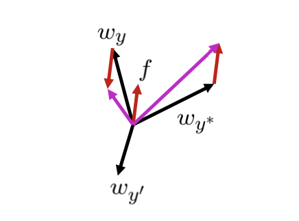

### Example
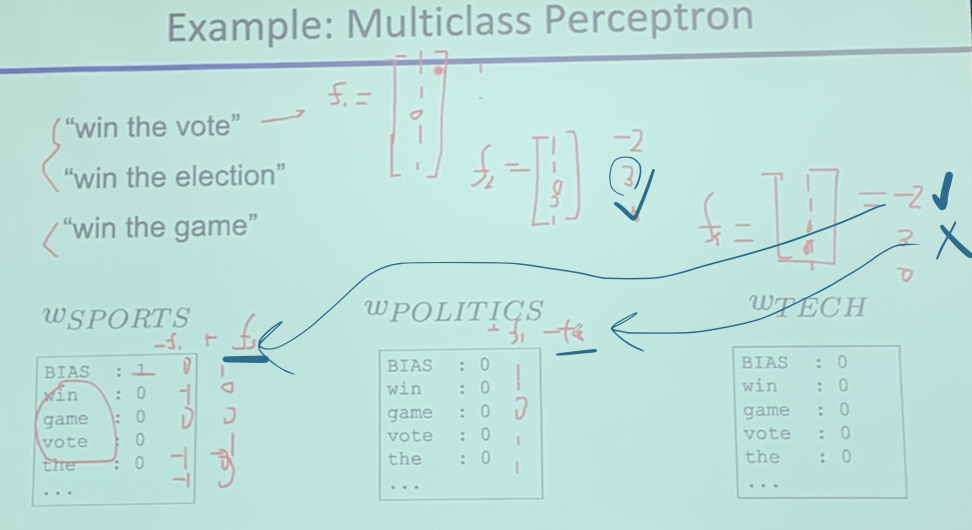

### Remark

- Separability: true if some parameters get the training set perfectly correct
- Convergence: if the training is **separable**, perceptron will eventually converge (binary case)
- Mistake Bound: the maximum number of mistakes (binary case) related to the margin or degree of separability
  > For non-separable cases, an approximately correct result can be gained

$\text { mistakes }<\frac{k}{\delta^{2}}$
where k is the dimension of the vector and $\delta$ is related to the distance between the reference vector and the nearest sample.

### Problems with the perceptron

- Noise: if the data isn’t separable, weights might thrash
  - Averaging weight vectors over time can help (averaged perceptron)
- Mediocre generalization: finds a “barely” separating solution
  > How good is the bound found from the traning data **w.r.t the actual problem**?
- Overtraining: test / held-out accuracy usually rises, then falls
  - Overtraining is a kind of overfitting
  > Recall: a held-out set for pure validation

## Improving the Perceptron

### Non-Separable Case: From Deterministic Decision to Probabilistic Decision

Deterministic Decision | Probabilistic Decision
---------------------- | ----------------------
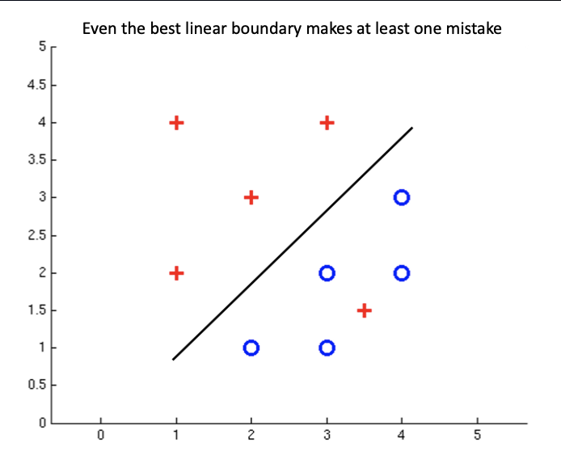 | 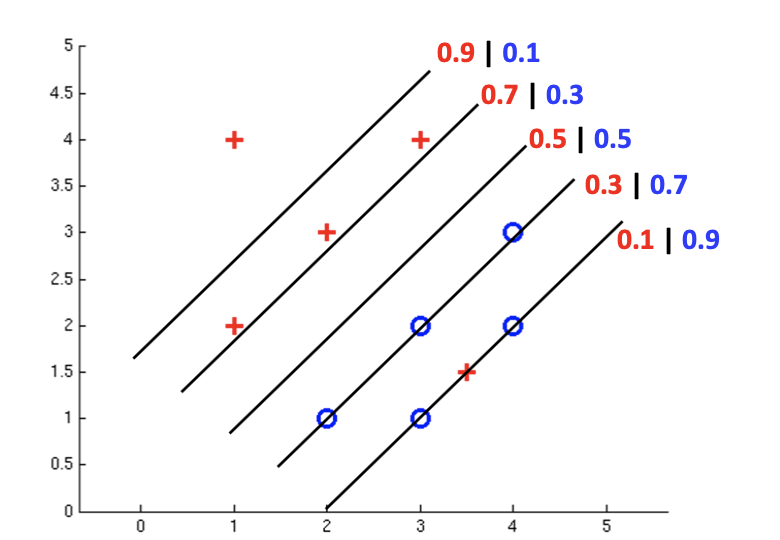
> The distance from the point to the bound is its competitive probability

### How to get probabilistic decisions?

- Perceptron scoring: $z=w \cdot f(x)$ 
  - If $\quad z=w \cdot f(x) \quad$ very positive $\rightarrow$ want probability going to 1 
  - If $\quad z=w \cdot f(x) \quad$ very negative $\rightarrow$ want probability going to 0

- Sigmoid Function
  $$\phi(z) = \frac{1}{1+e^{-z}}$$

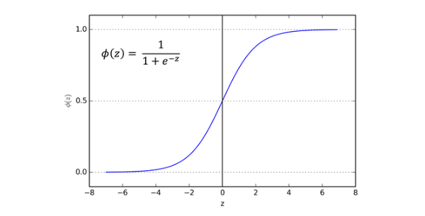

### Best w?
> Use the maximum likelihood estimation!

$$\begin{aligned}
\max _{w}l l(w)&=\max _{w} \sum_{i} \log P\left(y^{(i)} \mid x^{(i)} ; w\right) \\
\text{with } P\left(y^{(i)}=+1 \mid x^{(i)} ; w\right) &=\frac{1}{1+e^{-w \cdot f\left(x^{(i)}\right)}}\\
P\left(y^{(i)}=-1 \mid x^{(i)} ; w\right)&=1-\frac{1}{1+e^{-w \cdot f\left(x^{(i)}\right)}}\end{aligned}$$
> Note, assumption: all samples are independent
> Therefore, the joint distribution is the product of all single conditional probabilities
> Assumption 2:samples are uniformly distributed

> which leads to Logistic Regression

### Separable Case: Probabilistic Decision – Clear Preference

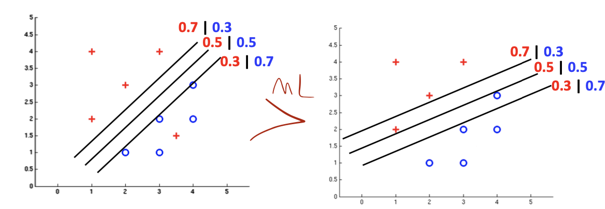

## Multiclass Logistic Regression

Recall Perceptron:
- A weight vector for each class: $\quad w y$
- Score (activation) of a class y: $\quad w y \cdot f(x)$
- Prediction highest score wins $y=\arg \max _{y} w_{y} \cdot f(x)$

How to make the scores into probabilities?

$$
\underbrace{z_{1}, z_{2}, z_{3}}_{\text {original activations }} \rightarrow \underbrace{\frac{e^{z_{1}}}{e^{z_{1}}+e^{z_{2}}+e^{z_{3}}}, \frac{e^{z_{2}}}{e^{z_{1}}+e^{z_{2}}+e^{z_{3}}}, \frac{e^{z_{3}}}{e^{z_{1}}+e^{z_{2}}+e^{z_{3}}}}_{\text {softmax activations }}
$$

### Best w?

$$
\begin{array}{c}
\max _{w}  l l(w)=\max _{w} \sum_{i} \log P\left(y^{(i)} \mid x^{(i)} ; w\right) \\
\text { with: } P\left(y^{(i)} \mid x^{(i)} ; w\right)=\frac{e^{w_{y}(i) \cdot f\left(x^{(i)}\right)}}{\sum_{y} e^{w_{y} \cdot f\left(x^{(i)}\right)}}
\end{array}
$$

> = Multi-Class Logistic Regression

> Logistic solve the "best plane" problem with the notion of probabilistic